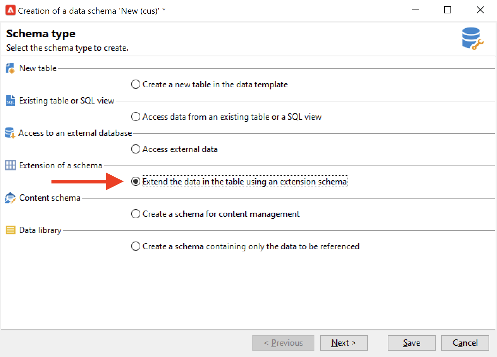
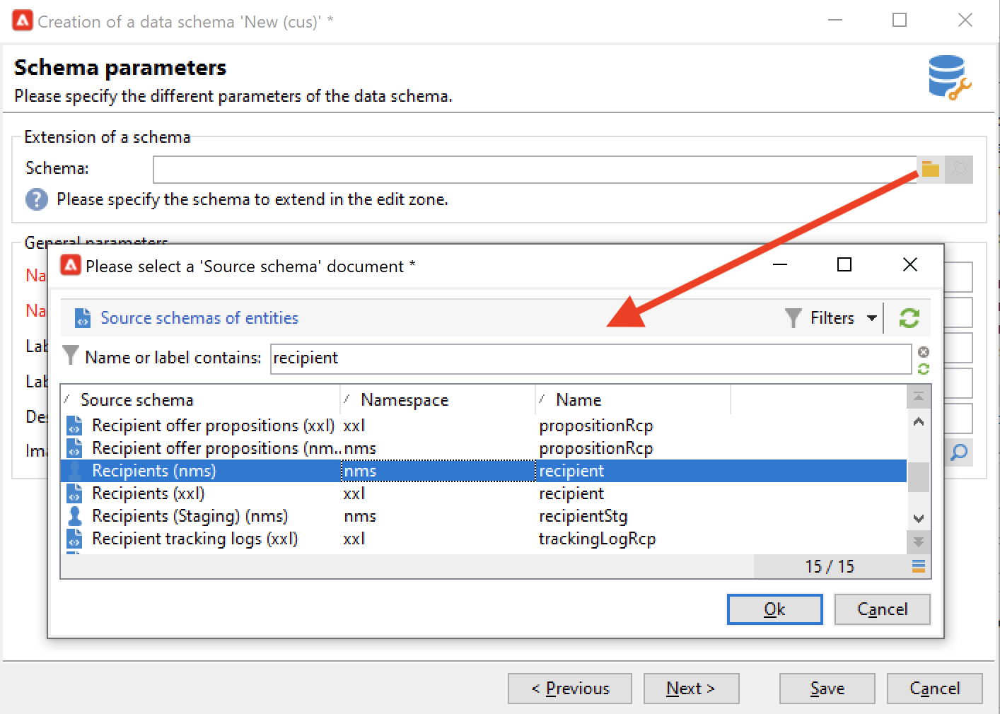
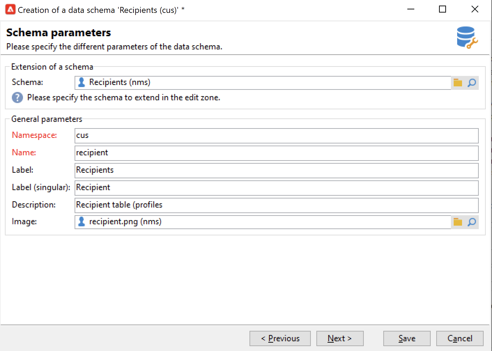
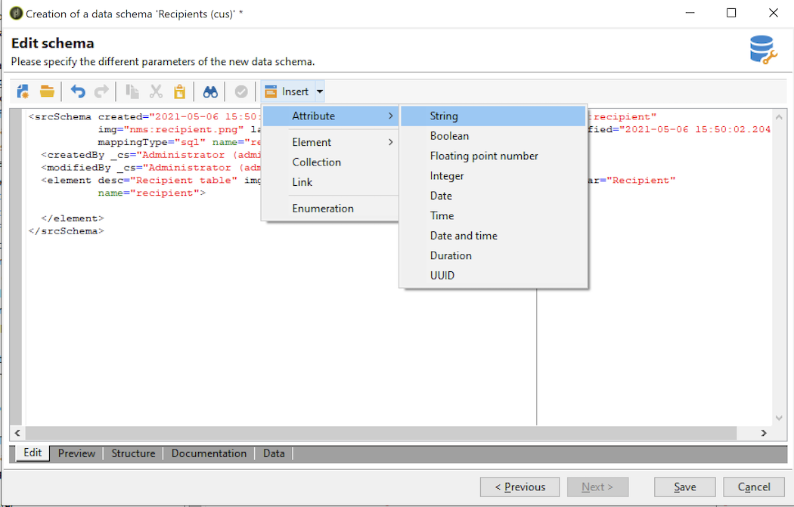
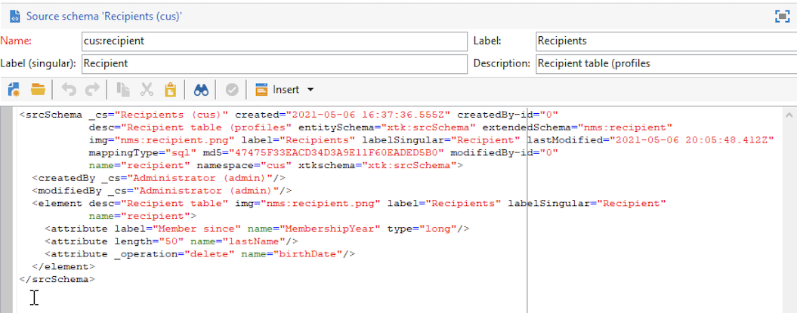
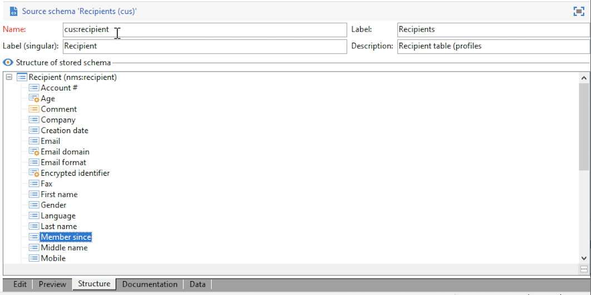

# Extend a schema{#extend-schemas}

As a technical user, you can customize Campaign datamodel to meet the needs of your implementation: add elements to an existing schema, modify an element in a schema or delete elements.

Key steps to customize Campaign datamodel are:

1. Create an extension schema
1. Update Campaign database
1. Adapt the input form

>[!CAUTION]
>Built-in schema must not be modified directly. If you need to adapt a built-in schema, you must extend it.

For a better understanding of Campaign built-in tables and their interaction, refer to [this page](datamodel.md). See also recommendations when creating a new schema in [this page](create-schema.md).

To extend a schema, follow the steps below:

1. Navigate to the **[!UICONTROL Administration > Configuration > Data schemas]** folder in the Explorer.
1. Click the **New** button and select **[!UICONTROL Extend the data in a table using an extension schema]**.

    

1. Identify the built-in schema to extend and select it.

    

    By convention, name the extension schema the same as the built-in schema, and use a custom namespace.  Note that some namespaces are internal only. [Learn more](schemas.md#reserved-namespaces)

    

1. Once in the schema editor, add the elements you need using the contextual menu, and save.

    

    In the example below, we add the **MembershipYear** attribute, put a length limit for last name (this limit will overwrite the default one), and remove the birth date from the built-in schema.

    

    ```
    <srcSchema created="YYYY-MM-DD" desc="Recipient table" extendedSchema="nms:recipient"
            img="nms:recipient.png" label="Recipients" labelSingular="Recipient" lastModified="YYYY-MM-DD"
            mappingType="sql" name="recipient" namespace="cus" xtkschema="xtk:srcSchema">
     <element desc="Recipient table" img="nms:recipient.png" label="Recipients" labelSingular="Recipient" name="recipient">
        <attribute label="Member since" name="MembershipYear" type="long"/>
        <attribute length="50" name="lastName"/>
        <attribute _operation="delete" name="birthDate"/>
    </element>
    </srcSchema>
    ```

1. Disconnect and reconnect to Campaign to check schema structure update in the **[!UICONTROL Structure]** tab.

    

1. Update the database structure to apply your changes. [Learn more](update-database-structure.md)

1. Once changes are implemented in the database, you can adapt the recipient input form to make your changes visible. [Learn more](forms.md)
