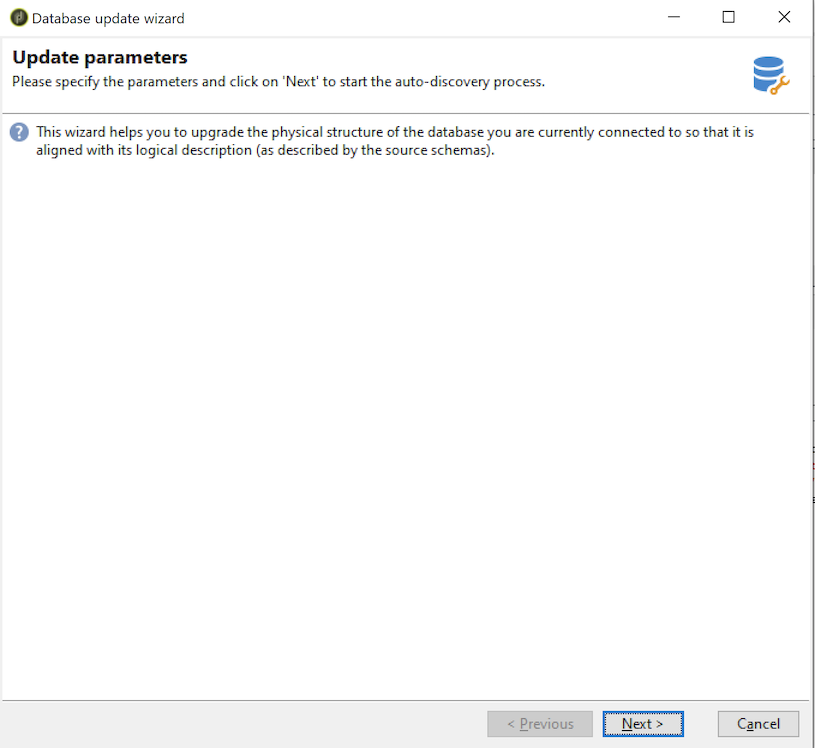
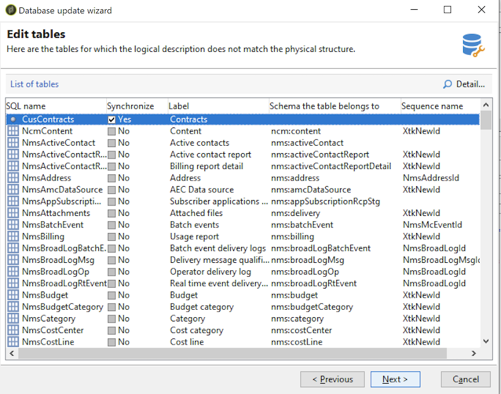
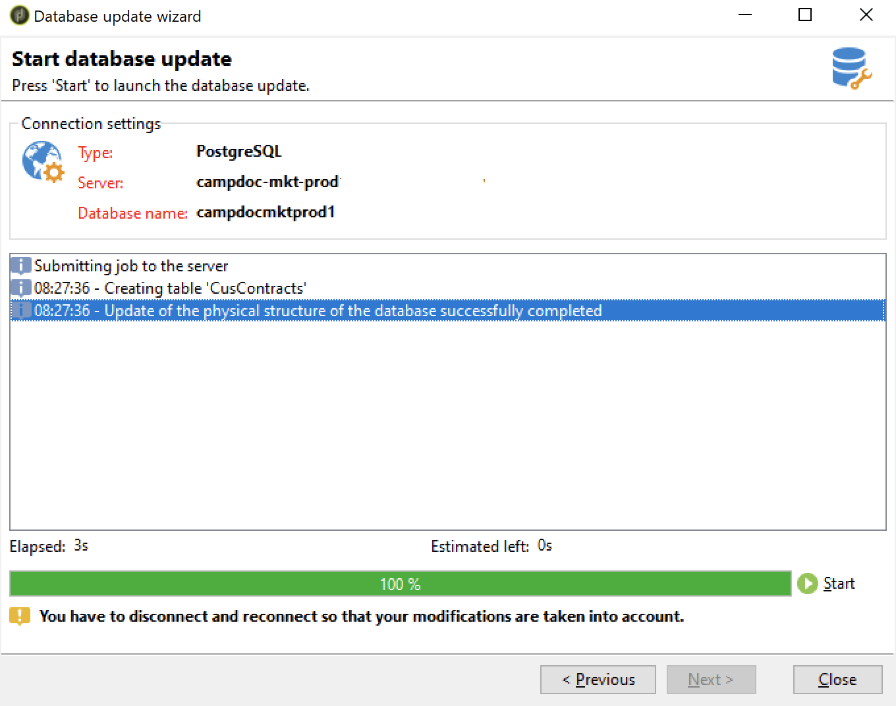

# Update the database structure {#updating-the-database-structure}

To apply the modifications made to the schemas, launch the Database update wizard. This assistant is accessible via **[!UICONTROL Tools > Advanced > Update database structure]**. It checks whether the physical structure of the database matches its logical description and executes the SQL update scripts.

The modules in the database are automatically populated and activated.

Follow the steps and view the database update SQL script:

>[!NOTE]
>
>This is in an editing field and can be modified in order to delete or add SQL code.

Next, launch the database update:

