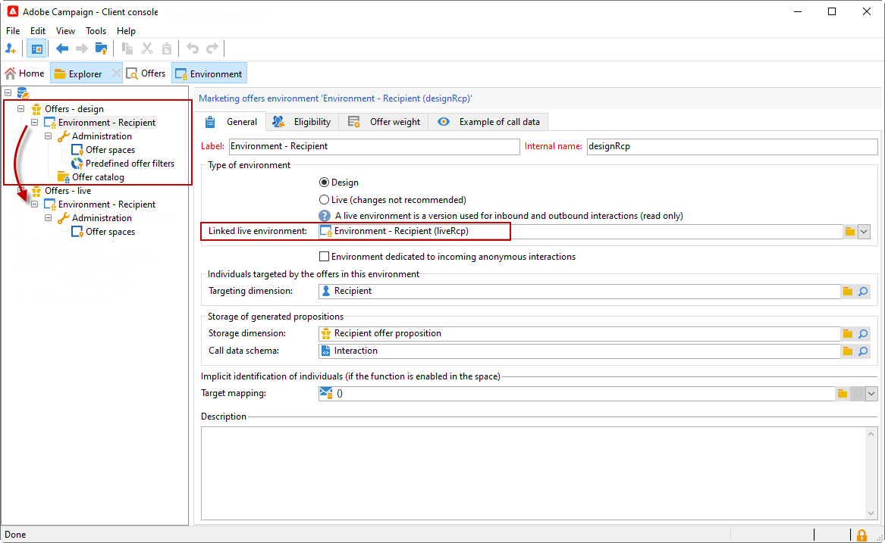

# Work with environments{#work-with-environments}

## Live and Design environments{#live-design-environments}

Interaction operates with two types of offer environments:

* **[!UICONTROL Design]** offer environments that include offers that are being edited and can be altered. These offers haven't been through the approval cycle and aren't delivered to contacts.
* **[!UICONTROL Live]** offer environments that include approved offers as they are presented to contacts. The offers in this environment are read-only.

Each **[!UICONTROL Design]** environment is linked to a **[!UICONTROL Live]** environment. When an offer is complete, its content and eligibility rules are subjected to an approval cycle. Once this cycle is complete, the concerned offer is automatically deployed to the **[!UICONTROL Live]** environment. From this moment on, it will be available for delivery.

By default, Campaign comes with a **[!UICONTROL Design]** environment and a **[!UICONTROL Live]** environment linked to it. Both environments are pre-configured to target the [built-in recipient table](../dev/datamodel.md#ootb-profiles).

>[!NOTE]
>
>To target recipient table, you need to use the target mapping assistant to create the environments. [Learn more](#creating-an-offer-environment).

Delivery managers can only view the **[!UICONTROL Live]** environment and leverage offers to deliver them. Offer managers can view and use the **[!UICONTROL Design]** environment, and view the **[!UICONTROL Live]** environment. [Learn more](interaction-operators.md)

## Create an environment for anonymous interactions{#create-an-offer-environment}

By default, Campaign comes with a built-in environment to target the recipient table (identified offers). To target another table, such as anonymous profiles visiting your website for inbound interactions, you need to update your configuration.

Follow the steps below:

1. Browse to **[!UICONTROL Administration]** > **[!UICONTROL Campaign management]** > **[!UICONTROL Target mappings]**, right-click the target mapping you want to use and select **[!UICONTROL Actions]** > **[!UICONTROL Modify the options of the targeting dimension]**.

   

1. Click **[!UICONTROL Next]**, select the **[!UICONTROL Generate a storage schema for propositions]** option and click **[!UICONTROL Save]**.

   

   >[!NOTE]
   >
   >If the option is already checked, uncheck it then recheck it.

1. Adobe Campaign creates two environments - **[!UICONTROL Design]** and **[!UICONTROL Live]** - with targeting information from the previously enabled target mapping. The environment is preconfigured with the targeting information.
   
  If you have activated **[!UICONTROL Visitor]** mapping, the **[!UICONTROL Environment dedicated to incoming anonymous interactions]** box is automatically checked in the environment's **[!UICONTROL General]** tab.

   This option lets you activate anonymous interaction specific functions, particularly when configuring environment offer spaces. You can also configure options that allow you to switch from an "identified" environment to an "anonymous" environment.

   For example, you can link a recipient environment offer space (identified contact) with an offer space that matches a visitor environment (unidentified contact). In this way, different offers will be made available to the contact depending on whether this contact is identified or not. For more on this, refer to [Creating offer spaces](interaction-offer-spaces.md).

   

>[!NOTE]
>
>For more information on anonymous interactions on an inbound channel, refer to [Anonymous interactions](anonymous-interactions.md).
