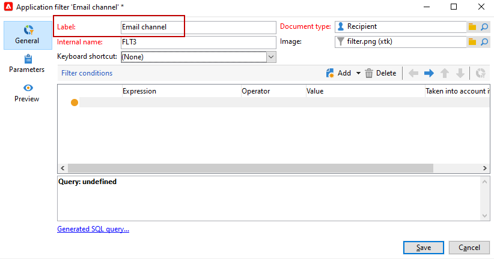

# Create pre-defined filters{#creating-pre-defined-filters}

 Create pre-defined filters to define eligibility rules for the target population that can easily be re-used during offer creation. They are specific to each environment and take the offer parameters into account.

>[!NOTE]
>
>Adobe Campaign Web UI offers you an user-friendly interface to effortlessly manage and customize predefined filters to meet your specific needs. Create once and save for future use. To learn more about Pre-defined filters for Web UI, please refer to the [Adobe Campaign Web UI documentation](https://experienceleague.adobe.com/en/docs/campaign-web/v8/start/predefined-filters){target=_blank}.

To create a pre-defined filter, apply the following process:

1. Browse to the **[!UICONTROL Administration]** folder and select **[!UICONTROL Pre-defined offer filters]**.

   

1. Click **[!UICONTROL New]**.

   

1. Change the label to be able to identify the filter later.

   

1. Select the field that the filtering condition will concern.

   

1. Select an operator and a value if necessary, then save the query.

   

1. Click **[!UICONTROL Preview]** to view the result of the filter.

   
