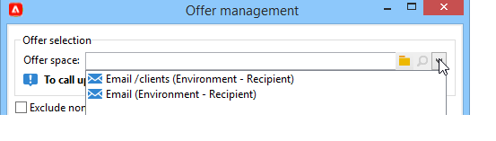
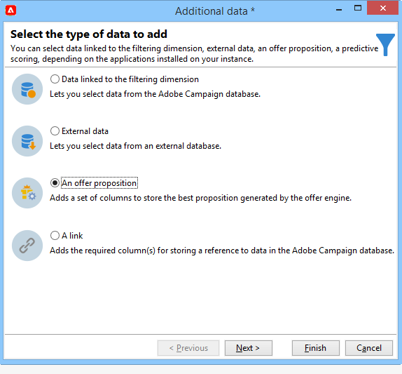

# Send an offer{#send}

In order for an offer to be selected by the Offer engine, it has be approved and available in a **Live** environment. [Learn more](interaction-offer.md#approve-offers)

Offer presentation via an outbound communication channel is carried out via direct mail, email, or mobile deliveries. You can also use unitary mode with Transactional messaging (Message Center).

## Insert an offer in a delivery {#offer-into-a-delivery}

To insert offer propositions into a delivery, follow the steps below:

1. In the delivery window, click the **Offers** icon. 

   

1. Select the space that matches your offer environment.

   

1. To refine the engine's choice of offers, select either the category from which the offer(s) to be presented is a part of, or one/several themes. We recommend only using one of these fields at a time to avoid overloading the restrictions.

   

   

1. Specify the number of offers you want to insert into the delivery body.

   

1. Select the **[!UICONTROL Exclude non-eligible recipients]** option if necessary. [Learn more](#parameters-for-calling-offer-engine)

   

1. If needed, select the **[!UICONTROL Do not display anything if no offers are selected]** option. [Learn more](#parameters-for-calling-offer-engine)

   

1. Insert the properties into the delivery content using the merge fields. The number of propositions available depends on the way the engine call is configured and their order depends on the priority of offers.

   

1. Finalize the content, test and send your delivery.

   

### Parameters of the Offer engine {#parameters-for-calling-offer-engine}

* **[!UICONTROL Space]** : space of the offer environment which must be selected to activate the Offer engine.
* **[!UICONTROL Category]** : specific folder in which offers are sorted. If no category is specified, all the offers contained in the environment will be taken into account by the Offer engine, unless a theme is selected. 
* **[!UICONTROL Themes]** : key words defined upstream in the categories. These act as a filter and let you refine the number of offers to be presented by selecting them in a set of categories. 
* **[!UICONTROL Number of propositions]** : number of offers returned by the engine that can be inserted into the delivery body. If they are not inserted into the message, the offers will still be generated, but not presented.
* **[!UICONTROL Exclude non-eligible recipients]** : This option lets you activate or deactivate the exclusion of recipients for whom there are not enough eligible offers. The number of eligible propositions may be lower than the requested number of propositions. If this box is checked, recipients who don't have enough propositions will be excluded from the delivery. If you don't select this option, these recipients will not be excluded but they won't have the requested number of propositions.
* **[!UICONTROL Do not display anything if no offer is selected]** : this option lets you choose how the message will be processed in case one of the propositions does not exist. When this box is checked, the representation of the missing proposition is not displayed and no content will appear in the message for this proposition. If the box isn't checked, the message itself is cancelled during sending and recipients will no longer receive any messages.

## Send offers in workflows{#offer-via-wf}

Several workflow activities allow you to define the way offers are presented:

* Enrichment
* Offer engine
* Offers by cell

### Enrichment {#enrichment}

The **Enrichment** activity lets you add offers or links to offers for delivery recipients.

 For more on the Enrichment activity, refer to [Campaign Classic v7 documentation](https://experienceleague.adobe.com/docs/campaign-classic/using/automating-with-workflows/targeting-activities/enrichment.html)

For example, you can enrich the data for a recipient query before a delivery.

There are two methods for specifying offer propositions.

* Specifying an offer or an Offer engine call.
* Referencing a link to an offer.

#### Specify an offer or a call to the Offer engine {#specifying-an-offer-or-a-call-to-the-offer-engine}

After configuring your **Query** activity:

1. Add and open an **Enrichment** activity.
1. In the **[!UICONTROL Enrichment]** tab, select **[!UICONTROL Add data]**.
1. Select **[!UICONTROL An offer proposition]** in the types of data to add.

   

1. Specify an identifier as well as a label for the proposition that will be added.
1. Specify the offer selection. There are two possible options for this:

    * **[!UICONTROL Search for the best offer in a category]** : check this option and specify the Offer engine call parameters (offer space, category or theme(s), contact date, number of offers to keep). The engine will automatically calculate the offer(s) to add according to these parameters. We recommend completing either the **[!UICONTROL Category]** or the **[!UICONTROL Theme]** field, rather than both at the same time.
    
      

    * **[!UICONTROL A pre-defined offer]** : check this option and specify an offer space, a specific offer, and a contact date to directly configure the offer that you would like to add, without calling the Offer engine.
    
      

1. Then configure a delivery activity that corresponds to your chosen channel. [Learn more](#offer-into-a-delivery)

   >[!NOTE]
   >
   >The number of propositions available for the preview depends on the configuration carried out in the enrichment activity rather than any possible configuration carried out directly in the delivery.

#### Reference a link to an offer {#referencing-a-link-to-an-offer}

You can also reference a link to an offer in an **Enrichment** activity.

To do this, follow the steps below:

1. Select **[!UICONTROL Add data]** in the activity's **[!UICONTROL Enrichment]** tab.
1. In the window where you choose the type of data to add, select **[!UICONTROL A link]**.
1. Select the type of link you want to establish as well as its target. In this case, the target is the offer schema.

   

1. Specify the join between the inbound table data in the enrichment activity (here the recipient table) and the offer table. For example, you can link an offer code to a recipient.

   

1. Then configure a delivery activity that corresponds to your chosen channel. [Learn more](#offer-into-a-delivery)

   >[!NOTE]
   >
   >The number of propositions available for the preview depends on the configuration carried out in the delivery.

#### Store offer rankings and weights {#storing-offer-rankings-and-weights}

By default, when an **Enrichment** activity is used to deliver offers, their rankings and their weights are not stored in the proposition table.

>[!NOTE]
>
>The **[!UICONTROL Offer engine]** activity does store this information by default.

However, you can store this information as follows:

1. Create a call to the Offer engine in an enrichment activity placed after a query and before a delivery activity. [Learn more](#specifying-an-offer-or-a-call-to-the-offer-engine)
1. In the activity's main window, select **[!UICONTROL Edit additional data...]**.

   

1. Add the **[!UICONTROL @rank]** columns for the ranking and **[!UICONTROL @weight]** for the offer weight.

   

1. Confirm your addition and save your workflow.

The delivery automatically stores the ranking and weight of offers. This information is visible in the delivery's **[!UICONTROL Offers]** tab.

### Offer engine {#offer-engine}

The **[!UICONTROL Offer engine]** activity also lets you specify a call to the Offer engine prior to the delivery.

 For more on the **Offer engine** activity, refer to [Campaign Classic v7 documentation](https://experienceleague.adobe.com/docs/campaign-classic/using/automating-with-workflows/targeting-activities/offer-engine.html)

This activity works on the same principle as the **Enrichment** activity with an engine call, by enriching the inbound population data with an offer calculated by the engine, before a delivery.

After configuring your **Query** activity:

1. Add and open an **[!UICONTROL Offer engine]** activity.
1. Complete the various available fields to specify the call to Offer engine parameters (offer space, category or theme(s), contact date, number of offers to keep). The engine will automatically calculate the offer(s) to add according to these parameters.

   >[!CAUTION]
   >
   >If you use this activity, only the offer propositions used in the delivery will be stored.

   

1. Then configure a delivery activity that corresponds to your chosen channel. [Learn more](#inserting-an-offer-proposition-into-a-delivery)

### Offers by cell {#offers-by-cell}

The **[!UICONTROL Offers by cell]** activity lets you distribute the inbound population (from a query for example) into several segments and to specify an offer to present for each of these segments.

 For more on the **Offer by cell** activity, refer to [Campaign Classic v7 documentation](https://experienceleague.adobe.com/docs/campaign-classic/using/automating-with-workflows/targeting-activities/offers-by-cell.html)

To do this, use the following process:

1. Add the **[!UICONTROL Offers by cell]** activity once you have specified the target population, then open it.
1. In the **[!UICONTROL General]** tab, select the offer space on which you want to present the offers.
1. In the **[!UICONTROL Cells]** tab, specify the different sub-sets using the **[!UICONTROL Add]** button:

    * Specify the subset population using the available filtering and limiting rules.
    * Then select the offer that you want to present to the sub-set. The available offers are those that are eligible on the offer environment that was selected at the previous step.
    
      

1. Then configure a delivery activity that corresponds to your chosen channel.

<!--

## Delivering with delivery outlines {#delivering-with-delivery-outlines}

You can also present offers in a delivery using delivery outlines.

For more information on delivery outlines, refer to the Campaign - MRM guide.

1. Create a new campaign or access an existing campaign.
1. Access the delivery outlines via the campaign's **[!UICONTROL Edit]** > **[!UICONTROL Documents]** tab.
1. Add an outline then insert as many offers as you like into it by right-clicking on the outline and selecting **[!UICONTROL New]** > **[!UICONTROL Offer]**, then save the campaign.

1. Create a delivery whose delivery outlines you have access to (for example, a direct mail delivery).
1. When editing the delivery, click **[!UICONTROL Select a delivery outline]**.

   >[!NOTE]
   >
   >Depending on the type of delivery, this option can be found in the **[!UICONTROL Properties]** > **[!UICONTROL Advanced]** menu (for email deliveries for example).

1. Using the **[!UICONTROL Offers]** button, you can then configure the offer space as well as the number of offers to present in the delivery.

1. Add the propositions into the delivery body using the personalization fields (for more on this, refer to the [Inserting an offer proposition into a delivery](#inserting-an-offer-proposition-into-a-delivery) section), or in the case of a direct mail delivery, by editing the extraction file format.

   Propositions will be selected from the offers referenced in the delivery outline.

   >[!NOTE]
   >
   >Information regarding the offer rankings and weights is only saved in the proposition table if the offers are generated directly in the delivery.
-->
