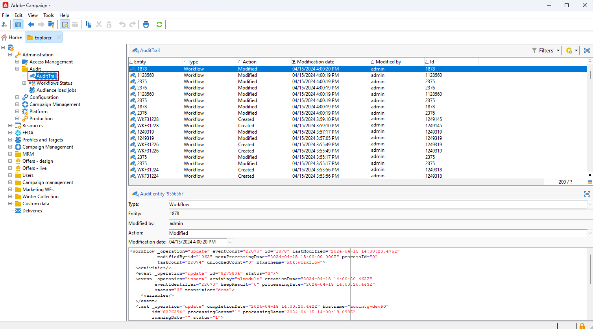

# Audit trail{#audit-trail}

The **[!UICONTROL Audit trail]** functionality within Adobe Campaign offers a granular record of all modifications made to important entities within your instance, typically those that significantly impact a smooth operation of the instance. Functioning as a real-time log, it captures a detailed list of actions and events as they occur. 

>[!NOTE]
>
>Adobe Campaign is not auditing changes made within user rights, templates, personalization or campaigns.  
>Audit trail can only be managed by administrators of the instance.

+++ Learn more on Audit Trail available entities

* **Schema audit trail**: allows you to explore the changes made to your schemas, as well as identify who made these modifications and when they occurred.

  For detailed information on schemas, refer to [page](../dev/schemas.md).

* **Workflow audit trail** tracks all actions related to your workflows, including:

    * Start
    * Pause
    * Stop
    * Restart
    * Cleanup which equals to the action Purge history
    * Simulate which equals to the action Start in simulation mode
    * Wakeup which equals to the action Execute pending tasks now
    * Unconditional Stop

  For more information on workflows, refer to this [page](../../automation/workflow/about-workflows.md).
  
  For more on how to monitor workflows, refer to the [dedicated section](../../automation/workflow/monitor-workflow-execution.md).

* **Option audit trail** allows you to check activities and last modifications done to your options.

  For more information on options, refer to this [page](https://experienceleague.adobe.com/en/docs/campaign-classic/using/installing-campaign-classic/appendices/configuring-campaign-options).

* **Delivery audit trail** allows you to check the activities and last modifications done to your deliveries. 

  For more information on deliveries, refer to this [page](../start/create-message.md).

* **External Account** allows you to check modifications made to external accounts, used by technical processes such as technical workflows or campaign workflows.

  For more information on external account, refer to this [page](../config/external-accounts.md).

* **Delivery Mapping** enables you to monitor activities and recent modifications made to your Delivery Mappings. 

  For more information on delivery mapping, refer to this [page](../audiences/target-mappings.md).

* **Web Application** allows you to check modifications made to Web forms in Campaign V8 used to create pages with input and selection fields, and which may include data from the database. 

  For more information on web application, refer to this [page](../dev/webapps.md).

* **Offer** allows you to check the activities and last modifications done to your offers.

  For more information on offer, refer to this [page](../interaction/interaction.md).

* **Operator** enables you to monitor activities and recent modifications made to your Operators.

  For more information on operators, refer to this [page](../interaction/interaction-operators.md).

+++

## Accessing Audit trail {#accessing-audit-trail}

To access your instance's **[!UICONTROL Audit trail]**:

1. Access the **[!UICONTROL Explorer]** menu of your instance.

1. Under the **[!UICONTROL Administration]** menu, select **[!UICONTROL Audit]** then **[!UICONTROL Audit Trail]**.

   

1. The **[!UICONTROL Audit trail]** window opens with the list of your entities. Adobe Campaign will audit the create, edit and delete actions for your different entities.

   Select one of the entities to learn more about the last modifications.

1. The **[!UICONTROL Audit entity]** window gives you more detailed information on the chosen entity such as:

    * **[!UICONTROL Type]**: Workflow, Options, Deliveries or Schemas.
    * **[!UICONTROL Entity]**: Internal name of your activities.
    * **[!UICONTROL Modified by]**: Username of the last person who last modified this entity.
    * **[!UICONTROL Action]**: Last action performed on this entity, either Created, Modified or Deleted.
    * **[!UICONTROL Modification date]**: Date of the last action performed on this entity.

   

>[!NOTE]
>
>By default, retention period is set to 180 days for **[!UICONTROL Audit logs]**. This value can be modified in the deployment wizard.

## Enable/disable Audit trail {#enable-disable-audit-trail}

Audit trail can be easily activated or deactivated for a specific activity if, for example, you want to save some space on the database.

To do so:

1. Access the **[!UICONTROL Explorer]** menu of your instance.

1. Under the **[!UICONTROL Administration]** menu, select **[!UICONTROL Platform]** then **[!UICONTROL Options]**.

1. Select one of the following options depending on the entity you want to activate/deactivate:

   * For Workflow: **[!UICONTROL XtkAudit_Workflows]**
   * For Schemas: **[!UICONTROL XtkAudit_DataSchema]**
   * For Options: **[!UICONTROL XtkAudit_Option]**
   * For Deliveries: **[!UICONTROL XtkAudit_Delivery]**
   * For External Account: **[!UICONTROL XtkAudit_ExtAccount]**
   * For Delivery Mapping: **[!UICONTROL XtkAudit_DeliveryMapping]**
   * For Web Application: **[!UICONTROL XtkAudit_WebApp]**
   * For Offer: **[!UICONTROL XtkAudit_Offer]**
   * For Operator: **[!UICONTROL XtkAudit_Operator]**
   * For every entity: **[!UICONTROL XtkAudit_Enable_All]**

   

1. Change the **[!UICONTROL Value]** to 1 if you want to enable the entity or to 0 if you want to disable it.

   

1. Click **[!UICONTROL Save]**.
