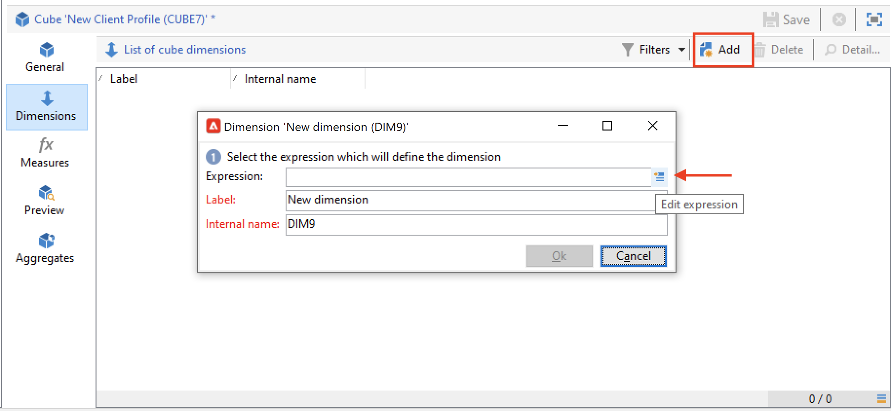
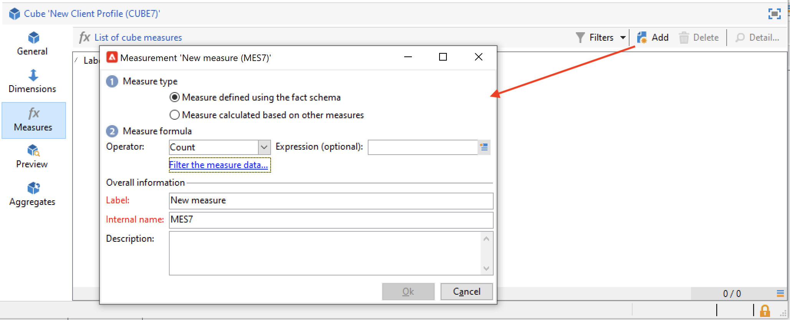
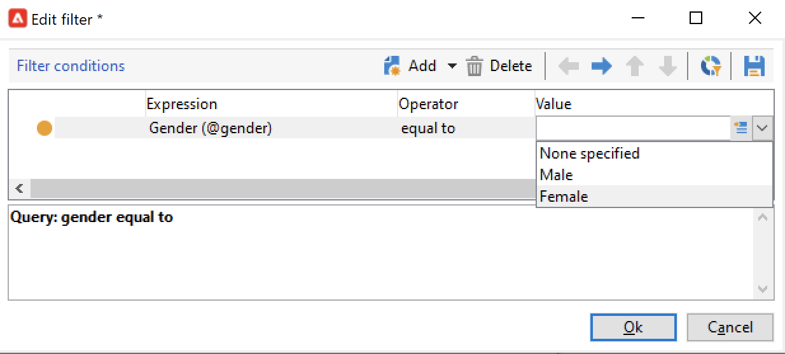

# Create a cube{#create-a-cube}

## Cube workspace {#cube-workspace}

To access cubes, browse to **[!UICONTROL Administration > Configuration > Cubes]** from Campaign explorer.

With cubes you can:

* Export data directly in a report, designed in the **[!UICONTROL Reports]** tab of the Adobe Campaign platform.

  To do this, create a new report and select the cube you want to use.

  

  Cubes appear like templates based on which reports are created. Once you have chosen a template, click **[!UICONTROL Create]** to configure and view the new report.

  You can adapt measures, change the display mode or configure the table, then display the report using the main button.

  

* Reference a cube in the **[!UICONTROL Query]** box of a report to use its indicators, as shown below:

  

* Insert a pivot table based on a cube into any page of a report. To do this, reference the cube to be used in the **[!UICONTROL Data]** tab of the pivot table on the concerned page.

  

  For more on this, refer to [Explore the data in a report](cube-tables.md#explore-the-data-in-a-report).

>[!CAUTION]
>
>Admin permissions are required to create cubes.
>

## Build a cube{#cube-create}

Before starting building a cube report, identify the relevant dimensions and measures, and create them in the cube.

To create a cube, apply the following steps:

1. Select the work table. [Learn more](#select-the-work-table).
1. Define dimensions. [Learn more](#define-dimensions).
1. Define measures. [Learn more](#build-indicators).
1. Create aggregates (optional). [Learn more](cube-best-practices.md#calculate-and-use-aggregates).

In the example below, learn how to quickly create a simple cube in a report to export its measures.

### Select the work table {#select-the-work-table}

To create a cube, follow the steps below:

1. Click the **[!UICONTROL New]** button above the list of cubes.

    

1. Select the schema which contains the elements you want to explore (also known as the 'fact schema'). In this example, select the default **Recipient** table.
1. Click **[!UICONTROL Save]** to create the cube: it is added to the list of cubes. You can now use the tabs to configure it.

1. Click the **[!UICONTROL Filter the source data...]** link to apply the calculations of this cube to data in the database.

    

### Define dimensions {#define-dimensions}

Once the cube is created, define its dimensions. Dimensions are the analysis axes defined for each cube based on their related fact schema. These are the dimensions explored in the analysis, such as time (year, month, date), a classification of products or contracts (family, reference, etc.), a population segment (by city, age group, status, etc.).

To create dimensions, follow the steps below:

1. Browse to the **[!UICONTROL Dimension]** tab of the cube and click the **[!UICONTROL Add]** button to create a new dimension.
1. In the **[!UICONTROL Expression field]**, click the **[!UICONTROL Edit expression]** icon to select the field that contains the concerned data.

    

1. In this example, we are selecting the recipient **Age**. For this field, you can define binning to group ages and make information reading easier. We recommend using binning when there is a likelihood of several separate values.

  To do this, check the **[!UICONTROL Enable binning]** option. [Learn more](cube-best-practices.md#data-binning).

  

1. Add a **Date** type dimension. Here, we want to display recipient profile creation dates. To do this, click **[!UICONTROL Add]** and select the **[!UICONTROL Creation date]** field in the recipient table.
  You can customize the date display mode. To do this, select the hierarchy to use and the levels to generate:

  

  In our example, we only want to display years, months and days. Note that you cannot work with weeks and semesters/months at the same time: these levels aren't compatible.

1. Create another dimension to analyze data relative to the city of the recipient. To do this, add a new dimension and select the city in the **[!UICONTROL Location]** node of the recipient schema. 

  You can enable binning to make information reading easier and link the values to an enumeration.

  Select the enumeration from the drop-down list. Note that this enumeration must be defined as **[!UICONTROL Reserved for binning]**.

  

  Only the values in the enumeration will be displayed. The others will be grouped under the label defined in the **[!UICONTROL Label of the other values]** field.

  For more on this, refer to [this section](cube-best-practices.md#dynamically-manage-bins).

### Build indicators {#build-indicators}

Once the dimensions are defined, specify a calculation mode for the values to be displayed in the cells. 

To do this, create the indicators in the **[!UICONTROL Measures]** tab. Create as many measures as there are columns to display in the reports based on this cube.

To build indicators, follow the steps below:

1. Browse to the **[!UICONTROL Measures]** tab and click the **[!UICONTROL Add]** button.
1. Select the type of measure and the formula to apply. In this example, we are counting the number of women among the recipients. Our measure is based on the fact schema and uses the **[!UICONTROL Count]** operator.

   

   Use the **[!UICONTROL Filter the measure data...]** link to select women only. [Learn more](cube-best-practices.md#define-measures).

   

1. Enter the label of the measure and save it.

   

1. Save the cube.

You can now create a report based on this cube. [Learn more](cube-tables.md).