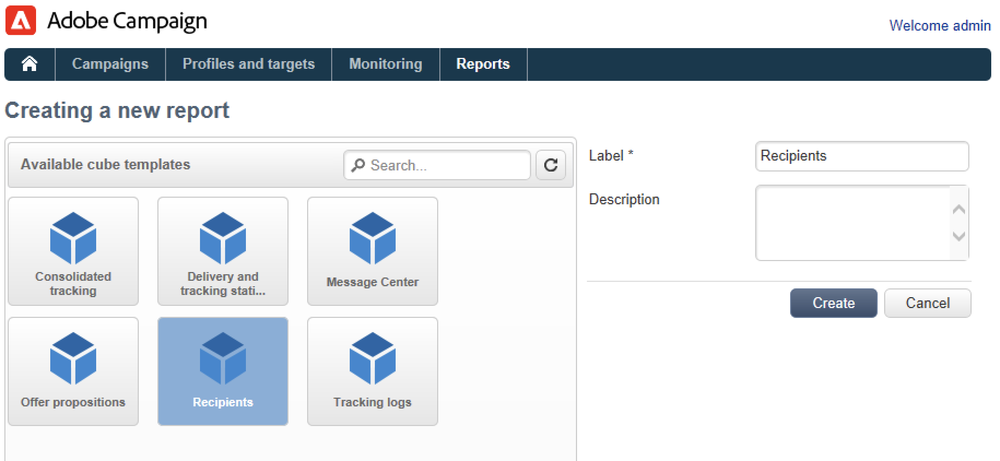
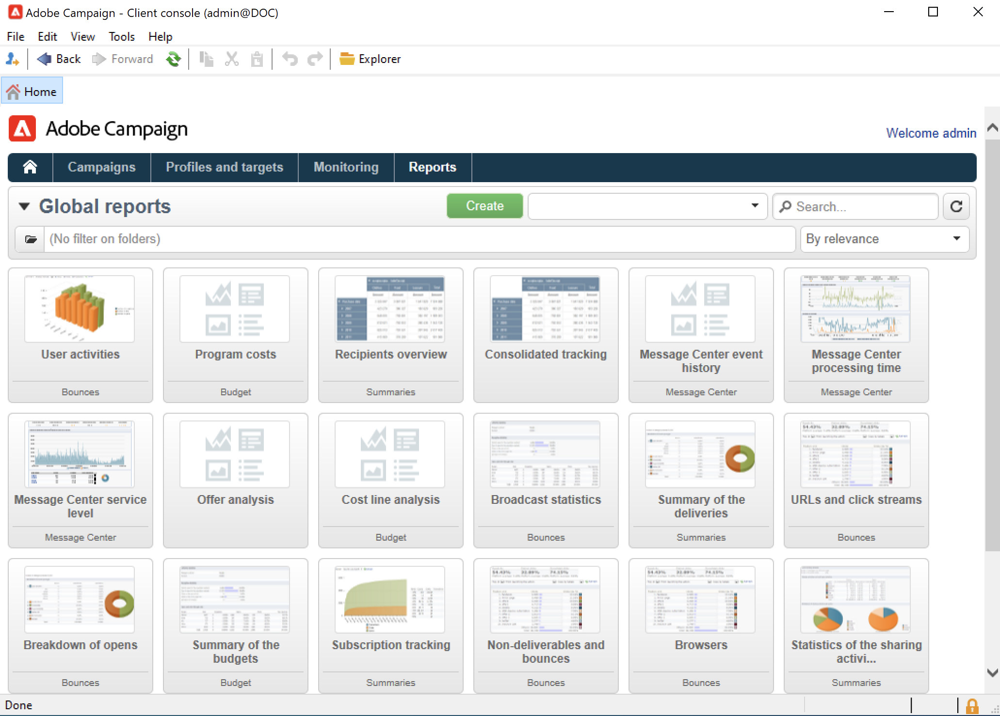
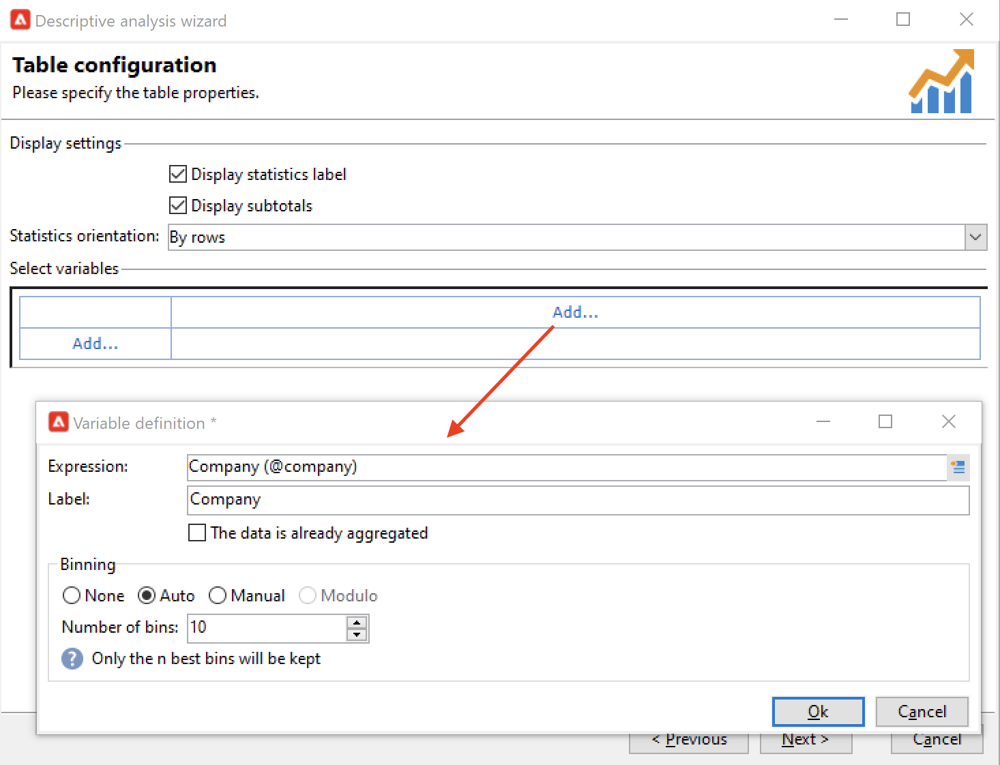

# Get Started with reporting{#gs-ac-reports}

Adobe Campaign provides a set of reporting tools listed in this page.

* **Dynamic reporting**

    Available with the Campaign Web UI, Dynamic Reporting provides fully customizable and real-time reports to measure the impact of your marketing activities. It adds access to profile data, enabling demographic analysis by profile dimensions such as gender, city and age in addition to functional email campaign data like opens and clicks. Refer to the [Web UI v7 documentation](https://experienceleague.adobe.com/docs/campaign-web/v8/reports/dynamic-reporting/get-started-reporting.html){target="_blank"}.

* **Cubes**

    Adobe Campaign comes with an intuitive data exploration tool to create dynamic reports.
        
    Use marketing analytics capatilities to analyze and measure data, calculate statistics, simplify and optimize report creation and calculation. You can create reports and build target populations and store them into lists which can be used in Adobe Campaign for targeting or segmentation tasks.

    

    Depending on the complexity of the queries, calculations and volumes, the data analyzed in these reports can be collected via a query and pre-aggregated in a list (data management type workflow) or in a Cube (using Marketing Analytics). It will be displayed in the form of a pivot table or a group list.

    For more on this, refer to [this section](gs-cubes.md).

* **Built-in reports**

    Adobe Campaign comes with reports on deliveries, campaigns, platform activities, optional capabilities, etc. These reports are available via the various functionalities which they relate to. They can be adapted to suit your specific needs. 

    Use the **Reports** tab to access these reports.

    

   For more on this, refer to [this section](built-in-reports.md).

* **Descriptive data analysis**

    Adobe Campaign provides a visual tool for producing statistics on the data in the database. You can create descriptive analysis reports using a dedicated assistant and adapt their content and layout depending on your needs. 

    Use the **[!UICONTROL Tools > Descriptive analysis...]** menu to create a new report.

    

    Campaign Descriptive analysis reporting is presented in [Campaign Classic v7 documentation](https://experienceleague.adobe.com/docs/campaign-classic/using/reporting/analyzing-populations/about-descriptive-analysis.html){target="_blank"}.

* **Custom reports** 

    Use Adobe Campaign to create reports on the data in the database. Once these have been created, make them accessible in the appropriate contexts.

    Steps to create a report are detailed in [Campaign Classic v7 documentation](https://experienceleague.adobe.com/docs/campaign-classic/using/reporting/creating-new-reports/about-reports-creation-in-campaign.html){target="_blank"}. Personalized report creation is reserved to advanced users.
