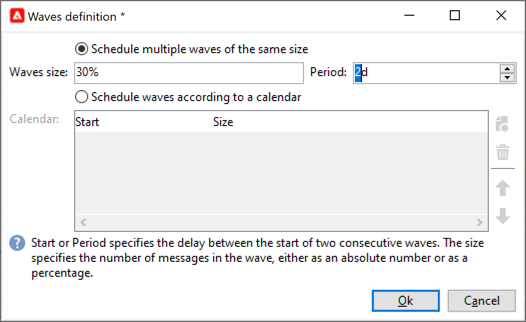

# Configure and send the delivery {#configure-delivery}

Access the delivery parameters to configure more settings and define how to send your messages. You can define delivery [priority](#delivery-priority), set up [waves](#sending-using-multiple-waves), and test your delivery sending. Once this configuration is done, you can confirm the sending as described in [this section](#confirm-delivery). Messages are then sent immediately, or based on the delivery [schedule](#schedule-delivery-sending).

## Set additional parameters {#delivery-additional-parameters}

Before sending the delivery, you can define the sending parameters in the delivery properties, via the **[!UICONTROL Delivery]** tab.

### Delivery priority {#delivery-priority}

Use the **[!UICONTROL Delivery priority]** option to change the sending order for your deliveries by setting their priority level, from **[!UICONTROL Very low]** to **[!UICONTROL Very high]** (the default value being **[!UICONTROL Normal]**). 

### Batch quantity {#delivery-batch-quantity}

Use the  **[!UICONTROL Message batch quantity]** option to define the number of messages grouped within the same XML delivery package. If the parameter is set to 0, the messages are automatically grouped. The package size is defined by the calculation `<delivery size>/1024`, with a minimum of 8 and a maximum of 256 messages by package.

>[!IMPORTANT]
>
>When the delivery is created by duplicating an existing one, this parameter is reset.

### Test your delivery sending

Use the  **[!UICONTROL Test SMTP delivery]** option to test sending via SMTP. The delivery is processed up to connection to the SMTP server but is not sent: for every recipient of the delivery, Campaign connects to the SMTP provider server, executes the SMTP RCPT TO command, and closes the connection before the SMTP DATA command.

>[!NOTE]  
>
>* This option must not be set in mid-sourcing. 
>
>* Learn more about SMTP server configuration in [Campaign Classic v7 documentation](https://experienceleague.adobe.com/docs/campaign-classic/using/installing-campaign-classic/additional-configurations/configure-delivery-settings.html#smtp-relay){target="_blank"}.

## Send using multiple waves {#sending-using-multiple-waves}

To balance the load, you can divide deliveries into several batches. Configure the number of batches and their proportion with respect to the entire delivery.

### Enable waves {#enable-waves}

To define waves, follow these steps:

1. Open the delivery properties and browse to the **[!UICONTROL Delivery]** tab.
1. Enable the **[!UICONTROL Send using multiple waves]** option, and click the **[!UICONTROL Define waves...]** link.

   

### Configure waves {#config-waves}

>[!NOTE]
>
>You can only define the size and the delay between two consecutive waves. The recipient selection criteria for each wave cannot be configured.
   
You can either define the size of each waves, or add them to a calendar.

* **Define the size for each wave**. For example, if you enter **[!UICONTROL 30%]** in the corresponding field, each wave will represent 30% of the messages included in the delivery, except the last one, which will represent 10% of the messages.

  In the **[!UICONTROL Period]** field, specify the delay between the start of two consecutive waves. For example, if you enter **[!UICONTROL 2d]**, the first wave will start immediately, the second wave will start in two days, the third wave in four days, and so on.

  

* **Define a calendar for sending each wave**.  For example, the first wave represents 25% of the total number of messages included in the delivery and will start immediately. The next two waves complete the delivery and are set to begin at six-hour intervals.

  In the **[!UICONTROL Start]** column, specify the delay between the start of two consecutive waves. In the **[!UICONTROL Size]** column, enter a fixed number or a percentage.

  

### Wave scheduling check {#check-waves}

A specific typology rule, **[!UICONTROL Wave scheduling check]**, ensures that the last wave is planned before the delivery validity limit. Campaign typologies and their rules, configured in the **[!UICONTROL Typology]** tab of the delivery properties, are presented in [this section](../../automation/campaign-opt/campaign-typologies.md#typology-rules)<!--ref TBC-->.

>[!IMPORTANT]
>
>* Make sure the last waves do not exceed the delivery deadline, which is defined in the **[!UICONTROL Validity]** tab. Otherwise some messages might not be sent. Learn more about the validity period of a delivery in [this section](delivery-failures.md#valid-period).
>
>* You must also set enough time for retries when configuring the last waves. Learn more about retries in [this section](delivery-failures.md#retries).

### Monitor waves {#monitor-waves}

To monitor your sends, browse to the delivery logs. See [this page](send.md)

You can see the deliveries that were already sent in the processed waves (**[!UICONTROL Sent]** status) and the deliveries to be sent in the remaining waves (**[!UICONTROL Pending]** status).

### Waves samples {#samples-waves}

The two examples below are the most common use cases for using multiple waves.

* **During ramp-up process**

  When emails are sent using a new platform, Internet service providers (ISPs) are suspicious of IP addresses that are not recognized. If large volumes of emails are suddenly sent, the ISPs often mark them as spam.

  To avoid being marked as spam, you can progressively increase the volume sent using waves. This should ensure smooth development of the start-up phase and enable you to reduce the overall rate of invalid addresses.

  To do so, use the **[!UICONTROL Schedule waves according to a calendar]** option. For example, set the first wave to 10%, the second to 15%, and so on.

  

* **Campaigns with a call center**

  When managing a loyalty campaign by phone, your organization has a limited capacity to process the number of calls to contact subscribers.

  Using waves, you can restrict the number of messages to 20 per day, for example, considering the daily processing capacity of a call center.

  To do this, select the **[!UICONTROL Schedule multiple waves of the same size]** option. Enter **[!UICONTROL 20]** as the wave's size and **[!UICONTROL 1d]** in the **[!UICONTROL Period]** field.

  

## Confirm the delivery {#confirm-delivery}

When the delivery is configured and ready to be sent, make sure you have run the delivery analysis before confirming the sending.

To do this, follow the steps below.

1. Click **[!UICONTROL Send]**, select the desired action.

    * To send the delivery immediately, select **[!UICONTROL Deliver as soon as possible]**.
    * To schedule the sending to a later date, select **[!UICONTROL Postpone the delivery]**. [Learn more](#schedule-delivery-sending)

1. Click **[!UICONTROL Analyze]**. For more on this, see [this section](delivery-analysis.md).

    

1. Once done, click **[!UICONTROL Confirm delivery]** to launch the delivery of messages.

    

1. You can close the delivery wizard and track the execution of the delivery from the **[!UICONTROL Delivery]** tab, accessible via the detail of this delivery or via the list of deliveries.

    For more on this, refer to the sections below:

    * [Monitoring a delivery](send.md)
    * [Understanding delivery failures](delivery-failures.md)

<!--About message tracking-->

## Schedule the delivery sending {#schedule-delivery-sending}

You can defer the delivery of messages in order to schedule the delivery or to manage sales pressure and avoid over-soliciting a population.

1. Click the **[!UICONTROL Send]** button and select the **[!UICONTROL Postpone delivery]** option.

1. Specify a start date in the **[!UICONTROL Contact date]** field.

    

1. Start the delivery analysis and confirm the delivery sending. However, the delivery sending will not start until the date given in the **[!UICONTROL Contact date]** field.

    >[!IMPORTANT]
    >
    >Once you have started the analysis, the contact date that you defined is fixed. If you modify this date, you will have to restart the analysis so that your modifications are taken into account.

    

In the delivery list, the delivery will appear with the **[!UICONTROL Pending]** status.

Scheduling can also be configured upstream via the **[!UICONTROL Scheduling]** button of the delivery.

It lets you defer the delivery to a later date or save the delivery in the provisional calendar.

* The **[!UICONTROL Schedule delivery (no automatic execution)]** option lets you schedule a provisional analysis of the delivery.

  When this configuration is saved, the delivery changes to **[!UICONTROL Targeting pending]** status. The analysis will be launched on the specified date.

* The **[!UICONTROL Schedule delivery (automatic execution on planned date)]** option lets you specify the delivery date.

  Click **[!UICONTROL Send]** and select **[!UICONTROL Postpone delivery]** then launch the analysis and confirm delivery. When the analysis is complete, the delivery target is ready and messages will automatically be sent on the specified date.

Dates and times are expressed in the time zone of the current operator. The **[!UICONTROL Time zone]** drop-down list located below the contact date input field lets you automatically convert the entered date and time into the selected time zone.

For instance, if you schedule a delivery to be executed automatically at 8 o'clock London time, the time is automatically converted into the selected time zone:

<!--
## Adjust delivery failure management {#delivery-failure-management}

### Configure retries {#configure-retries}

Temporarily undelivered messages due to a **Soft** or **Ignored** error are subject to an automatic retry. The delivery failure types and reasons are presented in this [section](../../delivery/using/understanding-delivery-failures.md#delivery-failure-types-and-reasons).

>[!IMPORTANT]
>
>For hosted or hybrid installations, if you have upgraded to the [Enhanced MTA](../../delivery/using/sending-with-enhanced-mta.md), the retry settings in the delivery are no longer used by Campaign. Soft bounce retries and the length of time between them are determined by the Enhanced MTA based on the type and severity of the bounce responses coming back from the message's email domain.

For on-premise installations and hosted/hybrid installations using the legacy Campaign MTA, the central section of the **[!UICONTROL Delivery]** tab for delivery parameters indicates how many retries should be performed the day after the delivery and the minimum delay between retries.

By default, five retries are scheduled for the first day of the delivery with a minimum interval of one hour spread out over the 24 hours of the day. One retry per day is programmed after that and until the delivery deadline, which is defined in the **[!UICONTROL Validity]** tab (see [Defining validity period](#defining-validity-period)).

### Define the validity period {#define-validity-period}

When the delivery has been launched, the messages (and any retries) can be sent until the delivery deadline. This is indicated in the delivery properties, via the **[!UICONTROL Validity]** tab.

* The **[!UICONTROL Delivery duration]** field lets you enter the limit for global delivery retries. This means that Adobe Campaign sends the messages beginning on the start date, and then, for messages returning an error only, regular, configurable retries are performed until the validity limit is reached.

  You can also choose to specify dates. To do this, select **[!UICONTROL Explicitly set validity dates]**. In this case, the delivery and validity limit dates also let you specify the time. The current time is used by default, but you can modify this directly in the input field.

  >[!IMPORTANT]
  >
  >For hosted or hybrid installations, if you have upgraded to the [Enhanced MTA](../../delivery/using/sending-with-enhanced-mta.md), the **[!UICONTROL Delivery duration]** setting in your Campaign email deliveries will be used only if set to **3.5 days or less**. If you define a value higher than 3.5 days, it will not be taken into account.

* **Validity limit of resources**: The **[!UICONTROL Validity limit]** field is used for uploaded resources, mainly for the mirror page and images. The resources on this page are valid for a limited time (to save disk space).

  The values in this field can be expressed in the units listed in [this section](../../platform/using/adobe-campaign-workspace.md#default-units).
-->
