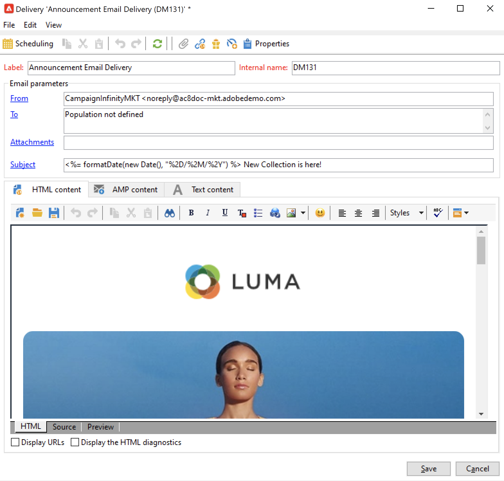

# Work with delivery template{#work-with-delivery-template}

Use delivery templates to standardize the creative look and feel, in order to be quicker in executing and launching campaigns.

A template can systematically include:

* Typologies
* Sender and reply-to addresses
* Basic personalization blocks
* Links to mirror pages and unsubscription links
* Content, company logo, or signature
* Other delivery properties, such as resource validity, retry parameters, or quarantine settings.

 [Discover this feature in video](#delivery-template-video)

## Create a template{#create-a-delivery-template}

To create a delivery template, you can duplicate a built-in template, convert an existing delivery into a template or create a delivery template from scratch.

### Duplicate an existing template{#copy-an-existing-template}

Campaign comes with a set of built-in templates for each channel: email, push, SMS, direct mail, and more.

The easiest way to create a delivery template is to duplicate and customize a built-in template.

To duplicate a delivery template, follow the steps below:

1. Browse to **[!UICONTROL Resources > Templates > Delivery templates]** in Adobe Campaign explorer.
1. Select a built-in delivery template. Built-in templates are bolded in the list.
1. Right-click and select **[!UICONTROL Duplicate]**.

    

1. Define the template settings and save the new template.

    

The template is added to the list of delivery templates. You can now select it when creating a new delivery.

### Convert an existing delivery to a template {#convert-an-existing-delivery}

A delivery can be converted to a template for new repeated delivery actions. 

To convert a delivery to a template, follow the steps below:

1. Select the delivery from the delivery list, accessible via the **[!UICONTROL Campaign management]** node of Campaign explorer.

1. Right-click and select **[!UICONTROL Actions > Save as template...]**.

   

1. Edit the delivery properties and select the folder where the new template must be saved (in the **[!UICONTROL Folder]** field), and the folder where the deliveries created based on this template must be created (in the **[!UICONTROL Execution folder]** field).

   

### Create a new template {#create-a-new-template}

>[!NOTE]
>
>To avoid configuration errors, Adobe recommends that you [duplicate a built-in template](#copy-an-existing-template) and customize its properties rather than create a new template.

To configure a delivery template from scratch, follow the steps below:

1. Browse to the **Resources** folder in Campaign explorer, and select **Templates** then **Delivery templates**.
1. Click **New** in the toolbar to create a new delivery template.
1. Set the **Label** and the **Internal name** of the folder.
1. Save your template and reopen it.
1. From the **Properties** button, adapt the settings.
1. In the **General** tab, confirm or change the locations selected in the **Execution folder**, **Folder**, and **Routing** drop-down menus.
1. Complete the **Email parameters** category with your email subject and targeted population.
1. Add your **HTML content** to personalize your template, you can display a mirror page link and an unsubscription link.
1. Select the **Preview** tab. In the **Test personalization** drop-down menu, select **Recipient** to preview your template as the chosen profile.
1. Click **Save**. Your template is now ready to be used in a delivery.

## Use templates{#use-a-delivery-template}

### Create a delivery from a template{#create-a-delivery-from-a-template}

To create a delivery based on an existing template, select the template from the list of available delivery templates.

If you cannot see your template, click the **[!UICONTROL Select link]** folder to the right of the field to browse Campaign folders.

Select the desired directory from the **[!UICONTROL Folder]** field, or click the **[!UICONTROL Display sub-levels]** icon to display the contents of the directories in the sub-trees of the current directory.

Select the delivery template to be used, and click **[!UICONTROL Ok]**.

### Execute a template {#execute-a-template}

You can launch the execution of a template directly from the template list without creating a delivery first. 

To do this, select the template to be executed and right-click. Select **[!UICONTROL Actions>Execute the delivery template...]**.

You can also use **[!UICONTROL File>Actions>Execute the delivery template...]**.

Enter the delivery parameters and click **[!UICONTROL Send]**.

This action generates a delivery in the folder associated to the template. The name of this delivery is the name of the delivery template from which it was created.

## Tutorial videos {#delivery-template-video}

### How to configure a delivery template 

The following video demonstrates how to configure a template for an ad hoc delivery.

>[!VIDEO](https://video.tv.adobe.com/v/342082?quality=12)

### How to set up delivery templates properties

The following video shows how to set the delivery template properties and explains each property in detail.

>[!VIDEO](https://video.tv.adobe.com/v/338969?quality=12)

### How to deploy an ad-hoc delivery template

This video explains how to deploy an ad-hoc email delivery template and it explains the difference between an email delivery and a delivery workflow.

>[!VIDEO](https://video.tv.adobe.com/v/338965?quality=12)

Additional Campaign Classic how-to videos are available [here](https://experienceleague.adobe.com/docs/campaign-classic-learn/tutorials/overview.html).
