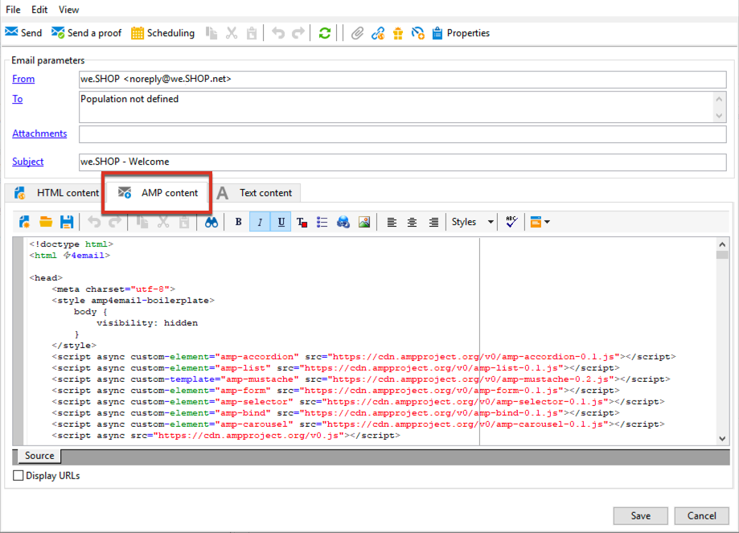
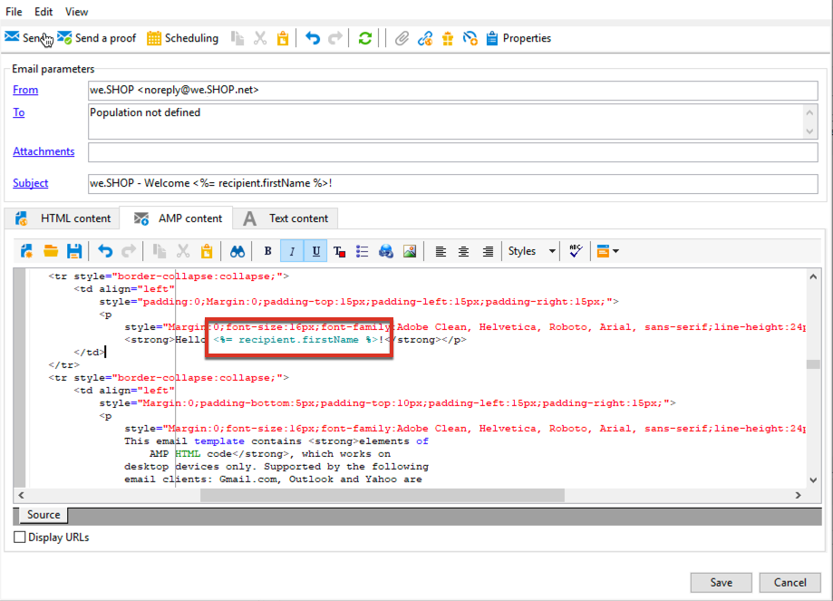

# Define interactive content{#defining-interactive-content}

Adobe Campaign enables you to use the interactive [AMP for Email](https://amp.dev/about/email/) format, which enables to send dynamic emails, under certain conditions.

With AMP for Email, you can:
* Test delivering AMP emails to specific addresses appropriately configured.
* Deliver AMP emails to Gmail or Mail.ru addresses after registering with the corresponding providers.

For more on testing and sending AMP emails, see [this section](#targeting-amp-email).

This feature is available through a dedicated package in Adobe Campaign. Depending on your permissions and your deployment model,you can install this package or reach out to Adobe to install it for you.

## About AMP for Email {#about-amp-for-email}

Use the **AMP for Email** new format to include AMP components in your messages and improve the email experience with a rich and actionable content. With modern app functionality directly available within emails, recipients can interact dynamically with content in the message itself.

For example:
* Emails written with AMP can contain interactive elements such as image carousels.
* Content stays up-to-date in the message.
* Recipients can respond to a form without leaving their inbox.

AMP for Email is compatible with existing emails. The AMP version of the message is embedded into the email as a new MIME part, in addition to the HTML and/or plain text, ensuring compatibility across all email clients.

For more on the AMP for Email format, specification and requirements, see the [AMP developer documentation](https://amp.dev/documentation/guides-and-tutorials/learn/email-spec/amp-email-format/?format=email).

 [Discover this feature in video](#amp-email-video)

## Key steps to use AMP for Email with Adobe Campaign {#key-steps-to-use-amp}

To successfully test and send an AMP email with Adobe Campaign, follow the steps below:
1. Create an email and build your AMP content within Adobe Campaign. See [Build AMP email content with Adobe Campaign](#build-amp-email-content).
1. Make sure you follow all the delivery requirements from the email providers supporting the AMP format. See [AMP for Email delivery requirements](#amp-for-email-delivery-requirements).
1. When defining your target, make sure you select recipients that will be able to display the AMP format. See [Targeting an AMP email](#targeting-amp-email).

    >[!NOTE]
    >
    >Currently you can only deliver AMP emails to [specific email addresses](#testing-amp-delivery-for-selected-addresses) (for testing purpose) or after [registration](#delivering-amp-emails-by-registering) with the supported email clients.

1. Send your email as you would usually do. See [Sending an AMP email](#sending-amp-email).

## Build AMP email content in Adobe Campaign {#build-amp-email-content}

To build an email using the AMP format, follow the steps below.

>[!IMPORTANT]
>
>Make sure you follow the AMP for Email requirements and specifications detailed in the [AMP developer documentation](https://amp.dev/documentation/guides-and-tutorials/learn/email_fundamentals/?format=email). You can also consult the [AMP for Email best practices](https://amp.dev/documentation/guides-and-tutorials/develop/amp_email_best_practices/?format=email).

1. When creating your email delivery, select any template.

    >[!NOTE]
    >
    >A specific AMP template contains an example of the main capacities you can use: product listing, carousel, double opt-in, survey, and advanced server request.

1. Click the **[!UICONTROL AMP content]** tab.

    

1. Edit the AMP content to suit your needs. 

    >[!NOTE]
    >
    >For more on building your first AMP email, see the [AMP developer documentation](https://amp.dev/documentation/guides-and-tutorials/start/create_email/?format=email).

    For example,  you can use the product list component from the AMP template and maintain a list of products from a third-party system, or even inside Adobe Campaign. Whenever you adjust a price or another element, it is automatically reflected when recipients open the email from their mailbox.

1. Personalize your AMP content as needed, as you would usually do with HTML format in Adobe Campaign, with personalization fields and personalization blocks.

    

1. Once done with editing, select your whole AMP content and copy-paste it into the [AMP web-based validator](https://validator.ampproject.org) or a similar website.

    >[!NOTE]
    >
    >Make sure you select **AMP4 EMAIL** from the drop-down list on top of the screen.

    

    Errors are flagged inline.

    >[!NOTE]
    >
    >The Adobe Campaign AMP editor is not designed for content validation. Use an external website such as the [AMP web-based validator](https://validator.ampproject.org) to check that your content is correct.

1. Make amendments as needed until the AMP content passes validation.

    

1. To preview your content, copy-paste your validated content into [AMP Playground](https://playground.amp.dev) or a similar website.

    >[!NOTE]
    >
    >Make sure you select **AMP for Email** from the drop-down list on top of the screen.

    

    >[!NOTE]
    >
    >You cannot preview your AMP content directly in Adobe Campaign. Use an external website such as [AMP Playground](https://playground.amp.dev).

1. Go back to Adobe Campaign and copy-paste your validated content into the **[!UICONTROL AMP content]** tab.

1. Switch to the **[!UICONTROL HTML content]** or **[!UICONTROL Text content]** tab and define content for at least one of these two formats.

    >[!IMPORTANT]
    >
    >If your email does not contain an HTML or plain text version in addition to the AMP content, it cannot be sent.

## AMP for Email delivery requirements {#amp-for-email-delivery-requirements}

When building your AMP content in Adobe Campaign, you must comply with the conditions for a dynamic email to be delivered, which are specific to your recipients' email providers.

Currently two email providers support testing this format: Gmail and Mail.ru.

All the steps and specifications required to test delivery with AMP format on Gmail accounts are detailed in the corresponding [Gmail](https://developers.google.com/gmail/ampemail?), and [Mail.ru](https://postmaster.mail.ru/amp) developer documentations.

In particular, the following requirements must be met:
* Follow the AMP security requirements specific to [Gmail](https://developers.google.com/gmail/ampemail/security-requirements), and [Mail.ru](https://postmaster.mail.ru/amp/#howto).
* The AMP MIME part must contain a [valid AMP document](https://amp.dev/documentation/guides-and-tutorials/learn/validation-workflow/validate_emails/?format=email).
* The AMP MIME part must be smaller than 100KB.

You can also consult the [Tips and known limitations for Gmail](https://developers.google.com/gmail/ampemail/tips) documentation.

## Target an AMP email {#targeting-amp-email}

Currently you can experiment sending an AMP email in two steps:

1. Adobe Campaign enables you to test delivering an AMP-powered dynamic email to selected email addresses appropriately configured, in order to verify its contents and behavior. See [Testing AMP email delivery for selected addresses](#testing-amp-delivery-for-selected-addresses).

1. Once tested, you can send a delivery or a campaign as part of the AMP for Email program by registering with the relevant email provider(s) to have your sender domain added to the allowlist. See [Delivering AMP emails by registering with an email provider](#delivering-amp-emails-by-registering).

### Testing AMP email delivery for selected addresses {#testing-amp-delivery-for-selected-addresses}

You can test sending dynamic messages from Adobe Campaign to selected email addresses.

>[!NOTE]
>
>Only Gmail and Mail.ru support testing the AMP format.

For Gmail, you must first add the sender address(es) you are using to the allowlist to deliver from Adobe Campaign for the Gmail accounts you are targeting.

To do this:
1. Make sure the option enabling dynamic email is checked for the relevant email provider(s).
1. Copy the sender address displayed in the delivery's **[!UICONTROL From]** field and paste it into your email provider account settings' appropriate section.

For further details, consult the [Gmail](https://developers.google.com/gmail/ampemail/testing-dynamic-email) developer documentation.

To test sending an AMP email to a Mail.ru address, follow the steps from the [Mail.ru developer documentation](https://postmaster.mail.ru/amp/#howto) (**If you are a user** section).

### Delivering AMP emails by registering with an email provider {#delivering-amp-emails-by-registering}

 You can experiment delivering dynamic emails by registering with the supported email providers in order to have your sender domain added to the allowlist.

>[!NOTE]
>
>Only Gmail and Mail.ru support the AMP format.

Once tested with a few addresses, you can send AMP emails to any Gmail address. To do this, you must register with Google, and await their answer. Follow the steps presented in the [Gmail](https://developers.google.com/gmail/ampemail/register) developer documentation. After successful registration, you become an authorized sender.

To send AMP emails to Mail.ru addresses, follow the requirements and steps listed in the [Mail.ru developer documentation](https://postmaster.mail.ru/amp/#howto) (**If you are an Email sender** section).

## Send an AMP email {#sending-amp-email}

Once your AMP content and fallback are ready, and once you defined a compatible target, you can send the email as you would normally do.

Currently only Gmail and Mail.ru support the AMP format, under certain conditions. You can target addresses from other email providers, but they will receive the HTML or plain text version of your email.

>[!IMPORTANT]
>
>If your email does not contain an HTML or plain text version in addition to the AMP content, it cannot be sent.

The matching recipients will have the AMP version of the email displayed in their mailbox.

For example, if you included a product list in your email, when editing the prices in a third-party system, the prices will be automatically adjusted each time your recipients open the email again in their mailbox.

>[!NOTE]
>
>By default the **[!UICONTROL AMP inclusion]** option is set to **[!UICONTROL No]**.

## Tutorial video {#amp-email-video}

The video below explains how to activate AMP in Adobe Campaign and showcases the usage.

>[!VIDEO](https://video.tv.adobe.com/v/29940?quality=12&learn=on)
