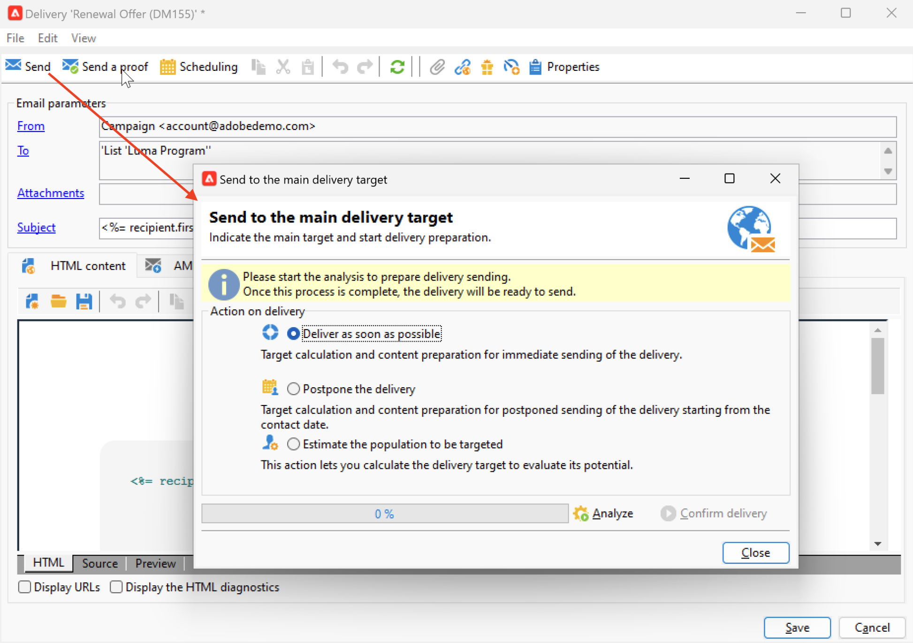

# Delivery analysis {#analyze-delivery}

The analysis is the delivery preparation step. It can be started once your target audience is defined, and the message content is ready and tested. During delivery analysis, the target population is calculated and the delivery content is prepared. Once it is complete, the delivery is ready to be sent.

### Start the analysis {#start-the-analysis}

To prepare the the delivery, make sure the delivery content and target have been defined, and follow the steps below:

1. From the delivery windows, click the **[!UICONTROL Send]** button.
1. Select **[!UICONTROL Deliver as soon as possible]** to perform the audience calculation, and content preparation for an immediate sending. You can also postpone the delivery to a later date, or get an estimation of the population without preparing the content.

   

1. Click **[!UICONTROL Analyze]** to launch the analysis manually. The progress bar shows the progress of the analysis.

    A set checking rules is applied during the delivery analysis. These rules are defined in a **typology**, which is selected in the **[!UICONTROL Typology]** tab in the delivery properties. Learn more about typologies in [this section](../../automation/campaign-opt/campaign-typologies.md).
    
    By default, for emails, the analysis covers the following points:

    * Approving the object
    * Approving the URLs and images
    * Approving the URL labels
    * Approving the unsubscription link
    * Checking the size of proofs
    * Checking the validity period
    * Checking the scheduling of waves

1. You can stop the analysis at any time by clicking the **[!UICONTROL Stop]** button.

   No messages are sent during the preparation phase. You can therefore start or cancel the analysis without risk.

   >[!IMPORTANT]
   >
   >When running, the analysis freezes the delivery (or proof). Any change to the delivery (or proof) must be followed by another analysis before becoming applicable.

When the analysis finishes, the upper section of the window indicates if the delivery preparation is complete or if any errors occurred. All the validation steps, warnings and errors are listed. Colored icons show the message type:

* A blue icon indicates an informative message.
* A yellow icon indicates a non-critical processing error.
* A red icon indicates a critical error that prevents sending the delivery.

   {width="800" align="left"}

1. Click **[!UICONTROL Close]** to correct the errors if any. After making the changes, restart the analysis clicking **[!UICONTROL Analyze]**.

    >[!NOTE]
    >
    >Click the **[!UICONTROL Change the main delivery target]** link if the number of messages to send does not match your expectations. This option lets you change the definition of the target population and re-start the analysis.
    >

1. After checking the result of the analysis,  click **[!UICONTROL Confirm delivery]** to send the message to the main target. 

### Analysis settings {#analysis-settings}

Browse to the **[!UICONTROL Analysis]** tab of the delivery properties to define settings for the message preparation during the analysis phase.

{width="800" align="left"}

This tab gives access to the following options:

* **[!UICONTROL Label and code of the delivery]** : the options in this section are used to calculate the values of these fields during the delivery analysis phase. The **[!UICONTROL Compute the execution folder during the delivery analysis]** field computes the name of the folder that will contain this delivery action during the analysis phase.

* **[!UICONTROL Approval mode]** : this field lets you define manual or automatic delivery once analysis is complete. 

    If warnings are generated during the analysis (e.g., if certain characters are accentuated in the subject of the delivery, etc.), you can configure the delivery to define whether or not it should still be executed. By default, the user must confirm the sending of messages at the end of the analysis phase: this is **manual** validation.

    Select another approval mode from the drop-down list in the appropriate field.

    The following approval modes are available:

    * **[!UICONTROL Manual]**: At the end of the analysis phase, the user must confirm delivery to start sending. To do this, click the **[!UICONTROL Start]** button to launch the delivery.
    * **[!UICONTROL Semi-automatic]**: Sending begins automatically if the analysis phase generates no warning messages.
    * **[!UICONTROL Automatic]**: Sending begins automatically at the end of the analysis phase irrespective of its result.

* **[!UICONTROL Start job in a detached process]** : this option lets you start the delivery analysis in a separate process. The analysis function uses the Adobe Campaign application server process (web nlserver) by default. By selecting this option, you ensure that the analysis will be completed even in the event of application server failure.
* **[!UICONTROL Log SQL queries generated during the analysis in the journal]** : this option adds the SQL query logs to the delivery journal during the analysis phase.
* **[!UICONTROL Ignore personalization scripts during sending]** : this option lets you bypass the interpretation of JavaScript directives found in HTML content. They will be displayed as is in the delivered contents. These directives are introduced with the `<%=` tag.

