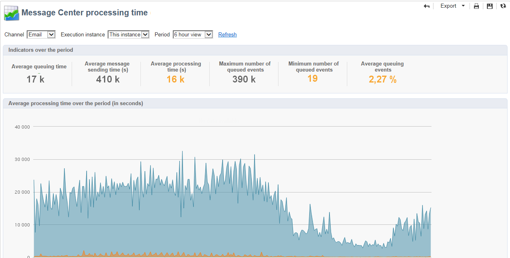

# Send and monitor transactional messages {#delivery-execution}

## Send messages{#send-transactional-msg}

Once the enrichment is complete and a delivery template has been linked to the event, the delivery is sent from the execution instance.

>[!NOTE]
>
>The transactional messages are prioritized over any other delivery.

All deliveries are grouped in the **[!UICONTROL Administration > Production > Message Center > Default > Deliveries]** folder.

By default, they are sorted into sub-folders by delivery month. This can be changed in the message template properties.

## Monitor messages {#monitor-transactional-msg}

To monitor your transactional messages, check the [delivery logs](send.md).

The transactional deliveries sent from the execution instance are synchronized back to the control instance through a technical workflow (**[!UICONTROL Message Center execution instance]**) that runs every hour.
 
>[!NOTE]
>
>The deliveries weekly accumulate the events based on the latest event update, and not on the event creation date. Therefore, when extracting transactional messaging delivery logs from the control instance, the delivery ID associated with each delivery log ID may change over time as the log is updated (for example, when an inbound bounce is received for the event).

<!--
To monitor the activity and running of the execution instance(s), see [Transactional messaging reports](transactional-messaging-reports.md).-->

## Reporting{#reporting-transactional-msg}

Adobe Campaign offers several reports that allow you to control the activity and smooth running of the execution instances.

These Message Center reports can be accessed from the **[!UICONTROL Reports]** tab of the **control instance**. 

### Message Center event history {#history-events}

The **[!UICONTROL Message Center event history]** report displays an overview of the Message Center module activity, i.e. the number of events processed and delivered as transactional messages.

When the report is opened, the information displayed by default coincides with the rate of successfully sent transactional messages. To view more levels, you can open the various nodes and place your cursor on the appropriate level to select it. 

You can view the data specific to each event type, per time period. The **[!UICONTROL Events]** column corresponds to the number of events received per control instance. The number of events transformed into personalized transactional messages is detailed in the **[!UICONTROL Sent]** column.

### Message Center processing time {#processing-time}

The **[!UICONTROL Message Center processing time]** report displays the main indicators related to the real time queue. This report can also be accessed via the **[!UICONTROL Monitoring]** tab on the control instance.

You can choose to display global statistics or those relative to a particular execution instance. You can also filter the data by channel and over a specific period.

The indicators displayed in the **[!UICONTROL Indicators over the period]** section are calculated over the period selected:

* **[!UICONTROL Average queuing time]**: the average time that successfully processed events spent in Message Center. Only the processing time is taken into account.
* **[!UICONTROL Average message sending time (s)]**: the average time that successfully processed events spent in Message Center. Only the mta delivery time is taken into account.
* **[!UICONTROL Average processing time (s)]**: the average time that successfully processed events spent in Message Center. The calculation takes the processing time and the mta sending time into account.
* **[!UICONTROL Maximum number of queued events]**: maximum number of events present in the Message Center queue at any given moment.
* **[!UICONTROL Minimum number of queued events]**: minimum number of events present in the Message Center queue at any given moment.
* **[!UICONTROL Average number of queued events]**: average number of events present in the Message Center queue at any given moment.

>[!NOTE]
>
>The warning (orange) and alert (red) indicator thresholds can be configured in Adobe Campaign deployment wizard. Refer to [Monitor thresholds](#thresholds).

### Message Center service level {#service-level}

The **[!UICONTROL Message Center service level]** report displays the delivery statistics related to transactional messages as well as the breakdown of errors. You can click on an error type to display its details.

This report can also be accessed via the **[!UICONTROL Monitoring]** tab on the control instance.

You can choose to display global statistics or those relative to a particular execution instance. You can also filter the data by channel and over a specific period.

The indicators displayed in the **[!UICONTROL Indicators over the period]** section are calculated over the period selected:

* **[!UICONTROL Incoming (throughput event/h)]**: average hourly number of events entered in the Message Center queue.
* **[!UICONTROL Incoming (event vol)]**: number of events entered in the Message Center queue.
* **[!UICONTROL Outgoing (throughput msg/h)]**: average hourly number of successful outgoing Message Center events (sent by a delivery).
* **[!UICONTROL Outgoing (msg vol)]**: number of successful outgoing Message Center events (sent by a delivery).
* **[!UICONTROL Average sending time (seconds)]**: average time spent in Message Center for successfully processed events. The calculation takes the processing time and the mta sending time into account.
* **[!UICONTROL Error rate]**: number of events with errors compared to the number of events that have entered the Message Center queue. The following errors are taken into account: routing error, expired event (event that has been in the queue too long), delivery error, ignored by the delivery (quarantine, etc.).

>[!NOTE]
>
>The warning (orange) and alert (red) indicator thresholds can be configured in Adobe Campaign deployment wizard. Refer to [Monitor thresholds](#thresholds).

### Monitor thresholds {#thresholds}

You can configure the warning (orange) and alert (red) thresholds of the indicators that appear in the **Message Center service level** and **Message Center processing time** reports.

To do this, follow the steps below:

1. Open the deployment wizard on the **execution instance**, and browse to the **[!UICONTROL Message Center]** page.
1. Use the arrows to change the thresholds.

    
