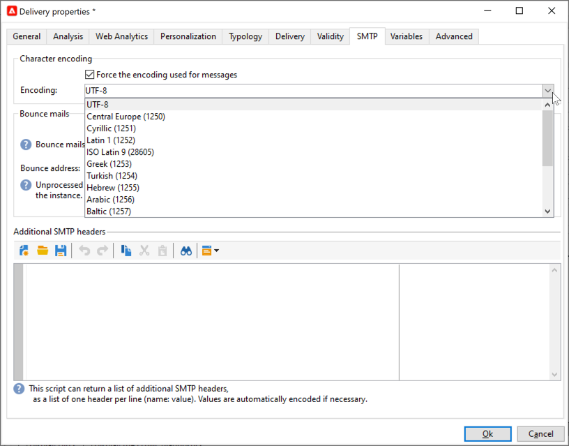

# Email parameters {#email-parameters}

This section presents the options and parameters available from the delivery properties that are specific to email delivery.

## Use Email BCC {#email-bcc}

<!--
>[!NOTE]
>
>This capability is available starting Campaign v8.3. To check your version, refer to [this section](../start/compatibility-matrix.md#how-to-check-your-campaign-version-and-buildversion)-->

You can configure Adobe Campaign to keep a copy of emails sent from your platform.

Adobe Campaign itself does not manage archived files. It does allow you to send the messages of your choice to a dedicated BCC (blind carbon copy) email address, from where they can be processed and archived using an external system. The .eml files corresponding to the sent emails can then be transferred to a remote server, such as an SMTP email server.

>[!CAUTION]
>
>For privacy reasons, BCC emails must be processed by an archiving system capable of storing securely personally identifiable information (PII).

The archiving destination is the BCC email address of your choice, which will remain invisible to the delivery recipients.

  As a Managed Cloud Services user, [contact Adobe](../start/campaign-faq.md#support){target="_blank"} to communicate the BCC email address to be used for archiving.

Once the BCC email address is defined, you must enable the dedicated option at the delivery level.

>[!CAUTION]
>
>**[!UICONTROL Email BCC]** is not enabled by default. You need to enable it manually in the email delivery or delivery template.

To do this, follow the steps below:

1. Go to **[!UICONTROL Campaign Management]** > **[!UICONTROL Deliveries]**, or **[!UICONTROL Resources]** > **[!UICONTROL Templates]** > **[!UICONTROL Delivery templates]**.
1. Select the delivery of your choice or duplicate the out-of-the-box **[!UICONTROL Email delivery]** template, then select the duplicated template.
1. Click the **[!UICONTROL Properties]** button.
1. Select the **[!UICONTROL Delivery]** tab.
1. Check the **[!UICONTROL Email BCC]** option.

    

1. Select **[!UICONTROL Ok]**.

A copy of all sent messages for each delivery based on this template will be sent to the email BCC address which has been configured.

Note the following specificities and recommendations:

* You can only use one BCC email address.

* Make sure the BCC address has enough reception capacity to archive all the emails that are sent.

* Email BCC <!--with Enhanced MTA--> delivers to the BCC email address before delivering to the recipients, which can result in BCC messages being sent even though the original deliveries may have bounced. For more on bounces, see [Understand delivery failures](delivery-failures.md).

* If the emails sent to the BCC address are opened and clicked through, this will be taken into account in the **[!UICONTROL Total opens]** and **[!UICONTROL Clicks]** from the send analysis, which could cause some miscalculations.

<!--Only successfully sent emails are taken in account, bounces are not.-->

## Select message formats {#selecting-message-formats}

You can change the format of email messages sent. To do this, edit the delivery properties and click the **[!UICONTROL Delivery]** tab.

Select the format of the email in the lower section of the window:

* **[!UICONTROL Use recipient preferences]** (default mode)

  The message format is defined according to the data stored in the recipient profile and stored by default in the **[!UICONTROL email format]** field (@emailFormat). If a recipient wishes to receive messages in a certain format, this is the format sent. If the field is not filled in, a multipart-alternative message is sent (see below).

* **[!UICONTROL Let recipient mail client choose the most appropriate format]**

  The message contains both formats: text and HTML. The format displayed on reception depends on the configuration of the recipient's mail software (multipart-alternative).

  >[!IMPORTANT]
  >
  >This option includes both versions of the document. It therefore reduces the delivery throughput, because the message size is greater.

* **[!UICONTROL Send all messages in text format]**

  The message is sent in text format. HTML format will not be sent, but used for the mirror page only when the recipient clicks on the message.

<!--
>[!NOTE]
>
>For more on defining the email content, see [this section]().-->

## Set character encoding {#character-encoding}

In the **[!UICONTROL SMTP]** tab of the delivery parameters, the **[!UICONTROL Character encoding]** section allows you to set a specific encoding.

The default encoding is UTF-8. If some of your recipients' email providers do not support the UTF-8 standard encoding, you may want to set a specific encoding to properly display the special characters to your emails' recipients.

For example, you want to send an email containing Japanese characters. To make sure that all characters will be correctly displayed to your recipients in Japan, you may want to use an encoding that will support the Japanese characters rather than the standard UTF-8.

To do this, select the **[!UICONTROL Force the encoding used for messages]** option in the **[!UICONTROL Character encoding]** section and choose an encoding from the drop-down list that is displayed.

## Manage bounce emails {#managing-bounce-emails}

The **[!UICONTROL SMTP]** tab of the delivery properties lets you also configure the management of bounce mails.

* **[!UICONTROL Errors-to-address]**: By default, bounced emails are received in the default error box of the platform, but you can define a specific error address for a delivery.

* **[!UICONTROL Bounce address]**: You can also define another address to which the unprocessed bounced emails are forwarded. This address allows to investigate the reasons for bouncing when emails could not be automatically qualified by the application.

Each of these fields can be personalized using the dedicated icon. Learn more on personalization fields in [this section](personalization-fields.md).

For more on bounce mail management, see [this section](delivery-failures.md#bounce-mail-management).

## Add SMTP headers {#adding-smtp-headers}

It is possible to add SMTP headers to your deliveries. To do this, use the relevant section of the **[!UICONTROL SMTP]** tab in the delivery.

The script entered in this window must reference one header per line in the following form: **name:value**.

Values are encoded automatically if necessary.

>[!IMPORTANT]
>
>Adding a script for inserting additional SMTP headers is reserved for advanced users.
>
>The syntax of this script must comply with the requirements of this content type: no unused space, no empty line, etc.

<!--
## Generate mirror page {#generating-mirror-page}

The mirror page is an HTML page accessible online via a web browser. Its content is identical to the email. It can be useful if your recipients are experiencing rendering issues or broken images when trying to view your email in their inbox.

Learn how to insert a link to the mirror page in [this section](mirror-page.md).-->
