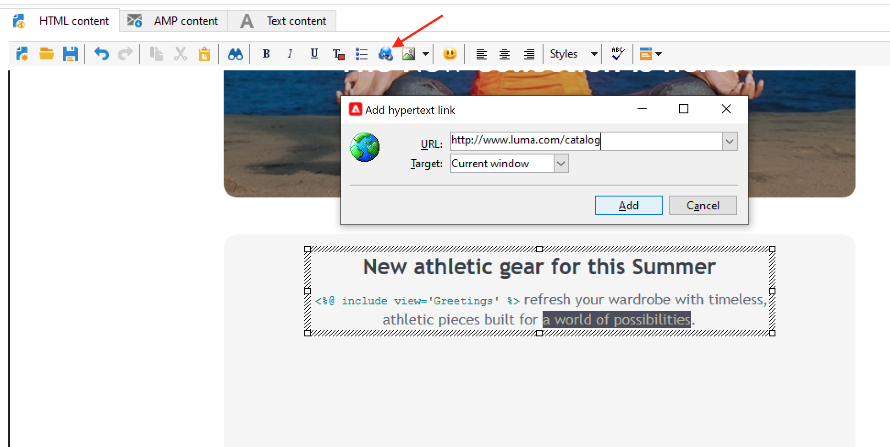

# Design and send emails

Email deliveries let you send personalized emails to the target population. 

 Learn more in [Campaign Classic v7 documentation](https://experienceleague.adobe.com/docs/campaign-classic/using/sending-messages/sending-emails/about-email-channel.html){target="_blank"}

## Create your first email delivery

Create personalized and contextually relevant emails that are consistent with the rest of the customer experience.

In the following sample, you will learn steps to design an email delivery in Adobe Campaign which contains personalized data, links to an external URL, and a link to the mirror page.

1. **Create the delivery**

   To create a new delivery, browse to the **Campaigns** tab, click **Deliveries** and click the **Create** button above the list of existing deliveries.
   
   

1. **Select the template**

   Select a delivery template, then name your delivery. This name will only be visible to users of the Adobe Campaign console and not by your recipients, however this heading will be displayed in your list of deliveries. Click **[!UICONTROL Continue]**.

   

1. **Import your content**

   Click the **Source** tab to paste your HTML content.
   
   

1. **Personalize your message**

   * Add the first and last names of your recipients

      To insert the first and last names of the targeted profiles in the content of the message, place the cursor where you want to insert them, and click the last icon in the toolbar, then click **[!UICONTROL Include]** and select **[!UICONTROL Greetings]**.

      

      Browse to the Preview tab to check personalization by selecting a recipient.
   
      

   * Insert a tracked link

      To take delivery recipients to an external address via an image or a text, select it and click the **[!UICONTROL Add a link]** icon in the toolbar.

      Enter the URL for the link in the **URL** field using the following format **https://www.myURL.com**, then confirm.

      

   * Add a mirror page

      To allow your recipients to view your delivery content in a web browser, add a link to the mirror page of your message.

      Place the cursor where you want to insert this link, and click the last icon in the toolbar, then click **[!UICONTROL Include]** and select **[!UICONTROL link to mirror page]**.

   Once the content is ready, click **Save**: it will now be displayed in your list of deliveries, in the **[!UICONTROL Campaigns > Deliveries]** tab. Your first email delivery is ready. You now need to define the audience, validate the delivery and send it.

Learn hhow to import an email content in this [use case](https://experienceleague-review.corp.adobe.com/docs/campaign/automation/workflows/use-cases/deliveries/load-delivery-content.html).

Learn more in these sections of **Campaign Classic v7 documentation**:

* Design an email in Campaign
    [Learn how to design an email](https://experienceleague.adobe.com/docs/campaign-classic/using/sending-messages/sending-emails/defining-the-email-content.html){target="_blank"}
* Create and use an email template
    [Learn more about email templates](https://experienceleague.adobe.com/docs/campaign-classic/using/sending-messages/using-delivery-templates/about-templates.html){target="_blank"}
* Select the audience of your email
    [Learn how to define the target population](https://experienceleague.adobe.com/docs/campaign-classic/using/sending-messages/key-steps-when-creating-a-delivery/steps-defining-the-target-population.html){target="_blank"}
* Validate a delivery and send proofs
    [Learn key steps to validate a delivery](https://experienceleague.adobe.com/docs/campaign-classic/using/sending-messages/key-steps-when-creating-a-delivery/steps-validating-the-delivery.html){target="_blank"}
* Add [seed addresses](https://experienceleague.adobe.com/docs/campaign-classic/using/sending-messages/using-seed-addresses/about-seed-addresses.html){target="_blank"}

## Test and validate your emails

Campaign offers several ways to test and validate your emails before sending them to your audiences.

 [Apply best practices listed in Campaign Classic v7 documentation](https://experienceleague.adobe.com/docs/campaign-classic/using/sending-messages/key-steps-when-creating-a-delivery/delivery-bestpractices/check-before-sending.html){target="_blank"}

You can:

* Check delivery analysis logs
* Send proofs
* Add seed addresses
* Use control groups
* Check email rendering

 [Learn more in Campaign Classic v7 documentation](https://experienceleague.adobe.com/docs/campaign-classic/using/sending-messages/key-steps-when-creating-a-delivery/steps-validating-the-delivery.html){target="_blank"}
