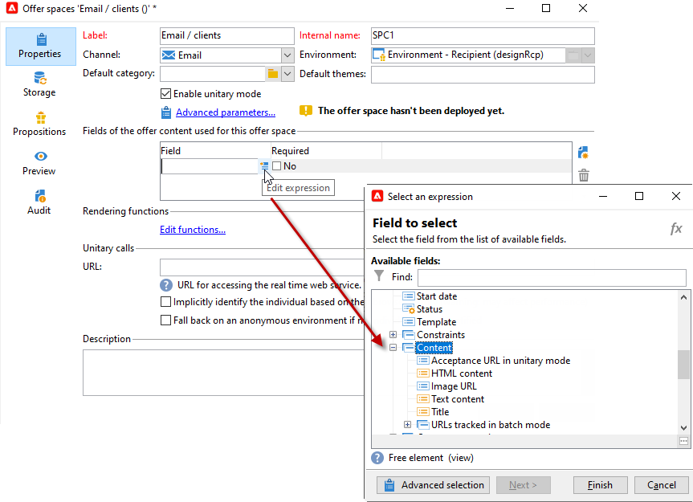

# Creating offer spaces{#creating-offer-spaces}

The content of the offer catalog is configured in offer spaces. By default, the content can include the following fields: **[!UICONTROL Title]**, **[!UICONTROL Destination URL]**, **[!UICONTROL Image URL]**, **[!UICONTROL HTML content]** and **[!UICONTROL Text content]**. The field sequence is configured in the offer space.

As a **technical administrator**, you can create offer spaces in the Design environment. You need to have access to the offer space sub-folder. Once created, these offer spaces are automatically duplicated into the Live environment during offer approval.

The HTML rendering is created via a rendering function. The sequence of the fields defined in the rendering function must be identical to the sequence configured in the content.


To create a new offer space, follow the steps below:

1. From the list of offer spaces, click **[!UICONTROL New]**.

   

1. Select the channel you want to use and change the label of the offer space.

   

1. Check the **[!UICONTROL Enable unitary mode]** option

1. Go to the **[!UICONTROL Content field]** window and click **[!UICONTROL Add]**.

   

1. Go to the **[!UICONTROL Content]** node and select the fields in the following order: **[!UICONTROL Title]**, then **[!UICONTROL Image URL]**, then **[!UICONTROL HTML content]**, then **[!UICONTROL Destination URL]**.

   

1. Check the **[!UICONTROL Required]** option to make each field mandatory.

   >[!NOTE]
   >
   >This option is used at the preview and makes offer spaces invalid when publishing if one of the mandatory field is missing from the offer. However, if an offer is already live on an offer space, these criteria are not taken into account.

   

1. Click **[!UICONTROL Edit functions]** to create a rendering function.

   These functions are used to generate offer representations on an offer space. There are several possible formats: HTML or text.
   
    **Note** -  XML format is restricted to inbound interactions which are temporary unavailable. [Learn more](../start/capability-matrix.md#gs-unavailable-features)

   _

1. Go to the **[!UICONTROL HTML rendering]** tab and select **[!UICONTROL Overload the HTML rendering function]**.
1. Insert your rendering function.

   

## Offer proposition statuses {#offer-proposition-statuses}

The offer proposition status varies depending on the interactions with the targeted population. Campaign Interaction module comes with a set of values that can be applied to the offer proposition throughout its life cycle. You need to configure the platform so that the status changes when the offer proposition is created and accepted.

>[!NOTE]
>
>Status update is an asynchronous process. It is carried out by the tracking workflow which is triggered every hour.

### Offer status list {#status-list}

Available offer statuses are:

* **[!UICONTROL Accepted]**
* **[!UICONTROL Scheduled]**
* **[!UICONTROL Generated]**
* **[!UICONTROL Interested]**
* **[!UICONTROL Presented]**
* **[!UICONTROL Rejected]**

These values are not applied by default: they have to be configured.

>[!NOTE]
>
>The status of an offer proposition will automatically be changed to "Presented" if the offer is linked to a delivery with the "Sent" status.

### Offer status when the proposition is created {#configuring-the-status-when-the-proposition-is-created}

When an offer proposition is **created**, its status is updated. 

In the **[!UICONTROL Design]** environment, for each offer space, configure the status to apply when a proposition is created, depending on the information you want to display in the offer reports.

To do this, follow the steps below:

1. Go to the **[!UICONTROL Storage]** tab of the desired space.
1. Select the status to apply to the proposition when it is created.

   

### Offer status when the proposition is accepted {#configuring-the-status-when-the-proposition-is-accepted}

Once an offer proposition has been **accepted**, use one of the values provided by default to configure the proposition's new status. The update is applied when a recipient clicks on a link in the offer.

To do this, follow the steps below:

1. Go to the **[!UICONTROL Storage]** tab of the desired space.
1. Select the status that you want to apply to the proposition when it is accepted.

   

<!--
**Inbound interaction**

The **[!UICONTROL Storage]** tab lets you define statuses for **proposed** and **accepted** offer propositions only. For inbound interaction, the status of offer propositions should be specified directly in the URL for calling the offer engine, rather than through the interface. This way, you will be able to specify which status to apply in other cases, for example if an offer proposition is rejected.

```
<BASE_URL>?a=UpdateStatus&p=<PRIMARY_KEY_OF_THE_PROPOSITION>&st=<NEW_STATUS_OF_THE_PROPOSITION>&r=<REDIRECT_URL>
```

For instance, the proposition (identifier **40004**) that matches the **Home insurance** offer displayed on the **Neobank** site contains the following URL:

```
<BASE_URL>?a=UpdateStatus&p=<40004>&st=<3>&r=<"http://www.neobank.com/insurance/subscribe.html">
```

As soon as a visitor clicks the offer, and therefore the URL, the **[!UICONTROL Accepted]** status (value **3**) is applied to the proposition and the visitor is redirected to a new page of the **Neobank** site to take out the insurance contract.

>[!NOTE]
>
>If you want to specify another status in the url (for example if an offer proposition is rejected), use the value corresponding to the desired status. Example: **[!UICONTROL Rejected]** = "5", **[!UICONTROL Presented]** = "1" and so on.
>
>Statuses and their values can be retrieved in the **[!UICONTROL Offer propositions (nms)]** data schema. For more on this, refer to [this page](../../configuration/using/data-schemas.md).

**Outbound interaction**
--> 

You can automatically apply the **[!UICONTROL Interested]** status to an offer proposition when the delivery contains a link. Simply add the **_urlType="11"** value to the link:

```
<a _urlType="11" href="<DEST_URL>">Link inserted into the delivery</a>
```

## Offer preview per space {#offer-preview-per-space}

In the **[!UICONTROL Preview]** tab, you can view the offers for which the recipient is eligible via a chosen method. In the example below, the recipient is eligible for three offer proposals via mail.


If a recipient is not eligible for any offers, this is shown in the preview.


<!--
The preview can ignore contexts when they are restricted to a space. This is the case when the interaction schema has been extended to add fields referenced in a space using an inbound channel (for more on this, refer to Extension example.
-->
