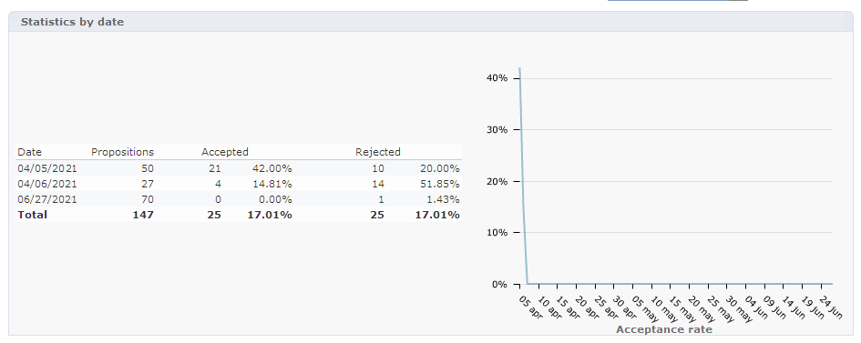

# Real-time interaction history and reporting

>[!NOTE]
>
>These functionalities are only visible online and only to the **Delivery managers**.

## Offer proposition history{#offer-proposition-history}

Once your offer propositions have been made, you can view the presentation history.

* At the offer level, in the **[!UICONTROL Edit]** tab, click **[!UICONTROL Propositions]**.

  

* From a recipient's profile, click the **[!UICONTROL Propositions]** tab.

  

* At the offer space level, click the **[!UICONTROL Propositions]** tab.

  

## Offer analysis report{#offer-analysis-report}

The **[!UICONTROL Offer analysis]** report provides you with an overview of the number of accepted or rejected propositions.

Statistics are sorted based on three criteria:

* By date:

  

* By space:

  

* By deliveries:

  

Data can be filtered based on the various criteria available in the upper section of the report. Once you have selected the desired criteria, click the **[!UICONTROL Refresh]** link to apply them to the report. 
