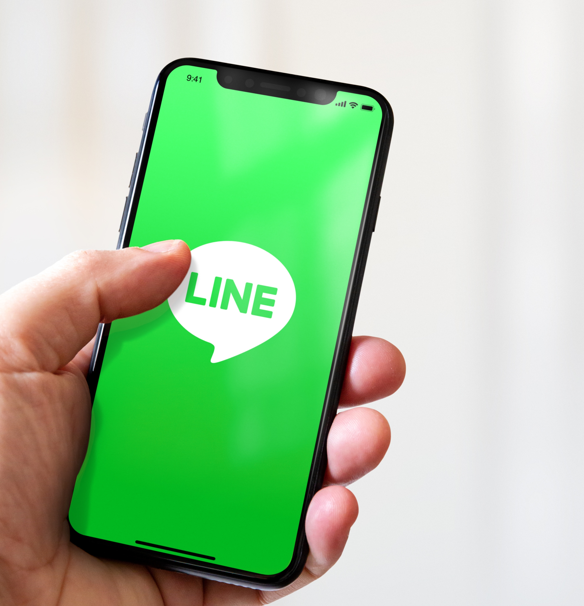

# Create LINE deliveries

LINE is an application for free instant messaging, voice and video calls, available on all mobile devices and on PC. You can use Adobe Campaign to send LINE messages.

Refer to this [end-to-end sample](https://experienceleague.adobe.com/docs/campaign-classic/using/sending-messages/line-channel.html#example--create-and-send-a-personalized-line-message){target="_blank"} in Campaign Classic v7 documentation to create and send your first LINE delivery.

{width="50%" align="left"}

Learn more in [Campaign Classic v7 documentation](https://experienceleague.adobe.com/docs/campaign-classic/using/sending-messages/line-channel.html){target="_blank"}.

