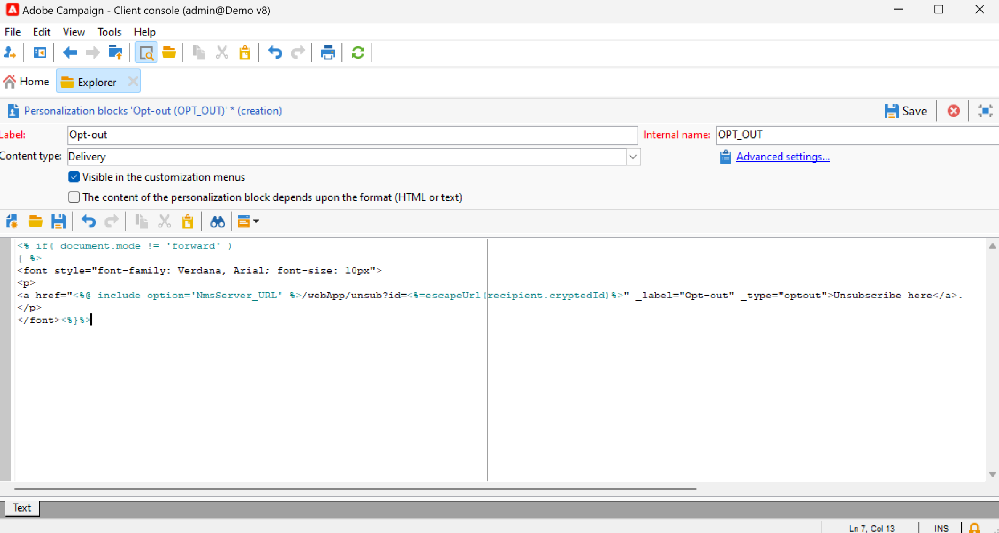

# Use personalization blocks{#personalization-blocks}

Personalization blocks are dynamic content which contain a specific rendering that you can insert into your deliveries. For example, you can add a logo, a greeting message, or a link to a mirror page. 

To access personalized content blocks, browse to the **[!UICONTROL Resources > Campaign Management > Personalization blocks]** node of the explorer. Built-in personalization blocks are listed in [this section](#ootb-personalization-blocks). 

You can also define new blocks to optimize your deliveries personalization. [Learn more](#create-custom-personalization-blocks).

## Insert personalization blocks {#insert-personalization-blocks}

To insert a personalization block in a message, follow the steps below:

1. In the content editor of the delivery wizard, click the personalization icon and select the **[!UICONTROL Include]** menu.
1. Select a personalization block from the list, or click the **[!UICONTROL Other...]** menu to access the full list.

   

1. The personalization block is then inserted as a script. It is automatically adapted to the recipient profile when personalization is generated.
1. Browse to the **[!UICONTROL Preview]** tab and select a recipient to view the content of this block for a specific recipient.

You can include the source code of a personalization block in the delivery content. To do this, select **[!UICONTROL Include the HTML source code of the block]** when selecting it. 

## Built-in personalization blocks {#ootb-personalization-blocks}

Built-in personalization blocks are:

* **[!UICONTROL Enabled by Adobe Campaign]**: inserts the "Enabled by Adobe Campaign" logo.
* **[!UICONTROL Formatting function for proper nouns]**: generates the **[!UICONTROL toSmartCase]** Javascript function, which changes the first letter of each word to uppercase. 
* **[!UICONTROL Greetings]**: inserts greetings with the recipient's full name, followed by a comma. Example: "Hello John Doe,".
* **[!UICONTROL Insert logo]**: inserts a logo which is is defined in the instance settings.
* **[!UICONTROL Link to mirror page]**: inserts a link to the [mirror page](mirror-page.md). Default format is: "If you are unable to view this message correctly, click here".
* **[!UICONTROL Mirror page URL]**: inserts the mirror page URL, enabling Delivery Designers to check the link.
* **[!UICONTROL Offer acceptance URL in unitary mode]**: inserts an URL enabling to set an offer to **[!UICONTROL Accepted]**. (This block is available if the Interaction module is enabled)
* **[!UICONTROL Registration confirmation]**: inserts a link enabling to confirm subscription.
* **[!UICONTROL Registration link]**: inserts a subscription link. This link is defined in the instance settings. The default content is: "To register click here."
* **[!UICONTROL Registration link (with referrer)]**: inserts a subscription link, enabling to identify the visitor and delivery. This link is defined in the instance settings.
* **[!UICONTROL Registration page URL]**: inserts a subscription URL
* **[!UICONTROL Style of content emails]** and **[!UICONTROL Notification style]**: generate code which format an email with predefined HTML styles. 
* **[!UICONTROL Unsubscription link]**: inserts a link enabling to unsubscribe from all deliveries (denylist). The default associated content is: "You are receiving this message because you have been in contact with ***your organization name*** or an affiliate. To no longer receive messages from ***your organization name*** click here."

## Create custom personalization blocks {#create-custom-personalization-blocks}

You can define new personalized content blocks to be inserted from the personalization icon.

To create a personalization block, follow the steps below:

1. Browse to the **[!UICONTROL Resources > Campaign Management > Personalization blocks]** folder of Campaign explorer.
1. Above the list of built-in blocks, click **[!UICONTROL New]**.

   

1. Fill in the settings of the personalization block:

   

    * Enter the label of the block. This label is displayed in the personalization field insertion window.
    * Select a **Delivery** content type.
    * Enable the **[!UICONTROL Visible in the customization menus]** option to make this block accessible from the personalization field insertion icon.
    * If necessary, enable the **[!UICONTROL The content of the personalization block depends upon the format]** optio, to define two different blocks for HTML and Text emails.
    * Enter the content (in HTML, text, JavaScript, etc.) of the personalization block and click **[!UICONTROL Save]**.

Once saved, the new personalization block is available in the delivery editor.

## Tutorial video {#personalization-blocks-video}

Learn how to create dynamic content blocks and how to use them to personalize the content of your email delivery in the following video.

>[!VIDEO](https://video.tv.adobe.com/v/342088?quality=12)

