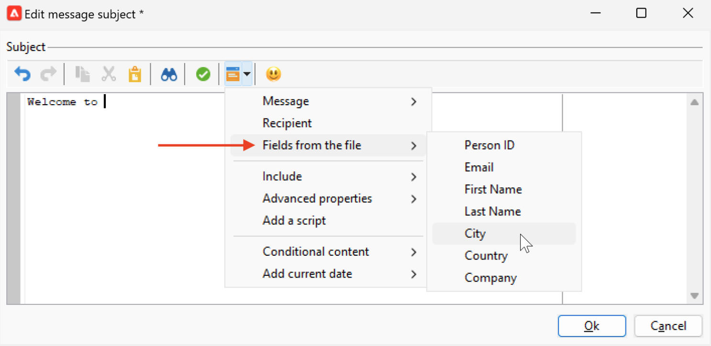

# Personalization data sources{#personalization-data}

Personalization data can be retrieved from various types of sources: Campaign database data source, External file data source, or External database data source.

## Campaign database data source

In the most common case, personalization data is stored in the database. For example 'recipient personalization fields' are all the fields defined in the recipients table, standard fields (typically: last name, first name, address, city, date of birth, etc.) or custom fields.

## External file data source  

You can use an external file containing all the fields defined in columns. This file is used as input during a message delivery definition. You can choose to insert those profiles in the database or not.

To select the file to use as a data source, browse to the To link in the message creation window and select the **Defined in an external file** option. Once the file is loaded, access the recipient data in the personalization options, from the **Fields from the file** entry.

## FDA data source

Personalization data can be pulled out from an external table through [Federated Data Access](../connect/fda.md).  If you want to carry out personalization in your deliveries using data from the external database, collect the data to use in a workflow to make it available in a temporary table. 

To perform this, add a **Query** activity in the targeting workflow and use the **Add data...** link to select the external database. The detailed process is available in [this section](../../automation/workflow/query.md#adding-data).

Then use the data from the temporary table to personalize your delivery. Once the query activity is configured, access the external data in the personalization options, from the **Target extension** entry.

When using external data accessed in FDA, it is recommended to pre-process message personalization in a dedicated workflow using the **Prepare the personalization data with a workflow** option as detailed below. 

### Optimize personalization {#optimize-personalization}

You can optimize personalization using a dedicated option: **[!UICONTROL Prepare the personalization data with a workflow]**, available in the **[!UICONTROL Analysis]** tab of the delivery properties. 

During the delivery analysis, this option automatically creates and executes a workflow that stores all of the data linked to the target in a temporary table, including data from tables linked in FDA.

Checking this option can highly improve the delivery analysis performance when a lot of data are being processed, especially if the personalization data come from an external table through FDA. [Learn more](../connect/fda.md).

To use this option, follow the steps below:

1. Create a campaign. 
1. In the **[!UICONTROL Targeting and workflows]** tab of your campaign, add a **Query** activity to your workflow. 
1. Add an **[!UICONTROL Email delivery]** activity to the workflow and open it. 
1. Go to the **[!UICONTROL Analysis]** tab of the **[!UICONTROL Delivery properties]** and select the **[!UICONTROL Prepare the personalization data with a workflow]** option.
1. Configure the delivery and start the workflow to launch the analysis.

Once the analysis is done, the personalization data are stored in a temporary table through a temporary technical workflow that is created on the fly during the analysis.

This workflow is not visible in the Adobe Campaign interface. It is only meant to be a technical means to quickly store and handle personalization data.

Once the analysis is complete, go to the workflow **[!UICONTROL Properties]** and select the **[!UICONTROL Variables]** tab. There you can see the name of the temporary table that you may use to make an SQL call in order to display the IDs that it contains.

## Personalization data in a workflow

When a delivery is created in the context of a workflow, you can use the data from the temporary workflow table. The data stored in the workflow temporary work table is available for personalization tasks. Data can be used in the personalization fields.

This data is grouped in the **[!UICONTROL Target extension]** menu. For more on this, refer to  [this section](../../automation/workflow/use-workflow-data.md#target-data).
