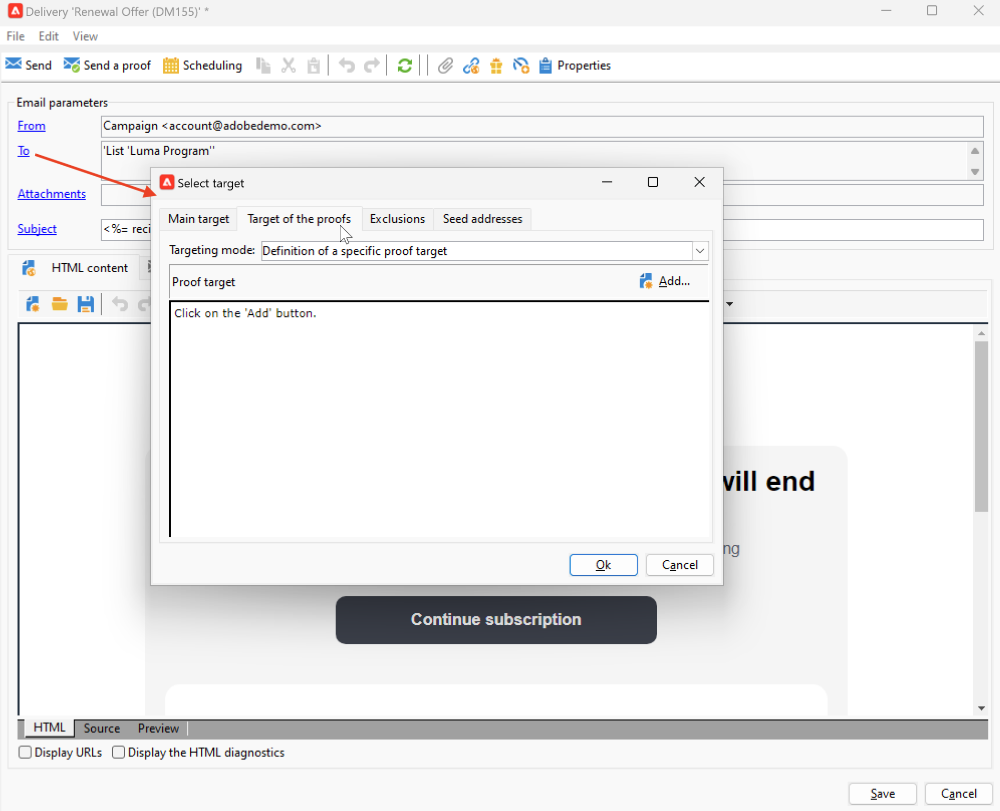
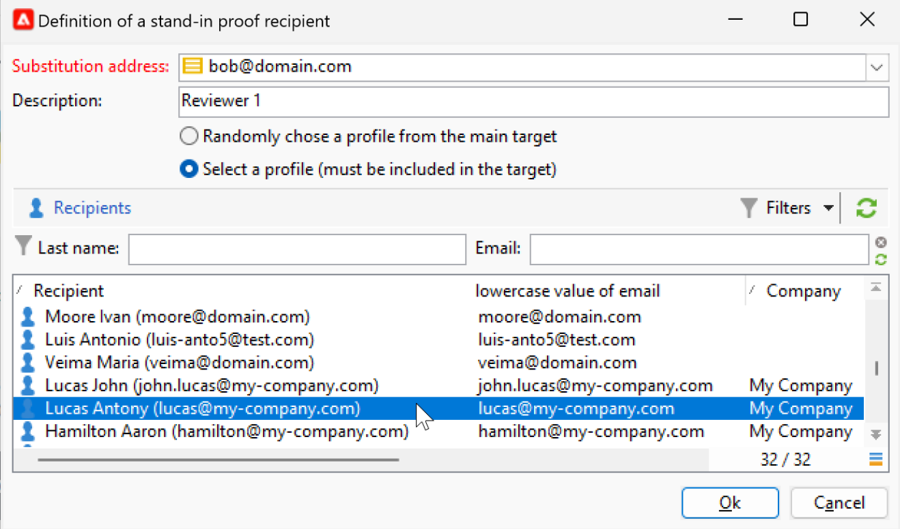

# Preview and test your email {#preview-test}

Once your message content has been defined, you can use test profiles to preview and test it. If you inserted [personalized content](personalize.md), you can check how this content is displayed in the message, using test profile data. In addition, to detect possible errors in the message content or personalization settings, send proofs to test profiles. A proof should be sent each time a change is made, to validate the latest content. 

## Content preview {#preview-content}

Before sending proofs, a best practice is to check the message content in the preview section of the delivery window. 

To preview the message content, follow the steps below:

1. Browse to the **Preview** tab of the delivery.
1. Click the **[!UICONTROL Test personalization]** button to select a profile to populate personalization data. You can choose a specific recipient in the database, a seed address, or select a profile from the target population - if it has been already defined. You can also check the content without personalization.

    

1. The preview is generated so that you can check the message rendering. In the message preview, personalized elements are replaced by the selected test profile data.

    

1. Select other test profiles to preview email rendering for each variant of your message.

## Send proofs {#send-proofs}

For email deliveries, you can send proofs to validate your message content. Sending proofs enables you to check the opt-out link, mirror page and any other links, validate the message, verify that images are displayed, detect possible errors, etc. You may also want to check your design and rendering on different devices.

A proof is a specific message that allows you to test a message before sending it to the main audience. Recipients of the proof are in charge of approving the message: rendering, content, personalization settings, configuration.

### Proof recipients {#proofs-recipients}

The proof target can be defined in the delivery template, or specific to a delivery. In both cases, browse to the target definition screen from the **[!UICONTROL To]** link, and select the **[!UICONTROL Target of the proofs]** tab.

The type of proof target is selected from the **[!UICONTROL Targeting mode]** drop-down list.

* Use the **[!UICONTROL Definition of a specific proof target]** option to select recipients in the database as the proof target.
* Use the **[!UICONTROL Substitution of the address]** option to enter email addresses and use the target recipient data to validate the content. The substitution addresses can be entered manually or selected from the drop-down list. The associated [enumeration](../config/enumerations.md) is **Substitution address (rcpAddress)**.

    By default, substitution is performed randomly, but you can select a specific recipient from the main target, via the  **[!UICONTROL Detail]** icon. 

    {width="800" align="left"}

    Choose the **[!UICONTROL Select a profile (must be included in the target)]** option and select a recipient.

    {width="800" align="left"}

* Use the **[!UICONTROL Seed addresses]**  option to use seed addresses as proof target. These addresses can be imported from a file or entered manually.

    >[!NOTE]
    >
    >Seed addresses do not belong to the default recipient table (nms:recipient), they are created in a separate table. If you extend the recipients table with new data, you have to extend the seed addresses table as well with the same data. 
    
    Learn more about seed addresses in [this section](../audiences/test-profiles.md).

* Use the **[!UICONTROL Specific target and Seed addresses]** option to combine seed addresses and specific email addresses. The related configurations are then defined in two separate sub-tabs.

### Send a proof {#proofs-send}

To send message proofs, follow the steps below:

1. In the message definition screen, click the **[!UICONTROL Send a proof]** button.
1. From the **[!UICONTROL Send a proof]** window, check the proof recipients.
1. Click **[!UICONTROL Analyze]** to start proof message preparation.

    {width="800" align="left"}

1. Once the delivery preparation is complete, use the **[!UICONTROL Confirm delivery]** to start sending proof messages.

Browse to the **[!UICONTROL Audit]** tab of the delivery to check delivery of proof copies.

It is recommended to send proofs after each modification to the message content.

>[!NOTE]
>
>In the proof sent, the link to the mirror page is not active. It is only activated in the final messages.

### Proof properties {#proofs-properties}

Proof properties are set in the **[!UICONTROL Advanced]** tab of the delivery properties windows. Browse to the **[!UICONTROL Proof properties...]** link to define the parameters and the label of the proofs. You can choose to keep:

* Duplicate addresses in the proof
* Denylisted addresses in the proof
* Quarantined addresses in the proof

By default, proof messages are identified by the `Proof #N` mention in the subject, where `N` is the proof number. This number is incremented with each proof delivery analysis. You can change the `proof` prefix, as needed.

{width="800" align="left"}

## How-to video {#video-proof}

Learn how to send and validate a proof for an email delivery.

>[!VIDEO](https://video.tv.adobe.com/v/333404)
