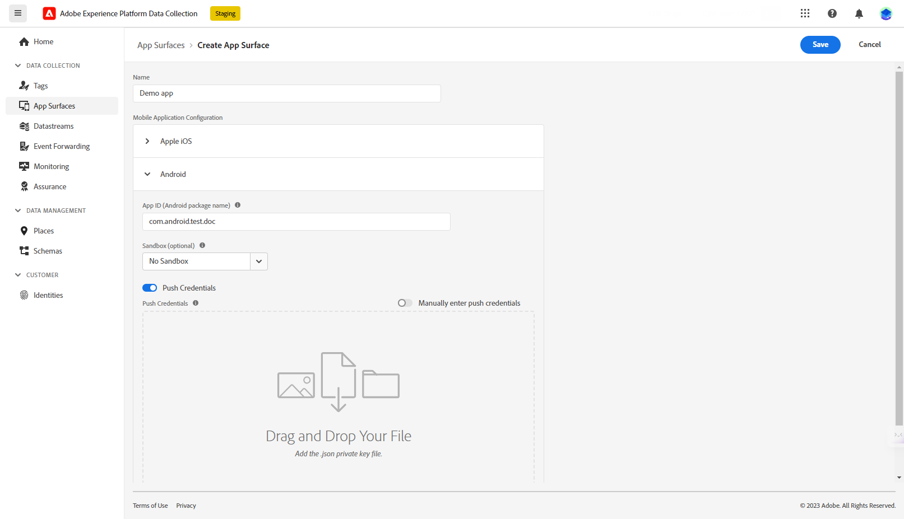

# Configure your push notifications with Data Collection {#push-data-collection}
 
To send push notifications in Adobe Campaign, you need to:

1. Create an App surface in Adobe Experience Platform Data Collection.

1. Create a Mobile application-type information service for your mobile application, and add the iOS and Android versions of the application to that service.

1. Create and configure a mobile property in Adobe Experience Platform Data Collection.

1. Integrate the SDK in Mobile App.

1. Create a delivery for both iOS and Android. 

## Create an App surface in Adobe Experience Platform Data Collection

You need to add your mobile application push credentials in [!DNL Adobe Experience Platform Data Collection]. 

The mobile app push credential registration is required to authorize Adobe to send push notifications on your behalf. Refer to the steps detailed below:

1. From [!DNL Adobe Experience Platform Data Collection], select the **[!UICONTROL App Surfaces]** tab in the left-hand panel.

1. Click **[!UICONTROL Create App Surface]** to create a new configuration.

   

1. Enter a **[!UICONTROL Name]** for the configuration.

1. From **[!UICONTROL Mobile Application Configuration]**, select the Operational system:

    * **For iOS**
      
      

        1. Enter the mobile app **Bundle Id** in the **[!UICONTROL App ID (iOS Bundle ID)]** field. 
        
         The app Bundle ID can be found in the **General** tab of the primary target in **XCode**.
        
        1. Switched on the **[!UICONTROL Push Credentials]** button to add your credentials.
        
        1. Drag and drop your .p8 Apple Push Notification Authentication Key file. 
        
            This key can be acquired from the **Certificates**, **Identifiers** and **Profiles** page.

        1. Provide the **Key ID**. This is a 10 character string assigned during the creation of p8 auth key. 
        
         It can be found under **Keys** tab in **Certificates**, **Identifiers** and **Profiles** page.
        
        1. Provide the **Team ID**. This is a string value which can be found under the **Membership** tab.

    * **For Android**

      

        1. Provide the **[!UICONTROL App ID (Android package name)]**. Usually the package name is the app id in your `build.gradle` file.

        1. Switched on the **[!UICONTROL Push Credentials]** button to add your credentials.

        1. Drag and drop the FCM push credentials. For more details on how to get the push credentials refer to [Google Documentation](https://firebase.google.com/docs/admin/setup#initialize-sdk){target="_blank"}.

1. Click **[!UICONTROL Save]** to create your app configuration.

## Configure your app settings in Adobe Campaign{#push-config}

### Create a service {#create-service}

Before sending push notifications, you must define your iOS and Android apps settings in Adobe Campaign.

Push notifications are sent to your app users through a dedicated service. When users install your app, they subscribe to this service: Adobe Campaign relies on this service to target only the subscribers of your app. In this service, you need to add your iOS and Android apps to send on iOS and Android devices.

To create a service to send push notifications, follow the steps below:

1. Browse to **[!UICONTROL Profiles and Targets > Services and Subscriptions]** tab, and click **[!UICONTROL Create]**.

   {width="800" align="left"}

1. Enter a **[!UICONTROL Label]** and an **[!UICONTROL Internal name]**, and select a **[!UICONTROL Mobile application]** type.

   >[!NOTE]
   >
   >The default **[!UICONTROL Subscriber applications (nms:appSubscriptionRcp)]** target mapping is linked to the recipients table. If you want to use a different target mapping, you need to create a new target mapping and enter it in the **[!UICONTROL Target mapping]** field of the service. Learn more about target mappings in [this page](../audiences/target-mappings.md).

1. Then use the **[!UICONTROL Add]** icon on the right to define the mobile applications that use this service.

   

### Create a mobile application {#create-app}

>[!BEGINTABS]

>[!TAB iOS]

To create an app for iOS devices, follow these steps:

1. From you Service, click **[!UICONTROL Add]** then select **[!UICONTROL Create an iOS application]**. Click **[!UICONTROL Next]**.

   

1. From the Launch app configurations list, select the App surface previously created in this section. Click **[!UICONTROL Next]**.

   

1. (optional) You can enrich a push message content with some **[!UICONTROL Application variables]**. These are fully customizable and a part of the message payload sent to the mobile device.

   In the example below, the **mediaURl** and **mediaExt** variables are added to create rich push notification and then provides the application with the image to display within the notification.

   

1. Browse to the **[!UICONTROL Subscription parameters]** tab to define the mapping with an extension of the **[!UICONTROL Subscriber applications (nms:appsubscriptionRcp)]** schema.

1. Browse to the **[!UICONTROL Sounds]** tab to define a sound to play. Click **[!UICONTROL Add]** and fill **[!UICONTROL Internal name]** field which must contain the name of the file embedded in the application or the name of the system sound.

1. Click **[!UICONTROL Next]** to start configuring the development application.

1. The **[!UICONTROL Integration key]** is specific to each application. It links the mobile application to Adobe Campaign and will be used when configuring Campaign extension.

   Make sure that the same **[!UICONTROL Integration key]** is defined in Adobe Campaign and in the application code via the SDK.    
   
   Learn more in [the Developer documentation](https://developer.adobe.com/client-sdks/documentation/adobe-campaign-classic/#configuration-keys){target="_blank"}
   

    >[!NOTE]
    >
    > The **[!UICONTROL Integration key]** is fully customizable with string value but needs to be exactly the same as the one specified in the SDK.
    >
    > You cannot use the same certificate for the development version (sandbox) and the production version of the application.

   

1. Select the icon from the **[!UICONTROL Application icon]** field to personalize mobile application in your service.

1. Click **[!UICONTROL Next]** to start configuring the production application and follow the same steps as detailed above. Note that you cannot use the same **[!UICONTROL Integration key]** for the development version (sandbox) and the production version of the application.

1. Click **[!UICONTROL Finish]**.

Your iOS application is now ready to be used in Campaign.

>[!TAB Android]

To create an app for Android devices, follow these steps:

1.  From you Service, click **[!UICONTROL Add]** then select **[!UICONTROL Create an Android application]**. Click **[!UICONTROL Next]**.

      

1. From the Launch app configurations list, select the App surface created in this section and click **[!UICONTROL Next]**.

   

1. The integration key is specific to each application. It links the mobile application to Adobe Campaign and will be used when configuring Campaign extension.

   Make sure that the same **[!UICONTROL Integration key]** is defined in Adobe Campaign and in the application code via the SDK. 
   
   Learn more in [the Developer documentation](https://developer.adobe.com/client-sdks/documentation/adobe-campaign-classic/#configuration-keys){target="_blank"}
   
    >[!NOTE]
    >
    > The **[!UICONTROL Integration key]** is fully customizable with string value but needs to be exactly the same as the one specified in the SDK.

   

1. Select the icon from the **[!UICONTROL Application icon]** field to personalize mobile application in your service.

1. (optional) You can enrich a push message content with some **[!UICONTROL Application variables]** if needed. These are fully customizable and a part of the message payload sent to the mobile device.

1. Browse to the **[!UICONTROL Subscription parameters]** tab to define the mapping with an extension of the **[!UICONTROL Subscriber applications (nms:appsubscriptionRcp)]** schema.

1. Click **[!UICONTROL Finish]** then **[!UICONTROL Save]**. 

Your Android application is now ready to be used in Campaign.

>[!ENDTABS]

Below are the FCM payload names to further personalize your push notification:

| Message type | Configurable message element (FCM payload name) |  Configurable options (FCM payload name) |
|:-:|:-:|:-:|
| data message  | N/A  | validate_only  |
| notification message |  title, body, android_channel_id, icon, sound, tag, color, click_action, image, ticker, sticky, visibility, notification_priority, notification_count   | validate_only |

## Configure a mobile property in Adobe Experience Platform Data Collection

1. From Data Collection homepage, access the Tags menu.

1. Click **[!UICONTROL New Property]**.

   

1. Type a name for the property and select **[!UICONTROL Mobile]** as the platform.

   

1. Click **[!UICONTROL Save]** to create the mobile property.

1. Access your newly created mobile property.

1. From your mobile property dashboard, access the **[!UICONTROL Extensions]** menu then the **[!UICONTROL Catalog]** tab. 

   

1. Install the Adobe Campaign Classic extension. [Learn more on Campaign extension](https://developer.adobe.com/client-sdks/documentation/adobe-campaign-classic/#configure-campaign-classic-extension)

   

1. Fill in your instance details:

   * Registration or tracking endpoint URLs can be found in the Tools > Advanced > Deployment wizard menu in Campaign.
   * Integration keys can be found in the mobile app configured in this section.

1. Click Save.

1. You now need to publish the configuration from the Publishing flow menu. [Learn more](https://developer.adobe.com/client-sdks/documentation/getting-started/create-a-mobile-property/#publish-the-configuration)

## Add Campaign Classic to your mobile app

The Adobe Experience Platform Mobile SDK helps power Adobe's Experience Cloud solutions and services in your mobile apps. SDKs configuration is managed through the Data Collection UI for flexible configuration and extensible, rules-based integrations. 

[Learn more in Adobe Developer documentation](https://developer.adobe.com/client-sdks/documentation/adobe-campaign-classic/#add-campaign-classic-to-your-app){target="_blank"}.

## Create your push notification{#push-create}

Once you have successfully configured your mobile application in Data Collection, you can now create and send push notifications in Adobe Campaign. 

Refer to [this page](push.md#push-create) for the detailed elements specific to the delivery of iOS and Android notifications.
