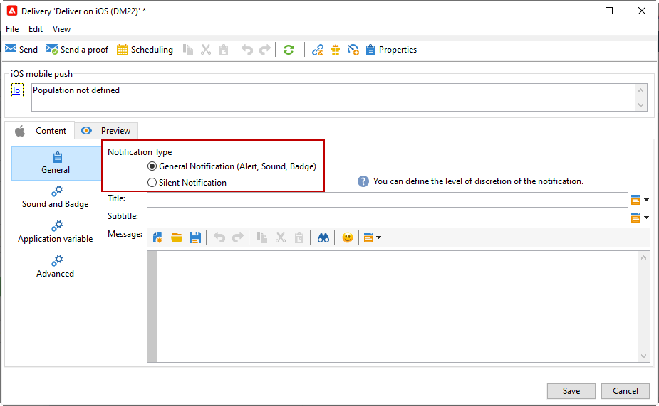

# Create and send push notifications{#push-notifications-create}

Mobile app deliveries let you send notifications to iOS and Android devices.

Before beginning to send push notifications with Adobe Campaign, you need to ensure configurations and integrations are in place on the mobile app and for tags in Adobe Experience Platform. [Learn more about push configuration.](push-settings.md).

>[!CAUTION]
>
>Some important changes to the Android Firebase Cloud Messaging (FCM) service are being released in 2024, and may impact your Adobe Campaign implementation. Your subscription services configuration for Android push messages may need to be updated to support this change. You can already check and take action.

## Create your first push notification {#push-create}

This section details the elements specific to the delivery of iOS and Android notifications.

>[!IMPORTANT]
>
>In the context of an [Enterprise (FFDA) deployment](../architecture/enterprise-deployment.md), mobile registration is now **asynchronous**. [Learn more](../architecture/staging.md)

To create a new delivery, browse to the **[!UICONTROL Campaigns]** tab, click **[!UICONTROL Deliveries]** and click the **[!UICONTROL Create]** button above the list of existing deliveries.

By default, Adobe Campaign comes with two delivery templates: one for iOS, one for Android. You can duplicate them to define your own settings. Steps to configure a push delivery based on these templates are detailed below.

>[!BEGINTABS]

>[!TAB iOS]

To send notifications on iOS devices, follow these steps:

1. Select the **[!UICONTROL Deliver on iOS]** delivery template.

   

1. To define the target of the notification, click the **[!UICONTROL To]** link, then click **[!UICONTROL Add]**.

   

1. Select **[!UICONTROL Subscribers of an iOS mobile application (iPhone, iPad)]**, select the service relevant to your mobile application, then select the iOS version of the application.

   

1. Choose your **[!UICONTROL Notification type]** between **[!UICONTROL General notification (Alert, Sound, Badge)]** or **[!UICONTROL Silent notification]**.

   

   >[!NOTE]
   >
   >The **Silent Push** mode allows a "silent" notification to be sent to a mobile application. The user is not made aware of the notification's arrival. It is transferred directly to the application.

1. In the **[!UICONTROL Title]** field, enter the label of the title that you want to appear in the list of notifications available from the notification center. 

   This field allows you to define the value of the **title** parameter of the iOS notification payload.

1. You can add a **[!UICONTROL Subtitle]**, value of the **subtitle** parameter of the iOS notification payload.

1. Enter the content of the message in the **[!UICONTROL Message content]** section of the wizard.

1. From the **[!UICONTROL Sound and Badge]** tab, you can edit the following options:

   * **[!UICONTROL Clean Badge]**: enable this options to refresh the badge value.

   * **[!UICONTROL Value]**: set a number which will be used to display directly on the application icon the number of new unread information.

   * **[!UICONTROL Critical alert mode]**: enable this option to add sound to your notification even the user's phone is set on focus mode or if the iPhone is muted.

   * **[!UICONTROL Name]**: select the sound to be played by the mobile terminal when the notification is received.

   * **[!UICONTROL Volume]**: volume of your sound from 0 to 100.

      >[!NOTE]
      > 
      >Sounds must be included in the application and defined when the service is created. 
      >

   

1. From the **[!UICONTROL Application variables]** tab, your **[!UICONTROL Application variables]** are automatically added. They let you define notification behavior, for instance, you can configure a specific application screen to be displayed when the user activates the notification.

1. From the **[!UICONTROL Advanced]** tab, you can edit the following general options:

   * **[!UICONTROL Mutable content]**: enable this option to allow the mobile application to download media content.

   * **[!UICONTROL Thread-id]**: identifier used to group related notifications together.

   * **[!UICONTROL Category]**: name of your category ID which will display action buttons. These notifications give the user a faster way to perform different tasks in response to a notification without opening or navigating in the application.

   

1. For time sensitive notification, you can specify the following options:

   * **[!UICONTROL Target content ID]**: identifier used to target which application window to brought forward when the notification is opened.

   * **[!UICONTROL Launch image]**: name of the launch image file to display. If the user chooses to launch your application, the selected image will displayed instead of your application's launch screen.

   * **[!UICONTROL Interruption level]**:

      * **[!UICONTROL Active]**: Set by default, the system presents the notification immediately, lights up the screen, and can play a sound. Notifications do not break through Focus modes.

      * **[!UICONTROL Passive]**: The system adds the notification to the notification list without lighting up the screen or playing a sound. Notifications do not break through Focus modes.

      * **[!UICONTROL Time sensitive]** The system presents the notification immediately, lights up the screen, can play a sound and break through Focus modes. This level does not require a special permission from Apple.

      * **[!UICONTROL Critical]** The system presents the notification immediately, lights up the screen, and bypasses the mute switch or focus modes. Note that this level requires a special permission from Apple.

   * **[!UICONTROL Relevance score]**: set a relevance score from 0 to 100. The system uses this to sort the notifications in the notification summary.

   

1. Once the notification is configured, click the **[!UICONTROL Preview]** tab to preview the notification. 

   

>[!TAB Android]

To send notifications on Android devices, follow these steps:

1. Select the **[!UICONTROL Deliver on Android (android)]** delivery template.

    
    
     >[!NOTE]
     > 
     >With the latest FCM APIs (HTTP v1), you must update your **delivery templates** for Android push notifications to increase the number of batch messages. To do this, browse to your Android delivery template's properties and, in the **Delivery** tab, set the [Message Batch quantity](../../v8/send/configure-and-send.md#delivery-batch-quantity) to **256**. Apply this change to all delivery templates used for your Android deliveries, and to all your existing Android deliveries.

1. To define the target of the notification, click the **[!UICONTROL To]** link, then click **[!UICONTROL Add]**.

    

1. Select **[!UICONTROL Subscribers of an Android mobile application]**, choose the service relevant to your mobile application (Neotrips, in this case), then select the Android version of the application.

   

1. Then enter the content for the notification.

   

1. Click the **[!UICONTROL Insert emoticon]** icon to insert emoticons to your push notification.

1. In the **[!UICONTROL Application variables]** field, enter the value of each variable. For example, you can configure a specific application screen to be displayed when the user activates the notification.

1. Once the notification is configured, click the **[!UICONTROL Preview]** tab to preview the notification. 

   <!---->

>[!ENDTABS]

## Test, send and monitor your push notifications {#push-test}

To send a proof and to send the final delivery, use the same process as for other deliveries. 

Learn how to validate a delivery in [this page](preview-and-proof.md).

Learn how to confirm and send the delivery in [this page](send.md)

After sending messages, you can monitor and track your deliveries. Learn more about push notification delivery failure reasons in [this page](delivery-failures.md#push-error-types).

