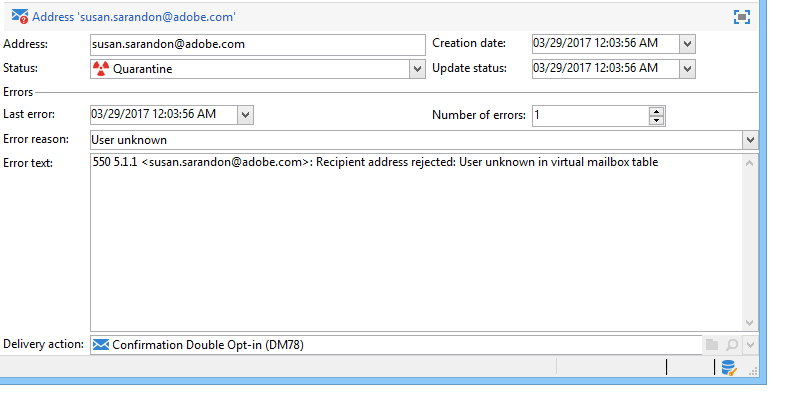

# Quarantine {#quarantine-management}

Adobe Campaign manages a list of quarantined addresses for online channels (email, SMS, push notification). Some internet access providers automatically consider emails as spam if the rate of invalid addresses is too high. Quarantine therefore allows you to avoid being added to denylist by these providers. Moreover, quarantines help reducing SMS sending costs by excluding erroneous phone numbers from deliveries.

When their address or phone number is quarantined, recipients are excluded from the target during delivery analysis: you will not be able to send marketing messages, including automated workflow emails, to those contacts. If those quarantined addresses are also present in lists, they will be excluded when sending to those lists. An email address can be quarantined, for example, when the mailbox is full, if the address does not exist, or if the email server is unavailable.

<!--For more on best practices to secure and optimize your deliveries, refer to [this page](delivery-best-practices.md).-->

**Quarantine** applies only to an **address**, a **phone number**, or a **device token**, but not to the profile itself. For example, a profile whose email address is quarantined can update their profile and enter a new address, and could then be targeted by delivery actions again. Likewise, if two profiles happen to have the same phone number, they will both be affected if the number is quarantined. The quarantined addresses or phone numbers are displayed in the [exclusion logs](#delivery-quarantines) (for a delivery) or in the [quarantine list](#non-deliverable-bounces) (for the entire platform).

On the other hand, profiles can be on the **denylist** as after an unsubscription (opt-out), for a given channel: this implies that they no longer being targeted by any. As a consequence, if a profile on the denylist for the email channel has two email addresses, both addresses will be excluded from delivery. You can check if a profile is on the denylist for one or more channels in the **[!UICONTROL No longer contact]** section of the profile’s **[!UICONTROL General]** tab. [Learn more](../audiences/view-profiles.md)

>[!NOTE]
>
>When recipients report your message as spam or reply to an SMS message with a keyword such as “STOP”, their address or phone number is quarantined as **[!UICONTROL Denylisted]**. Their profile is updated accordingly.

<!--For the email channel, email addresses are quarantined. For the mobile app channel, device tokens are quarantined. For the SMS channel, phone numbers are quarantined.?-->

## Why is an email, phone or device sent to quarantine {#quarantine-reason}

Adobe Campaign manages quarantine according to the type of delivery failure and its reason. These are assigned during error messages qualification. Learn more about delivery failure management [on this page](delivery-failures.md).

Two types or errors can be captured:

* **Hard error**: the email address, phone number or device is immediately sent to quarantine.
* **Soft error**: soft errors increment an error counter, and might quarantine an email, phone number or device token. Campaign performs [retries](delivery-failures.md#retries): when the error counter reaches the limit threshold, the address, phone number or device token is quarantined. [Learn more](delivery-failures.md#retries).

In the list of quarantined addresses, the **[!UICONTROL Error reason]** field indicates why the selected address was placed in quarantine. [Learn more](#identifying-quarantined-addresses-for-the-entire-platform).

If a user qualifies an email as a spam, the message is automatically redirected towards a technical mailbox managed by Adobe. The user's email address is then automatically sent to quarantine with the **[!UICONTROL Denylisted]** status. This status refers to the address only, the profile is not on the denylist, so that the user continues receiving SMS messages and push notifications. Learn more about Feedback loops in the [Delivery Best Practices Guide](https://experienceleague.adobe.com/docs/deliverability-learn/deliverability-best-practice-guide/transition-process/infrastructure.html#feedback-loops){target="_blank"}.

>[!NOTE]
>
>Quarantine in Adobe Campaign is case sensitive. Make sure to import email addresses in lower case, so that they are not retargeted later on.

## Access quarantined addresses {#access-quarantined-addresses}

Quarantined addresses can be displayed for a specific delivery or for the entire platform.

### Quarantines for a delivery{#delivery-quarantines}

Quarantine addresses are listed during the delivery preparation phase, in the delivery logs of the delivery dashboard.

For each delivery, you can also check the **[!UICONTROL Delivery summary]** report: it shows the number of addresses in quarantine in the delivery target, and displays:

* The number of addresses placed in quarantine during the delivery analysis,
* The number of addresses placed in quarantine following the delivery action.

### Non deliverable and bounce addresses{#non-deliverable-bounces}

To view the list of quarantined addresses **for the entire platform**, Campaign Administrators can browse to  **[!UICONTROL Administration > Campaign Management > Non deliverables Management > Non deliverables and addresses]**. This section lists quarantined elements for **email**, **SMS** and **Push notification** channels.  

 

>[!NOTE]
>
>Number of quarantines increase with time. For example, if the lifetime of an email address is considered to be three years and the recipients table increases by 50% each year, the increase in quarantines can be calculated as follows:
>
>End of Year 1: (1&#42;0.33)/(1+0.5)=22%.
>
>End of Year 2: ((1.22&#42;0.33)+0.33)/(1.5+0.75)=32.5%.

In addition, the **[!UICONTROL Non-deliverables and bounces]** built-in report, available from the **Reports** section of ths home page, displays information about the addresses in quarantine, the types of error encountered, and a failure breakdown by domain. You can filter data for a specific delivery, or customize this report as needed.

Learn more about bounce addresses in the [Deliverability Best Practice Guide](https://experienceleague.adobe.com/docs/deliverability-learn/deliverability-best-practice-guide/metrics-for-deliverability/bounces.html){target="_blank"}.

### Quarantined email address {#quarantined-recipient}

You can look up the status of the email address of any recipient. 

To do this, select the recipient profile and click the **[!UICONTROL Deliveries]** tab. For all deliveries to that recipient, you can find out whether the address failed, was quarantined during analysis, etc. 

For each folder, you can display only the recipients whose email address is in quarantine, with the **[!UICONTROL Quarantined email address]** built-in filter, as below:

 

## Remove a quarantined address {#remove-a-quarantined-address}

Addresses that match specific conditions are automatically deleted from the quarantine list by the **Database cleanup** built-in workflow.

The addresses are automatically removed from the quarantine list in the following cases:

* Addresses in a **[!UICONTROL With errors]** status will be removed from the quarantine list after a successful delivery.
* Addresses in a **[!UICONTROL With errors]** status will be removed from the quarantine list if the last soft bounce occurred more than 10 days ago. For more on soft error management, see [this section](#soft-error-management).
* Addresses in a **[!UICONTROL With errors]** status that bounced with the **[!UICONTROL Mailbox full]** error will be removed from the quarantine list after 30 days.

Their status then changes to **[!UICONTROL Valid]**.

>[!CAUTION]
>
>Recipients with an address in a **[!UICONTROL Quarantine]** or **[!UICONTROL Denylisted]** status will never be removed, even if they receive an email. 

You can also manually remove an address from the quarantine list. To remove an address from quarantine, you can:

* Change its status to **[!UICONTROL Valid]** from the **[!UICONTROL Administration > Campaign Management > Non deliverables Management > Non deliverables and addresses]** node.

     

* Change its status to **[!UICONTROL Allowlisted]**: in this case, the address remains on the quarantine list, but it will be systematically targeted, even if an error is encountered.

>[!CAUTION]
>
>If you remove an address from quarantine list, you will start again sending to this address again. This can have severe impacts on your deliverability and IP reputation, which could eventually lead to your IP address or sending domain being blocked. Proceed with extra care when considering removing any address from quarantine. If you need assistance, contact Adobe Support.
