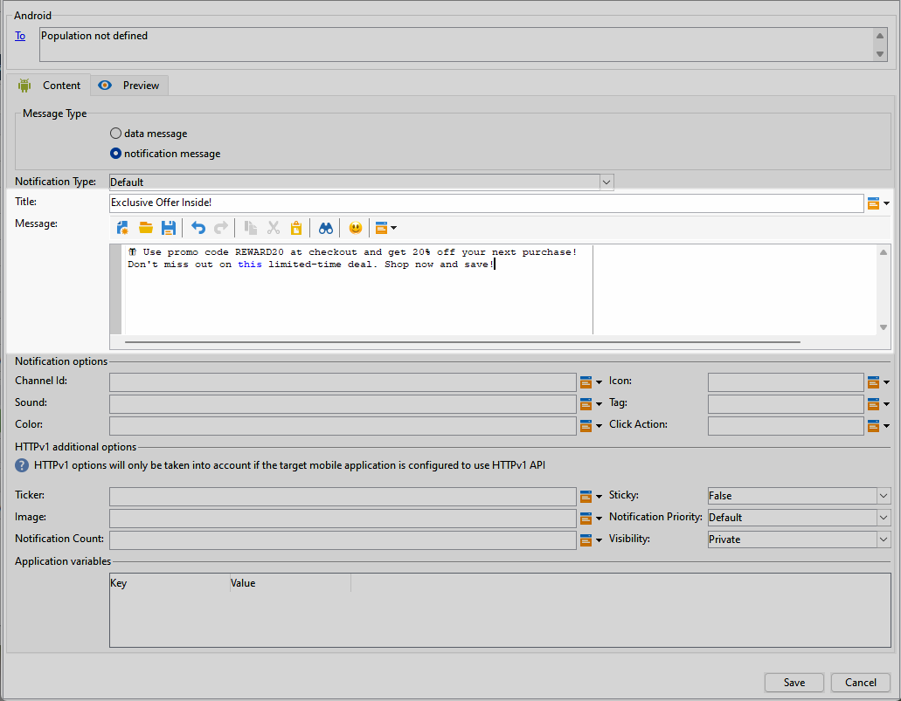
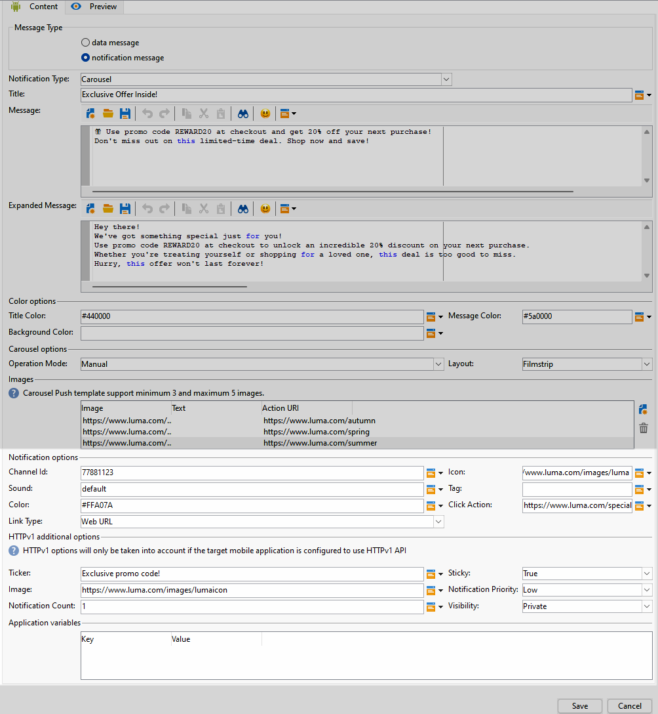
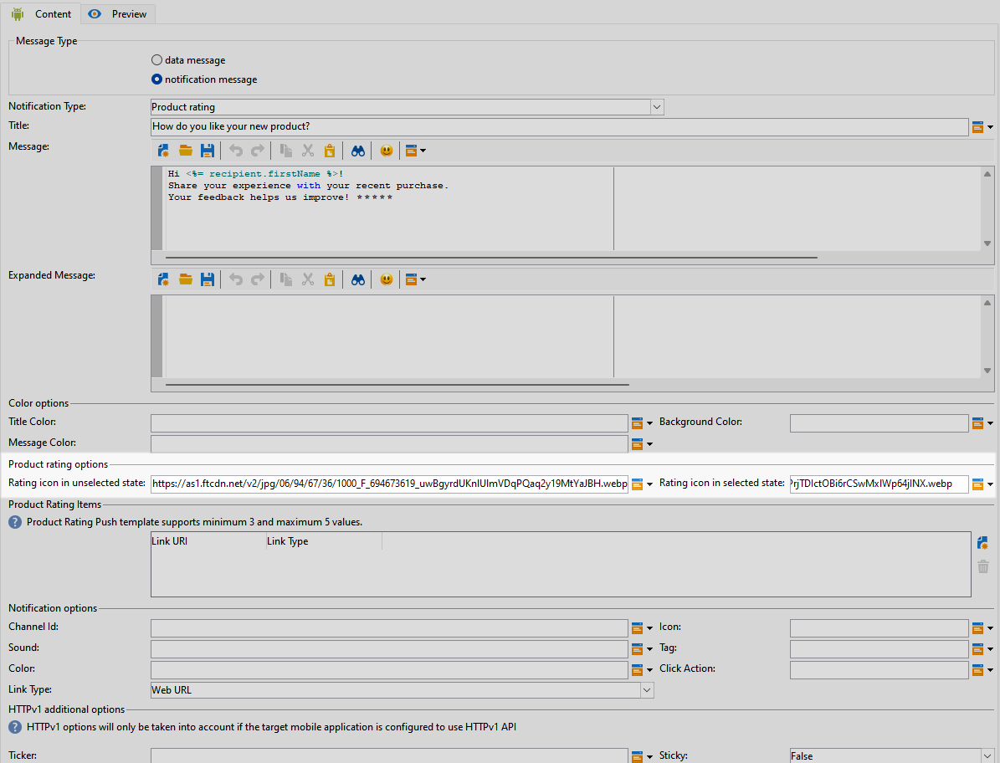

# Design an Android rich push delivery {#rich-push}

>[!IMPORTANT]
>
>Before designing a Rich Push Notification, you first need to configure your connector. Refer to [this page](https://experienceleague.adobe.com/en/docs/campaign-classic/using/sending-messages/sending-push-notifications/configure-the-mobile-app/configuring-the-mobile-application-android#configuring-external-account-android) for the detailed procedure.

With Firebase Cloud Messaging, you can choose between two types of messages:

* The **[!UICONTROL Data message]** is handled by the client app. These messages are sent directly to the mobile application, which generates and displays an Android notification on the device. Data messages contain only your custom application variables.

* The **[!UICONTROL Notification message]**, handled automatically by the FCM SDK. FCM automatically displays the message on your users' devices on behalf of the client app. Notification messages contain a predefined set of parameters and options but can still be further personalized with custom application variables.

If the scroll bar is disabled on your interface, access **[!UICONTROL Administration]** `>` **[!UICONTROL Platform]** `>` **[!UICONTROL Options]**, and set the **[!UICONTROL XtkUseScrollBar]** option to 1.

## Define the content of an Android notification {#push-message}

Once your push delivery is created, you can define its content using one of the following templates:

* **Default** allows you to send notifications with a simple icon and an accompanying image.

* **Basic** can include text, images, and buttons in your notifications.

* **Carousel** enables you to send notifications with text and multiple images that users can swipe through.

* **Icon buttons** allows you to send notifications with an icon and a corresponding image.

* **Input box** gathers user input and feedback directly through the notification.

* **Product catalog** displays a variety of product images.

* **Product rating** allows users to give feedback and rate products. 

* **Timer** includes a live countdown timer in your notifications.

* **Zero Bezel** uses the entire background surface for an image, with text overlaid seamlessly.

Navigate through the tabs below to learn more on how to personalize these templates.

>[!BEGINTABS]

>[!TAB Default]

1. From the **[!UICONTROL Notification type]** drop-down, select **[!UICONTROL Default]**.

    

1. To compose your message, enter your text in the **[!UICONTROL Title]** and **[!UICONTROL Message]** fields.

    

1. Use dynamic personalization fields to define content, personalize data and add dynamic content. [Learn more](../send/personalize.md)

1. To further personalize your push notification, configure the **[!UICONTROL Notification options]** and **[!UICONTROL HTTPv1 additional options]** of your push notification. [Learn more](#push-advanced)

    

Once you have defined your message content, you can use test subscribers to preview and test the message.

>[!TAB Basic]

1. From the **[!UICONTROL Notification Type]** drop-down, select **[!UICONTROL Basic]**.

    

1. To compose your message, enter your text in the **[!UICONTROL Title]**, **[!UICONTROL Message]** and **[!UICONTROL Expanded message]** fields. 

    The **[!UICONTROL Message]** text appears in the collapsed view while the **[!UICONTROL Expanded message]** is displayed when the notification is expanded.

    

1. Use dynamic personalization fields to define content, personalize data and add dynamic content. [Learn more](../send/personalize.md)

1. Under the **[!UICONTROL Color options]** menu, enter the hexadecimal color codes for your **[!UICONTROL Title]**, **[!UICONTROL Message]** and **[!UICONTROL Background]**.

1. Add a **[!UICONTROL Remind later button]** if needed. Enter your **[!UICONTROL Reminder Text]** and **Date** in the corresponding fields. 

    The **[!UICONTROL Reminder Date]** field expects a value representing an epoch in seconds.

1. Click **[!UICONTROL Add button]** and fill in the following fields:

    * **[!UICONTROL Label]**: Text displayed on the button.
    * **[!UICONTROL Link URI]**: Specify the URI to be executed upon clicking the button.

   You have the option to include up to three buttons in your push notification. If you opt for the **[!UICONTROL Remind later button]**, you can only include a maximum of two buttons.

1. Select the **[!UICONTROL Link type]** of your button's linked URL:

    * **[!UICONTROL Web URL]**: Web URLs direct users to online content. Upon clicking, they prompt the device's default web browser to open and navigate to the designated URL.

    * **[!UICONTROL Deeplink]**: Deep links are URLs guiding users to specific sections within an app even if the app is closed. When clicked, a dialog can appear, allowing users to choose from various apps capable of handling the link.

    * **[!UICONTROL Open App]**: Open App URLs allow you to directly connect to content within an application. It enables your application to establish itself as the default handler for a specific type of link, bypassing the disambiguation dialog. 

    For more information on how to handle Android App Links, refer to [Android Developers documentation](https://developer.android.com/training/app-links).

    

1. To further personalize your push notification, configure the **[!UICONTROL Notification options]** and **[!UICONTROL HTTPv1 additional options]** of your push notification. [Learn more](#push-advanced)

    

Once you have defined your message content, you can use test subscribers to preview and test the message.

>[!TAB Carousel]

1. From the **[!UICONTROL Notification Type]** drop-down, select **[!UICONTROL Carousel]**.

    

1. To compose your message, enter your text in the **[!UICONTROL Title]**, **[!UICONTROL Message]** and **[!UICONTROL Expanded message]** fields. 

    The **[!UICONTROL Message]** text appears in the collapsed view while the **[!UICONTROL Expanded message]** is displayed when the notification is expanded.

    

1. Use the Expression editor to define content, personalize data and add dynamic content. [Learn more](../send/personalize.md)

1. Under the **[!UICONTROL Color options]** menu, enter the hexadecimal color codes for your **[!UICONTROL Title]**, **[!UICONTROL Message]** and **[!UICONTROL Background]**.

1. Choose how the **[!UICONTROL Carousel]** is operated: 

    * **[!UICONTROL Auto]**: automatically cycles through images as slides, transitioning at predefined intervals.
    * **[!UICONTROL Manual]**: allows users to manually swipe between slides to navigate through the images.     

1. From the **[!UICONTROL Layout]** drop-down, select **[!UICONTROL Filmstrip]** option to include previews of the previous and next images alongside the main slide.

1. Click **[!UICONTROL Add image]** and enter your image URL, Text and Action URL.

    Ensure that you include a minimum of three images and a maximum of five images.

    

1. To further personalize your push notification, configure the **[!UICONTROL Notification options]** and **[!UICONTROL HTTPv1 additional options]** of your push notification. [Learn more](#push-advanced)

    

Once you have defined your message content, you can use test subscribers to preview and test the message.

>[!TAB Icon buttons]

1. From the **[!UICONTROL Notification Type]** drop-down, select **[!UICONTROL Icon buttons]**.

    

1. Under the **[!UICONTROL Color options]** menu, enter the hexadecimal color codes for your **[!UICONTROL Background]**.

    

1. Provide the URL for the **[!UICONTROL Cancel button image]**.

1. Under the **[!UICONTROL Icon image buttons]**, click **[!UICONTROL Add image]**. Then, enter the **Image URL**, **Link type**, and **Link URI**.

    Ensure you include a minimum of three buttons and a maximum of five buttons.

    

1. To further personalize your push notification, configure the **[!UICONTROL Notification options]** and **[!UICONTROL HTTPv1 additional options]** of your push notification. [Learn more](#push-advanced)

    

Once you have defined your message content, you can use test subscribers to preview and test the message.

>[!TAB Input box]

1. From the **[!UICONTROL Notification Type]** drop-down, select **[!UICONTROL Input box]**.

    

1. To compose your message, enter your text in the **[!UICONTROL Title]**, **[!UICONTROL Message]** and **[!UICONTROL Expanded message]** fields. 

    The **[!UICONTROL Message]** text appears in the collapsed view while the **[!UICONTROL Expanded message]** is displayed when the notification is expanded.

    

1. Under the **[!UICONTROL Color options]** menu, enter the hexadecimal color codes for the **[!UICONTROL Title]**, **[!UICONTROL Message]** and **[!UICONTROL Background]**.

1. In the **[!UICONTROL Input box options]** menu, fill in the following option:

    * **[!UICONTROL Input receiver name]**: Enter the name or identifier for the receiver of the input. 
    * **[!UICONTROL Input text]**: Enter the text for the **Input box**.
    * **[!UICONTROL Feedback text]**: Enter the text to display after a reply.
    * **[!UICONTROL Feedback image]**: Add the URL for the image displayed after a reply.

    

1. To further personalize your push notification, configure the **[!UICONTROL Notification options]** and **[!UICONTROL HTTPv1 additional options]** of your push notification. [Learn more](#push-advanced)

    

Once you have defined your message content, you can use test subscribers to preview and test the message.

>[!TAB Product Catalog]

1. From the **[!UICONTROL Notification Type]** drop-down, select **[!UICONTROL Product catalog]**.

    

1. To compose your message, enter your text in the **[!UICONTROL Title]**, **[!UICONTROL Message]** and **[!UICONTROL Expanded message]** fields. 

    The **[!UICONTROL Message]** text appears in the collapsed view while the **[!UICONTROL Expanded message]** is displayed when the notification is expanded.

    

1. Under the **[!UICONTROL Color options]** menu, enter the hexadecimal color codes for your **[!UICONTROL Title]**, **[!UICONTROL Message]** and **[!UICONTROL Background]**.

1. Under **[!UICONTROL Product catalog options]** menu, fill in the following options:

    * **[!UICONTROL Action button text]**: Text displayed on the button.
    * **[!UICONTROL Action button text color]**: Color of the Action button text.
    * **[!UICONTROL Action button color]**: Color of the Action button.
    * **[!UICONTROL Action button URI]**: Specify the URI to be executed upon clicking the button.
    * **[!UICONTROL Display type]**: Choose between vertical or horizontal display.

    

1. In the **[!UICONTROL Product catalog items]** menu, click **[!UICONTROL Add]** and enter the following details for each item:
 
    * **[!UICONTROL Title]**
    * **[!UICONTROL Description]**
    * **[!UICONTROL Image URL]**
    * **[!UICONTROL Price]**
    * **[!UICONTROL URI]**

    Ensure that you include a maximum of three items.

    

1. To further personalize your push notification, configure the **[!UICONTROL Notification options]** and **[!UICONTROL HTTPv1 additional options]** of your push notification. [Learn more](#push-advanced)

Once you have defined your message content, you can use test subscribers to preview and test the message.

>[!TAB Product Rating]

1. From the **[!UICONTROL Notification Type]** drop-down, select **[!UICONTROL Product rating]**.

    

1. To compose your message, enter your text in the **[!UICONTROL Title]**, **[!UICONTROL Message]** and **[!UICONTROL Expanded message]** fields. 

    The **[!UICONTROL Message]** text appears in the collapsed view while the **[!UICONTROL Expanded message]** is displayed when the notification is expanded.

    

1. Under the **[!UICONTROL Color options]** menu, enter the hexadecimal color codes for your **[!UICONTROL Title]**, **[!UICONTROL Message]** and **[!UICONTROL Background]**.

1. In the **[!UICONTROL Product rating options]** menu, enter the URLs for the **[!UICONTROL Rating icon in unselected state]** and **[!UICONTROL Rating icon in selected state]**.

    

1. Under **[!UICONTROL Product rating items]** menu, click **[!UICONTROL Add]** and enter your **[!UICONTROL Link URI]** and choose your **[!UICONTROL Link type]**.
    
    * **[!UICONTROL Web URL]**: Web URLs direct users to online content. Upon clicking, they prompt the device's default web browser to open and navigate to the designated URL.

    * **[!UICONTROL Deeplink]**: Deep links are URLs guiding users to specific sections within an app even if the app is closed. When clicked, a dialog can appear, allowing users to choose from various apps capable of handling the link.

    * **[!UICONTROL Open App]**: Open App URLs allow you to directly connect to content within an application. It enables your application to establish itself as the default handler for a specific type of link, bypassing the disambiguation dialog. 

    * **[!UICONTROL Dismiss]**: No URL is associated with the button; clicking simply closes the dialog or interface.

    Ensure that you include a minimum of three values and a maximum of five values.

    

1. To further personalize your push notification, configure the **[!UICONTROL Notification options]** and **[!UICONTROL HTTPv1 additional options]** of your push notification. [Learn more](#push-advanced)

Once you have defined your message content, you can use test subscribers to preview and test the message.

>[!TAB Timer]

1. From the **[!UICONTROL Notification Type]** drop-down, select **[!UICONTROL Timer]**.

    

1. To compose your message, enter your text in the **[!UICONTROL Title]**, **[!UICONTROL Message]** and **[!UICONTROL Expanded message]** fields. 

    The **[!UICONTROL Message]** text appears in the collapsed view while the **[!UICONTROL Expanded message]** is displayed when the notification is expanded.

    

1. Enter the text that will be displayed after the timer has expired in the **[!UICONTROL Alternate title]**, **[!UICONTROL Alternate message]** and **[!UICONTROL Alternate expanded message]** fields.

1. Under the **[!UICONTROL Color options]** menu, enter the hexadecimal color codes for your **[!UICONTROL Title]**, **[!UICONTROL Message]**, **[!UICONTROL Background]** and **[!UICONTROL Timer]**.

    

1. Set your **[!UICONTROL Timer duration]** in seconds or the **[!UICONTROL Timer end timestamp]** to a specific epoch timestamp and add your **[!UICONTROL Alternate image]** URL that will be displayed after the timer has expired.

    

1. To further personalize your push notification, configure the **[!UICONTROL Notification options]** and **[!UICONTROL HTTPv1 additional options]** of your push notification. [Learn more](#push-advanced)

Once you have defined your message content, you can use test subscribers to preview and test the message.

>[!TAB Zero Bezel]

1. From the **[!UICONTROL Notification Type]** drop-down, select **[!UICONTROL Zero bezel]**.

    

1. To compose your message, enter your text in the **[!UICONTROL Title]**, **[!UICONTROL Message]** and **[!UICONTROL Expanded message]** fields. 

    The **[!UICONTROL Message]** text appears in the collapsed view while the **[!UICONTROL Expanded message]** is displayed when the notification is expanded.

    

1. Under the **[!UICONTROL Color options]** menu, enter the hexadecimal color codes for your **[!UICONTROL Title]**, **[!UICONTROL Message]** and **[!UICONTROL Background]**.

1. In the **[!UICONTROL Zero bezel options]** menu, add your image URL in the **[!UICONTROL Collapsed notification style]** field.

    

1. To further personalize your push notification, configure the **[!UICONTROL Notification options]** and **[!UICONTROL HTTPv1 additional options]** of your push notification. [Learn more](#push-advanced)

Once you have defined your message content, you can use test subscribers to preview and test the message.

>[!ENDTABS]

## Push notification advanced settings {#push-advanced}

### Notification options {#notification-options}

|Parameter | Description |
|---------|---------|
|**[!UICONTROL Channel ID]** |Set your notification's channel ID. The app must create a channel with this channel ID before any notification with this channel ID is received. |
|**[!UICONTROL Icon]** | Set the notification's icon to display on your profiles' devices. |
|**[!UICONTROL Sound]**| Set the sound to play when the device receives your notification.|
|**[!UICONTROL Tag]**| Set an identifier used to replace existing notifications in the notification drawer. This helps prevent the accumulation of multiple notifications and ensures that only the latest relevant notification is displayed.|
|**[!UICONTROL Color]**| Set your notification's icon color with hexadecimal color code.|
|**[!UICONTROL Click action]** | Set the action associated with a user click on your notification.|
|**[!UICONTROL Notification background color]**| Set the color of your Notification background with your Hex color codes.|
|**[!UICONTROL Link type]**|<ul><li>Web URL: Web URLs direct users to online content. Upon clicking, they prompt the device's default web browser to open and navigate to the designated URL.</li><li>Deeplink: Deep links are URLs guiding users to specific sections within an app even if the app is closed. When clicked, a dialog can appear, allowing users to choose from various apps capable of handling the link.</li><li> Open App: Open App URLs allow you to directly connect to content within an application. It enables your application to establish itself as the default handler for a specific type of link, bypassing the disambiguation dialog.</li></ul>|

### HTTPv1 additional options {#additional-options}

|Parameter | Description |
|---------|---------|
|**[!UICONTROL Ticker]**|Set the ticker text of your notification. Only available for devices set to Android 5.0 Lollipop.|
|**[!UICONTROL Sticky]**|When activated, the notification remains visible even after the user clicks on it.  If deactivated, the notification is automatically dismissed when the user interacts with it. The sticky behavior allows important notifications to persist on the screen for longer periods.|
|**[!UICONTROL Image]**|Set the image's URL to be displayed in your notification.|
|**[!UICONTROL Notification Priority]**| Set the priority level of your notification, which can be default, minimum, low, or high. The priority level determines the importance and urgency of the notification, influencing how it is displayed and whether it can bypass certain system settings. For more on this, refer to [FCM documentation](https://firebase.google.com/docs/reference/fcm/rest/v1/projects.messages#notificationpriority). |
|**[!UICONTROL Notification Count]**|Set the number of new unread information to be displayed directly on the application icon. This allows the user to quickly see the number of pending notifications. |
| **[!UICONTROL Visibility]**| Set the visibility level of your notification, which can be public, private, or secret. The visibility level determines how much of the notification's content is shown on the lock screen and other sensitive areas. For more information, refer to the [FCM documentation](https://firebase.google.com/docs/reference/fcm/rest/v1/projects.messages#visibility).|
|**[!UICONTROL Application variables]**|  Allow you to define notification behavior. These variables are fully customizable and are included as part of the message payload sent to the mobile device.|
