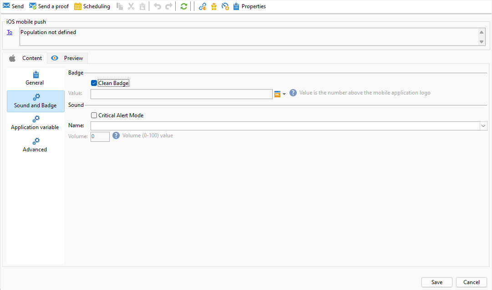
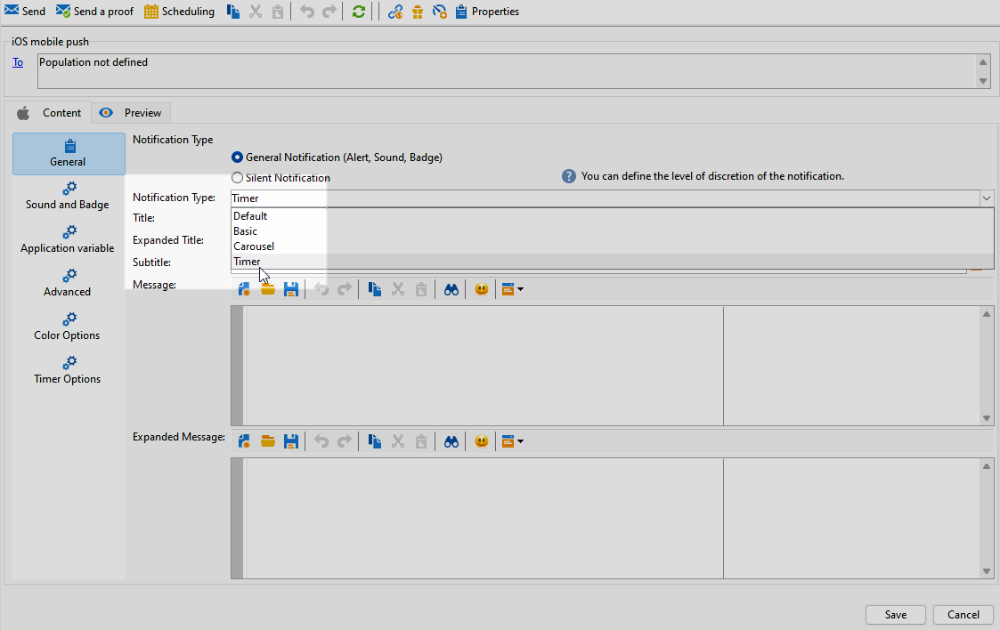

# Design an iOS rich push delivery {#rich-push}

## Define the content of an iOS notification {#push-message}

Once your push delivery is created, you can define its content using one of the following templates:

* **Default** allows you to send notifications with a simple icon and an accompanying image.

* **Basic** can include text, images, and buttons in your notifications.

* **Carousel** enables you to send notifications with text and multiple images that users can swipe through.

Navigate through the tabs below to learn more on how to personalize these templates.

>[!BEGINTABS]

>[!TAB Default]

1. Choose **[!UICONTROL General notification (Alert, Sound, Badge)]** as your **[!UICONTROL Notification type]**.

1. From the **[!UICONTROL Notification Type]** drop-down, select **[!UICONTROL Default]**.

   

1. In the **[!UICONTROL Title]** field, enter the label of the title that you want to appear in the list of notifications available from the notification center. 

   This field allows you to define the value of the **title** parameter of the iOS notification payload.

1. Optionally, add a **[!UICONTROL Subtitle]**, which corresponds to the **subtitle** parameter of the iOS notification payload.

1. Enter the content of the message in the **[!UICONTROL Message content]** section of the wizard.

   

1. Navigate to the **[!UICONTROL Sound and Badge]** tab to customize additional settings such as sound and badge options for your notifications. [Learn more](#sound-badge)

   

1. From the **[!UICONTROL Application variables]** tab, your **[!UICONTROL Application variables]** are automatically added. They let you define notification behavior, for instance, you can configure a specific application screen to be displayed when the user activates the notification.

1. For further customization, explore the **[!UICONTROL Advanced options]** available for your push notifications. [Learn more](#push-advanced)

   

1. Once the notification is configured, click the **[!UICONTROL Preview]** tab to preview the notification.

>[!TAB Basic]

1. Choose **[!UICONTROL General notification (Alert, Sound, Badge)]** as your **[!UICONTROL Notification type]**.

1. From the **[!UICONTROL Notification Type]** drop-down, select **[!UICONTROL Basic]**.

    

1. To compose your message, enter your text in the **[!UICONTROL Title]**,**[!UICONTROL Expanded message]**, **[!UICONTROL Message]** and **[!UICONTROL Expanded message]** fields. 

    The **[!UICONTROL Message]** text appears in the collapsed view while the **[!UICONTROL Expanded message]** is displayed when the notification is expanded.

    

1. Optionally, add a **[!UICONTROL Subtitle]**, which corresponds to the **subtitle** parameter of the iOS notification payload.

1. Navigate to the **[!UICONTROL Sound and Badge]** tab to customize additional settings such as sound and badge options for your notifications. [Learn more](#sound-badge)

1. From the **[!UICONTROL Application variables]** tab, your **[!UICONTROL Application variables]** are automatically added. They let you define notification behavior, for instance, you can configure a specific application screen to be displayed when the user activates the notification.

1. For further customization, explore the **[!UICONTROL Advanced options]** available for your push notifications. [Learn more](#push-advanced)

   

1. In the **[!UICONTROL Color options]** menu, enter hexadecimal color codes for the **[!UICONTROL Title]**, **[!UICONTROL Message]** and **[!UICONTROL Background]**.

    

Once you have defined your message content, you can use test subscribers to preview and test the message.

>[!TAB Carousel]

1. Choose **[!UICONTROL General notification (Alert, Sound, Badge)]** as your **[!UICONTROL Notification type]**.

1. From the **[!UICONTROL Notification Type]** drop-down, select **[!UICONTROL Carousel]**.

    

1. To compose your message, enter your text in the **[!UICONTROL Title]**, **[!UICONTROL Expanded Title]** and **[!UICONTROL Message]** fields.

    

1. Navigate to the **[!UICONTROL Sound and Badge]** tab to customize additional settings such as sound and badge options for your notifications. [Learn more](#sound-badge)

1. From the **[!UICONTROL Application variables]** tab, your **[!UICONTROL Application variables]** are automatically added. They let you define notification behavior, for instance, you can configure a specific application screen to be displayed when the user activates the notification.

1. For further customization, explore the **[!UICONTROL Advanced options]** available for your push notifications. [Learn more](#push-advanced)

    

1. In the **[!UICONTROL Color options]** menu, enter hexadecimal color codes for the **[!UICONTROL Title]**, **[!UICONTROL Message]** and **[!UICONTROL Background]**.

1. Choose how the **[!UICONTROL Carousel]** operates in the **[!UICONTROL Carousel options]** tab: 

    * **[!UICONTROL Auto]**: automatically cycles through images as slides, transitioning at predefined intervals.
    * **[!UICONTROL Manual]**: allows users to manually swipe between slides to navigate through the images.

1. Click **[!UICONTROL Add image]** and enter your **[!UICONTROL Image URL]**, **[!UICONTROL Text]** and **[!UICONTROL Action URL]**.

    Ensure that you include a minimum of three images and a maximum of five images.

    

Once you have defined your message content, you can use test subscribers to preview and test the message.

>[!TAB Timer]

1. Choose **[!UICONTROL General notification (Alert, Sound, Badge)]** as your **[!UICONTROL Notification type]**.

1. From the **[!UICONTROL Notification Type]** drop-down, select **[!UICONTROL Timer]**.

   

1. To compose your message, enter your text in the **[!UICONTROL Title]**,**[!UICONTROL Expanded title]**, **[!UICONTROL Message]** and **[!UICONTROL Expanded message]** fields. 

    The **[!UICONTROL Message]** text appears in the collapsed view while the **[!UICONTROL Expanded message]** is displayed when the notification is expanded.

   

1. Optionally, add a **[!UICONTROL Subtitle]**, which corresponds to the **subtitle** parameter of the iOS notification payload.

1. Navigate to the **[!UICONTROL Sound and Badge]** tab to customize additional settings such as sound and badge options for your notifications. [Learn more](#sound-badge)

1. From the **[!UICONTROL Application variables]** tab, your **[!UICONTROL Application variables]** are automatically added. They let you define notification behavior, for instance, you can configure a specific application screen to be displayed when the user activates the notification.

1. For further customization, explore the **[!UICONTROL Advanced options]** available for your push notifications. [Learn more](#push-advanced)

1. In the **[!UICONTROL Color options]** menu, enter hexadecimal color codes for the **[!UICONTROL Title]**, **[!UICONTROL Message]** and **[!UICONTROL Background]**.

    

1. From the **[!UICONTROL Timer]** tab, set your **[!UICONTROL Timer duration]** in seconds or the **[!UICONTROL Timer end timestamp]** to a specific epoch timestamp.

1. Enter the text and image that will be displayed after the timer has expired in the **[!UICONTROL Alternate title]**, **[!UICONTROL Alternate message]** and **[!UICONTROL Alternate image]** fields.

   

Once you have defined your message content, you can use test subscribers to preview and test the message.

>[!ENDTABS]

## Push notification advanced settings {#push-advanced}

### Sound and badge options {#sound-badge}

|Parameter | Description |
|---------|---------|
|**[!UICONTROL Clean Badge]** |Enable this options to refresh the badge value.|
|**[!UICONTROL Value]** | Set a number which will be used to display directly on the application icon the number of new unread information. |
|**[!UICONTROL Critical alert mode]**| Enable this option to add sound to your notification even the user's phone is set on focus mode or if the iPhone is muted.|
|**[!UICONTROL Name]**| Select the sound to be played by the mobile terminal when the notification is received.|
|**[!UICONTROL Volume]**|Set volume of your sound from 0 to 100. Sounds must be included in the application and defined when the service is created.|
    
### Advanced options {#notification-options}

|Parameter | Description |
|---------|---------|
|**[!UICONTROL Mutable content]** |Enable this option to allow the mobile application to download media content.|
|**[!UICONTROL Thread-id]** | Set the identifier used to group related notifications together. |
|**[!UICONTROL Category]**| Set the name of your category ID which will display action buttons. These notifications give the user a faster way to perform different tasks in response to a notification without opening or navigating in the application.|
|**[!UICONTROL Target content ID]**| Set an identifier used to target which application window to brought forward when the notification is opened.|
|**[!UICONTROL Launch image]**|Set name of the launch image file to display. If the user chooses to launch your application, the selected image will displayed instead of your application's launch screen.|
|**[!UICONTROL Click action]** | Set the action associated with a user click on your notification.|
|**[!UICONTROL Interruption level]** |<ul><li>Active: Set by default, the system presents the notification immediately, lights up the screen, and can play a sound. Notifications do not break through Focus modes..</li><li>Passive: The system adds the notification to the notification list without lighting up the screen or playing a sound. Notifications do not break through Focus modes.</li><li> Time sensitive: The system presents the notification immediately, lights up the screen, can play a sound and break through Focus modes. This level does not require a special permission from Apple.</li><li>Critical: The system presents the notification immediately, lights up the screen, and bypasses the mute switch or focus modes. Note that this level requires a special permission from Apple.</li></ul>|
|**[!UICONTROL Relevance score]**| Set a relevance score from 0 to 100. The system uses this to sort the notifications in the notification summary.|

