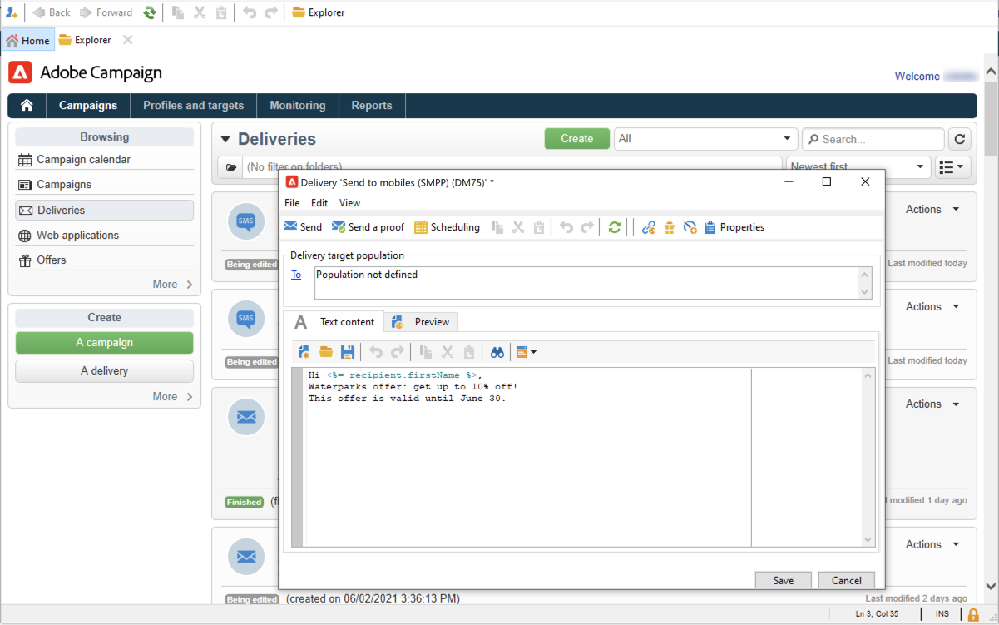

# Create and send SMS

Use Adobe Campaign to send personalized SMS messages.

Learn how to get started with SMS channel in [Campaign Classic v7 documentation](https://experienceleague.adobe.com/docs/campaign-classic/using/sending-messages/sending-messages-on-mobiles/sms-channel.html){target="_blank"}

>[!NOTE]
>
>Adobe Campaign also lets you submit push notifications on mobiles, via its **Adobe Campaign Mobile App Channel (NMAC)** option. Learn more in [this section](push.md).

## Configure SMS channel

To send to a mobile phone, you need:

* An external account specifying a connector and type of message.

* A delivery template in which this external account is referenced.

 Learn how to configure an SMS channel in [Campaign Classic v7 documentation](https://experienceleague.adobe.com/docs/campaign-classic/using/sending-messages/sending-messages-on-mobiles/sms-set-up.html#sending-messages){target="_blank"}

Before starting sending SMS:

* Make sure recipient profiles contain at least a mobile phone in their profile.
* Review the Adobe Campaign Classic [Delivery best practices](https://experienceleague.adobe.com/docs/campaign-classic/using/sending-messages/key-steps-when-creating-a-delivery/delivery-bestpractices/delivery-best-practices.html#sending-messages){target="_blank"} which also apply to Campaign v8.

In addition, you need to be familiar with the SMS protocol and settings. Walk through the connection set up between Adobe Campaign and an SMPP provider in [this document](https://experienceleague.adobe.com/docs/campaign-classic/using/sending-messages/sending-messages-on-mobiles/sms-protocol.html#sending-messages){target="_blank"}.

## Create your first SMS delivery

1. To create a new delivery, browse to the **[!UICONTROL Campaigns]** tab, click **[!UICONTROL Deliveries]** and click the **[!UICONTROL Create]** button above the list of existing deliveries.

   

   For global information on how to create a delivery, refer to [Campaign Classic v7 documentation](https://experienceleague.adobe.com/docs/campaign-classic/using/sending-messages/key-steps-when-creating-a-delivery/steps-about-delivery-creation-steps.html#sending-messages){target="_blank"}.

1. Select a delivery template referencing the relevant external account to send SMS deliveries.

   
    
    Learn how to create an SMPP external account in [Campaign Classic v7 documentation](https://experienceleague.adobe.com/docs/campaign-classic/using/sending-messages/sending-messages-on-mobiles/sms-set-up.html#creating-an-smpp-external-account){target="_blank"}

    Learn how to create a delivery template to deliver to mobiles in [Campaign Classic v7 documentation](https://experienceleague.adobe.com/docs/campaign-classic/using/sending-messages/sending-messages-on-mobiles/sms-set-up.html#changing-the-delivery-template){target="_blank"}

1. Identify your delivery with a label, code, and description.

1. Click **[!UICONTROL Continue]** to confirm and display the message configuration window.

1. Enter the content of the message in the **[!UICONTROL Text content]** section of the wizard, including personalization fields as needed.

   

1. Select the target population.

The key steps to create and design an SMS are detailed in Campaign Classic v7 documentation:

* Create an SMS

    [Learn how to create an SMS delivery](https://experienceleague.adobe.com/docs/campaign-classic/using/sending-messages/sending-messages-on-mobiles/sms-create.html#sending-messages){target="_blank"}

* Design the SMS content

    [Learn how to define the SMS content](https://experienceleague.adobe.com/docs/campaign-classic/using/sending-messages/sending-messages-on-mobiles/sms-create.html#defining-the-sms-content){target="_blank"}

* Select the audience of your email

   [Learn how to define the target population](https://experienceleague.adobe.com/docs/campaign-classic/using/sending-messages/key-steps-when-creating-a-delivery/steps-defining-the-target-population.html){target="_blank"}

Steps to define an audience are detailed on [this page](../start/audiences.md).

## Test your SMS

To view the rendering of the message with its personalization, click **[!UICONTROL Preview]** and select a recipient.

   

To send a proof, refer to these sections of Campaign Classic v7 documentation:

* Validate a delivery and send proofs
   [Learn key steps to validate a delivery](https://experienceleague.adobe.com/docs/campaign-classic/using/sending-messages/key-steps-when-creating-a-delivery/steps-validating-the-delivery.html){target="_blank"}
* Add seed addresses
    [Learn about seed addresses](https://experienceleague.adobe.com/docs/campaign-classic/using/sending-messages/using-seed-addresses/about-seed-addresses.html){target="_blank"}

## Send and monitor SMS deliveries

The key steps to send and monitor an SMS are detailed in Campaign Classic v7 documentation:

* Send, monitor and track SMS deliveries
    
    [Learn about the tools to send, monitor and track SMS](https://experienceleague.adobe.com/docs/campaign-classic/using/sending-messages/sending-messages-on-mobiles/sms-send.html#sending-messages){target="_blank"}

* Troubleshoot SMS deliveries
    
    [Learn about SMS Troubleshooting](https://experienceleague.adobe.com/docs/campaign-classic/using/sending-messages/sending-messages-on-mobiles/troubleshooting-sms.html#sending-messages){target="_blank"}
