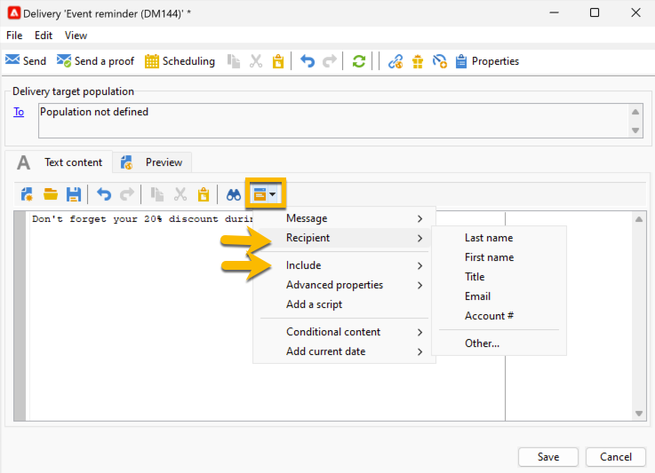
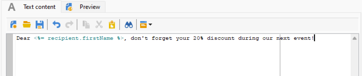
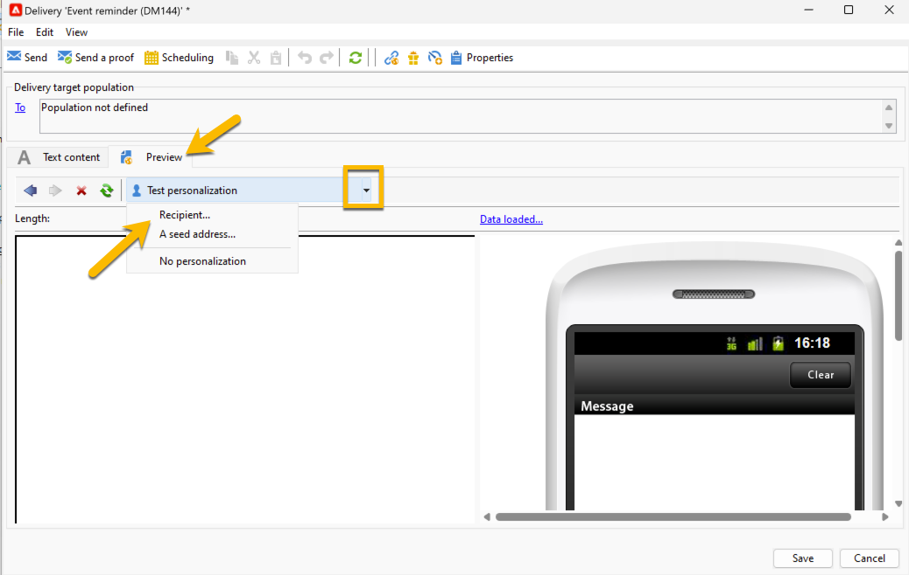
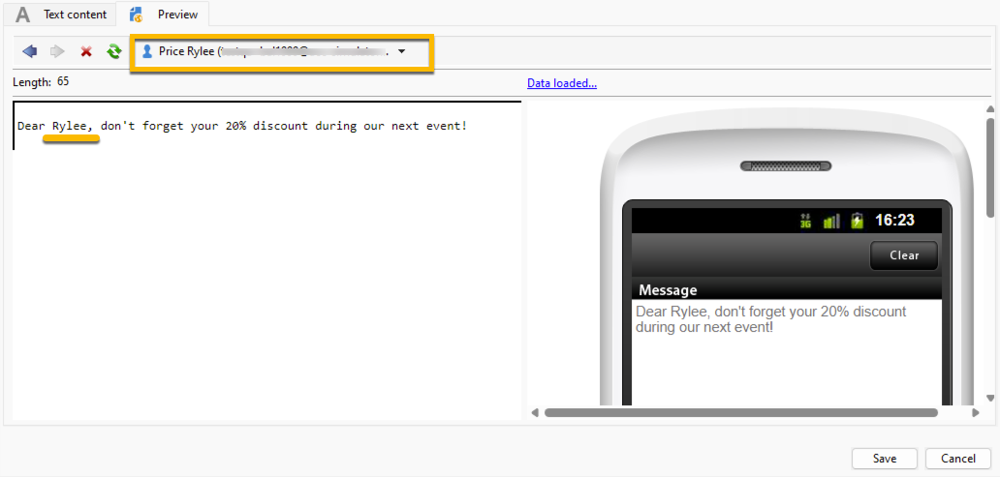

# Define the SMS content {#sms-content}

To configure the content of your SMS delivery:

1. Enter the content of your message in the **[!UICONTROL Text content]** tab.
    
    {zoomable="yes"}

1. You can personalize your message by inserting personalization fields (for example adding the first name), or inserting predefined personalization block (for example adding the greetings). Click on the personalization button to add these:

    {zoomable="yes"}

    For example, after clicking on **[!UICONTROL Recipient]** > **[!UICONTROL First name]**, the SMS content is updated with the personalization field, as below:

    {zoomable="yes"}

    Learn more about personalization in Adobe Campaign in [this section](../personalize.md).

1. You can preview you delivery content from the **[!UICONTROL Preview]** tab. To check your personalization settings, click on the **[!UICONTROL Test personalization]** drop-down list, and select a recipient.

    {zoomable="yes"}

    You can check the preview of your SMS with the personalization:

    {zoomable="yes"}

>[!NOTE]
>
>* SMS messages are limited to a length of 160 characters if the Latin-1 (ISO-8859-1) code page is used. If the message is written in Unicode, it must not exceed 70 characters. Certain special characters can affect message length. For more information on message length, refer to [SMS character transliteration ](smpp-external-account.md#smpp-channel-settings) section.
>
>* When personalization fields or conditional content fields are present, the size of the message varies from one recipient to the other. The length of the message must be evaluated when personalization has been carried out.
>
>*When you launch the analysis, the length of messages is checked and a warning is displayed in the event of overflow.

After creating the content of your delivery, you can [select your audience](sms-audience.md).
