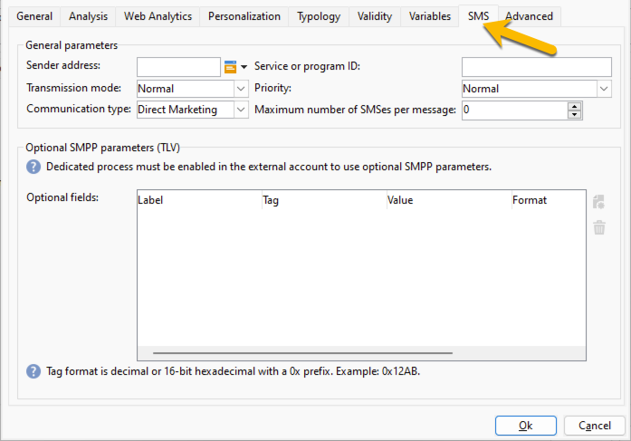

# SMS delivery settings {#sms-settings}

>[!AVAILABILITY]
>
>This capability is available to all Campaign FDA environments. It is **not** available for Campaign FFDA deployments. This documentation applies to Adobe Campaign v8.7.2 and later. To switch from the legacy to the new SMS connector, refer to this [technote](https://experienceleague.adobe.com/docs/campaign/technotes-ac/tn-new/sms-migration){target="_blank"}
>
>For older versions, please read the [Campaign Classic v7 documentation](https://experienceleague.adobe.com/en/docs/campaign-classic/using/sending-messages/sending-messages-on-mobiles/sms-set-up/sms-set-up){target="_blank"}.

The technical settings needed for a SMS delivery are:

* The SMPP external account for the message routing. [Learn more](smpp-external-account.md#smpp-connection-settings)
* Configure the SMS tab. [Learn how](#sms-tab)

You can set up all of these in a delivery template in order to avoid to do the settings for each SMS delivery creation.

## Configure the SMS tab {#sms-tab}

{zoomable="yes"}

Here are the information you need to fill this form. Each field is explained below:

* **[!UICONTROL Sender address]**

  This field is optional. It allows overriding sender address (oADC). The content of this field is placed in the *source_addr* field of the SUBMIT_SM PDU.

  The field is limited to 21 characters by the SMPP specification, but some providers may allow longer values. Note also that very strict restrictions may be applied in some countries (length, content, allowed characters, ...), so you may need to double-check that the content you place here is legal. Be especially careful when using personalized fields.

  If this field is left empty, the value of the Source number field defined in the external account will be used instead. If both values are empty, the *source_addr* field will be left empty.

* **[!UICONTROL Service or program ID]**

  >[!NOTE]
  >
  >Using this feature is discouraged. Optional SMPP parameters provide a much more flexible implementation.
  >
  >Both features cannot be used at the same time.

  In combination with the matching external account setting, allows sending one optional parameter with each MT. This field defines the value part of the TLV.

* **[!UICONTROL Transmission mode]**

  This field indicates the kind of SMS you wish to transfer: normal or flash messages, storing on the mobile or the SIM card. This setting is transmitted in the dest_addr_subunit optional field in the SUBMIT_SM PDU.
  
  * **Flash** sets the value to 1. It sends a flash message that pops up on the mobile and is not stored in memory.
  * **Normal** sets the value to 0. It sends a normal message.
  * **Save on mobile** sets the value to 2. It tells the phone to store the SMS in internal memory.
  * **Save on terminal** sets the value to 3. It tells the phone to store the SMS in the SIM card.

* **[!UICONTROL Priority, Communication type]**

  These fields are ignored by the extended SMPP connector.

* **[!UICONTROL Maximum number of SMS per message]**

  This setting only works if the Message payload setting is disabled (see in the external account settings for more info). If the message requires more SMS than this value, an error will be triggered.

  The SMS protocol limits SMS to 255 parts, but some mobile phones have trouble putting together long messages with more than 10 parts or so (the limit depends on the exact model). If you want to be safe, don't go over 5 parts per message.

  Due to how personalized messages work in Adobe Campaign, messages can vary in size, so having a lot of very long messages could increase sending costs a lot: setting this to a reasonable value helps controlling these costs.

  Specifying 0 disables the limit.

* **[!UICONTROL Optional SMPP parameters (TLV)]**
  You can specify extra fields to send as optional SMPP parameters (TLV). These extra fields are sent with each MT and personalized fields allow to have different values for each MT.
  The table lists optional parameters to send with each message. Columns contain the following information:
    * **Label**: this is an optional, free-form label. It is not transmitted to the provider. You can provide a textual description of the parameter.
    * **Tag**: the tag value, either in decimal format (e.g. 12345) or hexadecimal with 0x prefix (e.g. 0x12ab). Tags can go between 0 and 65535. Ask the SMPP service provider for tags they support.
    * **Value**: value to send in the optional parameter. This is a personalized field.
    * **Format**: Encoding used for the parameter. You can select any supported text encoding or the most common binary formats. Ask the SMPP service provider for the required format.
    * **Maximum length**: Maximum number of bytes for this parameter. This is ignored for binary fields as binary fields have a fixed size.

* **[!UICONTROL Using binary formats for TLV]**

  Campaign supports sending TLV in binary format. Binary is limited to sending numbers.

  Because personalized fields always output text, the personalized field must contain a decimal representation of the number (any string is okay as long as it only contains digits). Values can be both signed or unsigned, the personalization engine just converts it to the correct binary representation.

  When using binary formats, special values '' (empty string), 'null' and 'undefined' disable the field completely without throwing an error. In these 3 special cases, the tag is not passed at all. This allows passing a specific TLV only for some messages when using carefully crafted Javascript in the personalization field.

  >[!NOTE]
  >
  >Binary formats are always encoded into big-endian form.

