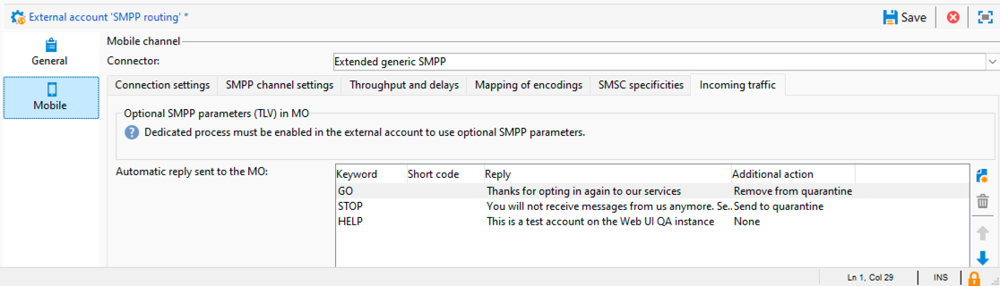
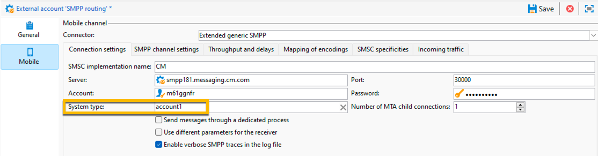

# Process inbound messages

The **[!UICONTROL nlserver sms]** module queries the SMS router at regular intervals. This allows Adobe Campaign to track the progress of deliveries and handle the status reports and recipient unsubscription requests.

* **Status reports** : view delivery logs to check the status of your messages.

>[!IMPORTANT]
>
>Every SMS sent is linked to an external account its primary key. In this way:
Status reports from a deleted external SMS account are not correctly processed.
An SMS account can only be linked to a single external account to ensure that status reports are attributed to the correct account

* **Unsubscription** : recipients who wish to stop receiving SMS deliveries can return a message containing the word STOP. If your provider allows it under the terms of the contract, you can retrieve messages via the **[!UICONTROL Inbound SMS]** workflow activity and then create a query to enable the **[!UICONTROL No longer contact this recipient]** option for the recipients concerned.

Learn more about the [Inbound SMS activity](../../../automation/workflow/inbound-sms.md).

# InSMS schema {#insms}

The **[!UICONTROL InSMS schema]** contains information relevant to incoming SMS. A description of these fields is available via the desc attribute.

* **message**: content of the SMS received.

* **origin**: mobile number at the origin of message.

* **providerId**: identifier of the message returned by the SMSC (message center).

* **created**: date incoming message was inserted into Adobe Campaign.

* **extAccount**: Adobe Campaign external account.

>[!IMPORTANT]
>
>The following fields are specific to NetSize.
If the operator in use is not NetSize, these fields are considered empty.

* **alias**: alias of incoming message.

* **separator**: separator between the alias and the body of the message.

* **messageDate**: message date given by operator.

* **receivalDate**: date message from operator was received by SMSC (message center).

* **deliveryDate**: date message sent by SMSC (message center).

* **largeAccount**: customer account code linked to incoming SMS.

* **countryCode**: operator country code.

* **operatorCode**: operator network code.

* **linkedSmsId** : Adobe Campaign identifier (broadlogId) linked to outgoing SMS, where this SMS is the response.

# Automatic reply {#automatic-reply}

When setting up an extended generic [SMPP connector](smpp-external-account.md), you can configure automatic replies.

When a subscriber replies to an SMS message which was sent to them via Adobe Campaign and their message contains a keyword such as "STOP", you can configure messages which are automatically sent back to them in the **[!UICONTROL Automatic reply sent to the MO]** section.

>[!NOTE]
>
>The keywords are not case-sensitive.

For each keyword, specify a short code, which is a number that is usually used to send deliveries and will serve as a sender name, then enter the message that will be sent to the subscriber.

You can also link an action to your automatic response: **[!UICONTROL Send to quarantine]** or **[!UICONTROL Remove from quarantine]**. For example, if a recipient sends the keyword "STOP", they will automatically receive an unsubscription confirmation and are sent to quarantine.

If you link the **[!UICONTROL Remove from quarantine]** action to an automatic response, the recipients sending the corresponding keyword are automatically removed from quarantine.

Recipients in quarantine are listed in the **[!UICONTROL Non deliverables and addresses]** table available through the **[!UICONTROL Administration]** > **[!UICONTROL Campaign Management]** > **[!UICONTROL Non deliverables Management]** menu.

* To send the same reply no matter what the short code, leave the **[!UICONTROL Short code]** column empty.
* To send the same reply no matter what the keyword, leave the **[!UICONTROL Keyword]** column empty.
* To carry out an action without sending a response, leave the **[!UICONTROL Reply]** column empty. For example, this allows you to remove from quarantine a user who replies with a message other than "STOP".

If you have multiple external accounts using the Extended generic SMPP connector with the same provider account, the following issue may happen: when sending a reply to a short code, it may be received on any of your external account connections. Consequently, the automatic reply that is sent could not be the expected message.
To avoid this, apply one of the following solutions, depending on the provider you are using:

* Create one provider account for each external account.
* Use the **[!UICONTROL System type]** field from the **[!UICONTROL Mobile]** > **[!UICONTROL Connection settings]** tab to distinguish each short code. Ask your provider a different value for each account.

   

The steps for setting up an external account using the Extended generic SMPP connector are detailed in the [SMPP external account documentation](smpp-external-account.md).

