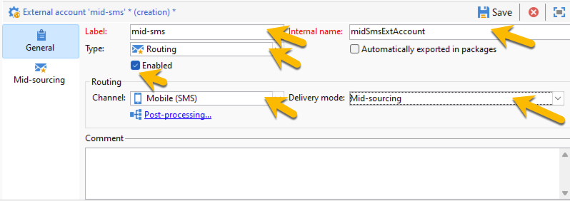

# SMS in a mid-sourcing infrastructure {#sms-mid}

>[!IMPORTANT]
>
>This documentation is for Adobe Campaign v8.7.2 and later.
For older versions, please read the [Campaign Classic v7 documentation](https://experienceleague.adobe.com/en/docs/campaign-classic/using/sending-messages/sending-messages-on-mobiles/sms-set-up/sms-set-up).

Sending SMS deliveries with a mid-sourcing infrastructure requires : 

1. An SMS Operator on the Mid-server. [Learn how to create it here](#sms-operator-mid)
1. An SMS external account on the Marketing server that will use the operaor created before. [Learn how to create it here](#sms-external-account)
1. An SMPP external account on the Mid server, specifying the Channel and Mid-sourcing Delivery mode. [Learn how to create it here](#smpp-external-account-mid)
1. A delivery template that references the external account to streamline the sending process. [Learn how to create it here](#sms-delivery-template)

## Create the SMS operator on the Mid-server {#sms-operator-mid}

First, you need to create an SMS operator on the Mid-server, that will be used by the SMS external account on the Marketing server.

To create you SMS operator, follow the steps below : 

1. In **[!UICONTROL Administration]** > **[!UICONTROL Access management]** > **[!UICONTROL Operators]**, click on the **[!UICONTROL New]** and fill in the form in the new window opened. 

**[!UICONTROL Name (login)]** and **[!UICONTROL Label]** are mandatory.
Password is not mandatory but highly recommended for the security.

Note that the Name (login) is to be later used to name your SMPP external account in the Mid-server.

{zoomable="yes"}

1. In **[!UICONTROL Groups and named rights]** part, click on **[!UICONTROL Add]** button.
On the new window opened, choose **[!UICONTROL Named rights]** in the **[!UICONTROL Folder]** list, and select **[!UICONTROL ADMINISTRATION]** in the right list.
Click on **[!UICONTROL Ok]** button.

{zoomable="yes"}

1. Click on **[!UICONTROL Save]** button to finalize the creation of your SMS operator. 

{zoomable="yes"}

You can see it in the operators list now.

{zoomable="yes"}

## Create an SMS external account on the Marketing server {#sms-external-account}

In a mid infrastructure, you need to create a SMS external account on the Marketing server as below

>[!IMPORTANT]
>
>Using the same account and password for multiple external SMS accounts can result in conflicts and overlap between the accounts. Learn more on [SMS troubleshooting page](smpp-connection.md#sms-troubleshooting). 

1. In **[!UICONTROL Administration]** > **[!UICONTROL Platform]** > **[!UICONTROL External Accounts]**, click the **[!UICONTROL New]** icon

    {zoomable="yes"}

1. Set up the **[!UICONTROL Label]** and the **[!UICONTROL Internal name]** of your external account. Define the account type as **[!UICONTROL Routing]**, check the **[!UICONTROL Enabled]** box, select **[!UICONTROL Mobile (SMS)]** for the channel, and **[!UICONTROL Mid-sourcing]** for the delivery mode.

    {zoomable="yes"}

1. In the **[!UICONTROL Mid-sourcing]** tab, fill in the form with the mid-sourcing server URL and the SMS operator created previously on the mid server.
Confirm the connection by clicking on **[!UICONTROL Test the connection]** button.

    {zoomable="yes"}

1. Click **[!UICONTROL Save]**.

## Create an SMPP external account on the Mid-server {#smpp-external-account-mid}

>[!IMPORTANT]
>
>Using the same account and password for multiple external SMS accounts can result in conflicts and overlap between the accounts. Refer to the [SMS troubleshooting page](smpp-connection.md#sms-troubleshooting).

The goal is now to establish your SMPP external account on the Mid-server.

To do this, follow the steps below : 

1. In **[!UICONTROL Administration]** > **[!UICONTROL Platform]** > **[!UICONTROL External Accounts]** of the Mid-server, click the **[!UICONTROL New]** icon

1. Set up the **[!UICONTROL Label]** and the **[!UICONTROL Internal name]** of your external account. 

>[!WARNING]
>
>When assigning an Internal name, make sure to follow the specified naming convention:
*SMS Operator Name_Internal Name of the Marketing SMS external account* 

Define the account type as **[!UICONTROL Routing]**, check the **[!UICONTROL Enabled]** box, select **[!UICONTROL Mobile (SMS)]** for the channel, and **[!UICONTROL Bulk delivery]** for the delivery mode.
{zoomable="yes"}

1. In the **[!UICONTROL Mobile]** tab, keep **[!UICONTROL Extended generic SMPP]** in the **[!UICONTROL Connector]** drop-down list.
The **[!UICONTROL Send messages through a dedicated process]** box is checked by default.

{zoomable="yes"}

To set up the connection, you need to fill the tabs of this form. For details, [learn more about SMPP external account](smpp-external-account.md#smpp-connection-settings).

## Configure the delivery template {#sms-delivery-template}

To facilitate the creation of your SMS delivery, create a SMS delivery template where all your settings are referenced.

In **[!UICONTROL Resources]** > **[!UICONTROL Templates]** > **[!UICONTROL Delivery templates]** on the Marketing server, right click on the existing Mobile delivery template, and choose **[!UICONTROL Duplicate]**.

{zoomable="yes"}

Change the **[!UICONTROL Label]** and the **[!UICONTROL Internal name]** of your template to easily recognize it, and click on **[!UICONTROL Properties]** button.

{zoomable="yes"}

In the **[!UICONTROL General]** tab, in **[!UICONTROL Routing]**, select your SMPP external account. 

{zoomable="yes"}

In the **[!UICONTROL SMS]** tab, you can add optional parameters to your template.

{zoomable="yes"}

[Learn more about this SMS tab configuration](sms-delivery-settings.md).