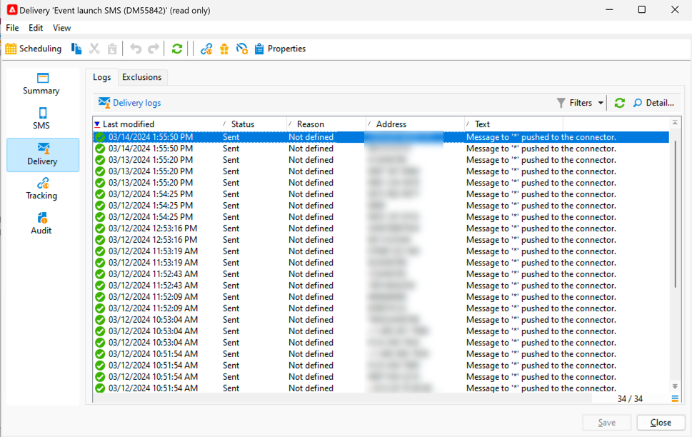
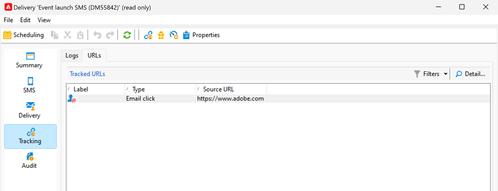

# Monitor and track a SMS

It is important to monitor you SMS delivery, in order to be sure that your marketing campaigns are efficient.

Here the possibilities you have to know what happens after the sending of your delivery

## Understand the SMS delivery dashboad

The delivery dashboard gives you many information about your SMS. 

To access the dashboard, double-click on your delivery in the delivery list.

In the **[!UICONTROL Summary]** tab, you have the main data like the number of messages processed, and the number of success.

{zoomable="yes"}

After the sending of the SMS, the **[!UICONTROL SMS]** tab, which is about the content of the delivery, is no longer accessible for a change.

In the **[!UICONTROL Delivery]** tab, you have the information about the delivery logs. For each address contacted, you can see if the SMS has been sent or not

{zoomable="yes"}

You can see in the **[!UICONTROL Exclusions]** tab the details on why some addresses are excluded from the target.

{zoomable="yes"}

The **[!UICONTROL Tracking]** tab is about the tracking. Below the example of an URL tracked in the SMS content.

{zoomable="yes"}

And last, the **[!UICONTROL Audit]** tab with all the details during the launch of the delivery:

{zoomable="yes"}

## Understand SMS failures

The failure types and reasons for failure for SMS are the same as for emails.

Learn more about [delivery failures](../delivery-failures.md) and specifically about [SMS quarantines](../delivery-failures.md#sms-quarantines).
