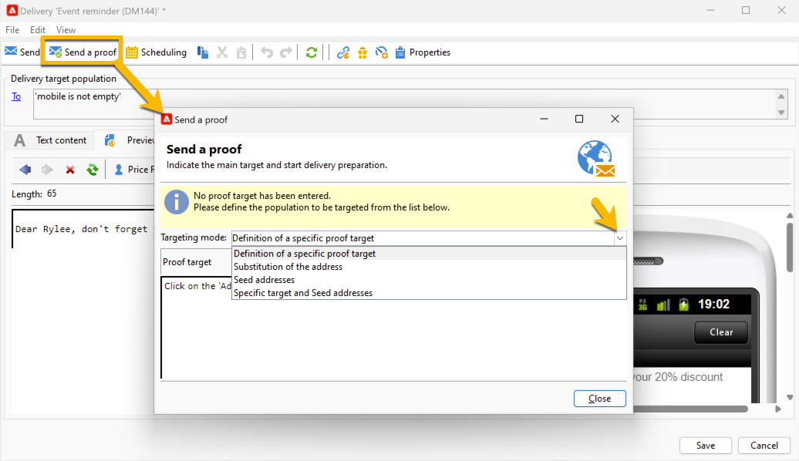

# Send a proof of an SMS delivery {#sms-proof}

Adobe highly recommends setting up a delivery validation cycle. Make sure your content is approved before sending it to your audience.

You can send a proof for your SMS delivery to validate it: 

1. Click on **[!UICONTROL Send a proof]** button, a window will be opened

{zoomable="yes"}

You have multiple modes to send a proof:

* **[!UICONTROL Definition of a specific proof target]**: lets you query with filters the addresses in the database as the proof target
* **[!UICONTROL Substitution of the address]**: lets you enter your test addresses and use the target recipient data to validate the content. The substitution addresses can be entered manually or selected from the drop-down list. The associated enumeration is **[!UICONTROL Substitution address (rcpAddress)]**.
By default, substitution is performed randomly, but you can select a specific recipient from the main target, via the **[!UICONTROL Detail]** icon.
* **[!UICONTROL Seed addresses]**: lets you access to seed addresses to be proof target. These addresses can be imported from a file or entered manually.
* **[!UICONTROL Specific target and Seed addresses]**: lets you combine seed addresses and addresses from recipient.

1. After choosing your **[!UICONTROL Targeting mode]**, add your proof addresses according to it

In the example below, we choose **[!UICONTROL Definition of a specific proof target]**, and add a recipient: 

{zoomable="yes"}

1. Click on the **[!UICONTROL Analyze]** button.
Adobe Campaign will perform all the control before validating the send of proof. At the end of the analysis, the **[!UICONTROL Confirm delivery]** button will be clickable.

{zoomable="yes"}

1. To send the proof of your SMS delivery, click on **[!UICONTROL Confirm delivery]** button.

If all is right at this stage, you can go forward and [send your SMS delivery to the audience](sms-audience.md).
