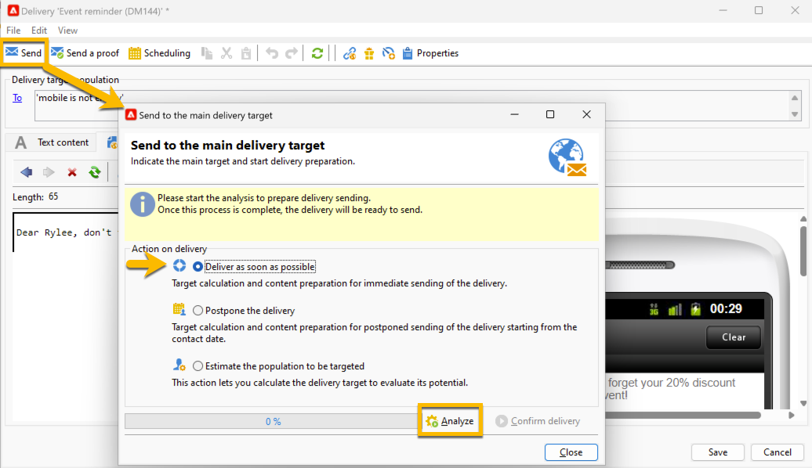

# Send your SMS delivery to the audience {#sms-send-audience}

When your SMS is validated, you can now send it to its audience.

1. Click on the **[!UICONTROL Send]** button. 
In the window opened, choose the right action that fits to you.

    In the example below, we choose to **[!UICONTROL Deliver it as soon as possible]**, the **[!UICONTROL Analyze]** button appeared. We click on that **[!UICONTROL Analyze]** button.

    {zoomable="yes"}

    Adobe Campaign will perform all the control before validating the send of proof. You will see there the real volume of the audience. At the end of the analysis, the **[!UICONTROL Confirm delivery]** button will be clickable.

    {zoomable="yes"}

1. To send your SMS delivery to its audience, click on **[!UICONTROL Confirm delivery]** button.
