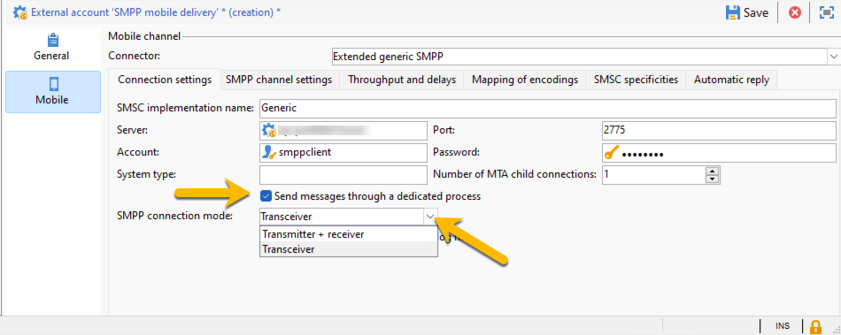
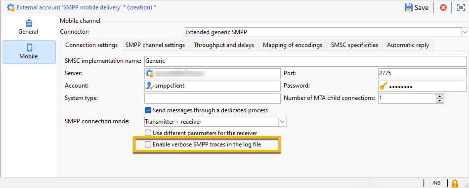

# SMS in a standalone instance {#sms-standalone}

>[!IMPORTANT]
>
>This documentation is for Adobe Campaign v8.7.2 and later.
For older versions, please read the [Campaign Classic v7 documentation](https://experienceleague.adobe.com/en/docs/campaign-classic/using/sending-messages/sending-messages-on-mobiles/sms-set-up/sms-set-up).

In a standalone instance, sending a SMS delivery requires : 

1. An **external account** specifying a connector and the type of message, [learn more here](#external-account)

1. A **delivery template** in which this external account is referenced, [learn more here](#sms-delivery-template)

## Create an external account {#external-account}

>[!IMPORTANT]
>
>Using the same account and password for multiple external SMS accounts can result in conflicts and overlap between the accounts. Learn more on [SMS troubleshooting page](smpp-connection.md#sms-troubleshooting). 

Here are the steps to create your SMPP external account : 

1. In **[!UICONTROL Administration]** > **[!UICONTROL Platform]** > **[!UICONTROL External Accounts]**, click the **[!UICONTROL New]** icon

{zoomable="yes"}

1. Set up the **[!UICONTROL Label]** and the **[!UICONTROL Internal name]** of your external account. Define the account type as **[!UICONTROL Routing]**, check the **[!UICONTROL Enabled]** box, and select **[!UICONTROL Mobile (SMS)]** for the channel, and **[!UICONTROL Bulk delivery]** for the delivery mode.

{zoomable="yes"}

1. In the **[!UICONTROL Mobile]** tab, select **[!UICONTROL Extended generic SMPP]** from the **[!UICONTROL Connector]** drop-down list.

{zoomable="yes"}

1. In the **[!UICONTROL Connection settings]** tab, complete the form with informations received from the SMPP provider. 
You can define the number of connections to the provider per MTA child. By default, it is set to 1.
Check the **[!UICONTROL Send messages througgh a dedicated process]** box, you will be able to choose the connection mode between *Transmitter + receiver* and *Transceiver*

{zoomable="yes"}

The **[!UICONTROL Enable verbose SMPP traces in the log file]** checkbox will allow you to have the SMPP traffic in the log files. This option will help you during troubleshootings.

{zoomable="yes"}

## Configure the delivery template {#sms-delivery-template}