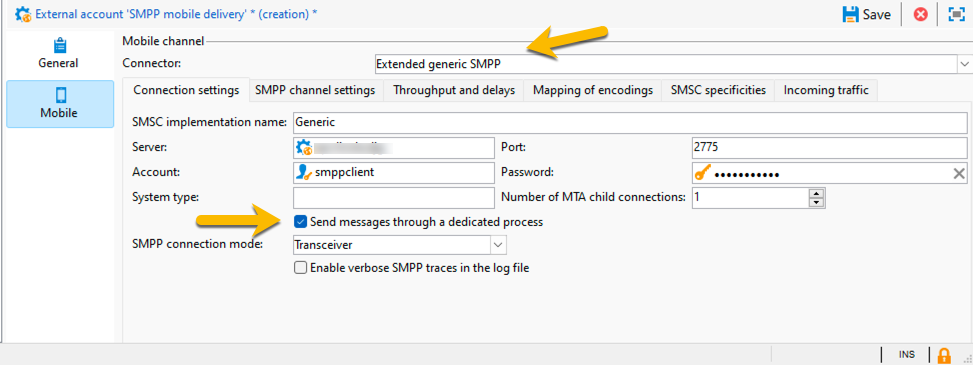

# SMS in a standalone instance {#sms-standalone}

>[!IMPORTANT]
>
>This documentation is for Adobe Campaign v8.7.2 and later.
For older versions, please read the [Campaign Classic v7 documentation](https://experienceleague.adobe.com/en/docs/campaign-classic/using/sending-messages/sending-messages-on-mobiles/sms-set-up/sms-set-up).

In a standalone instance, sending a SMS delivery requires : 

1. An **external account** specifying a connector and the type of message, [learn more here](#external-account)

1. A **delivery template** in which this external account is referenced, [learn more here](#sms-delivery-template)

## Create an external account {#external-account}

>[!IMPORTANT]
>
>Using the same account and password for multiple external SMS accounts can result in conflicts and overlap between the accounts. Learn more on [SMS troubleshooting page](smpp-connection.md#sms-troubleshooting). 

Here are the steps to create your SMPP external account : 

1. In **[!UICONTROL Administration]** > **[!UICONTROL Platform]** > **[!UICONTROL External Accounts]**, click the **[!UICONTROL New]** icon

{zoomable="yes"}

1. Set up the **[!UICONTROL Label]** and the **[!UICONTROL Internal name]** of your external account. Define the account type as **[!UICONTROL Routing]**, check the **[!UICONTROL Enabled]** box, and select **[!UICONTROL Mobile (SMS)]** for the channel, and **[!UICONTROL Bulk delivery]** for the delivery mode.

{zoomable="yes"}

1. In the **[!UICONTROL Mobile]** tab, keep **[!UICONTROL Extended generic SMPP]** in the **[!UICONTROL Connector]** drop-down list.
The **[!UICONTROL Send messages through a dedicated process]** box is checked by default.

{zoomable="yes"}

To set up the connection, you need to fill the tabs of this form. For details, [learn more about SMPP external account](smpp-external-account.md#smpp-connection-settings).

## Configure the delivery template {#sms-delivery-template}

To facilitate the creation of your SMS delivery, createn a SMS delivery template where your SMPP external account is referenced.

In **[!UICONTROL Resources]** > **[!UICONTROL Templates]** > **[!UICONTROL Delivery templates]**, right click on the existing Mobile delivery template, and choose **[!UICONTROL Duplicate]**.

{zoomable="yes"}

Change the **[!UICONTROL Label]** and the **[!UICONTROL Internal name]** of your template to easily recognize it, and click on **[!UICONTROL Properties]** button.

{zoomable="yes"}

In the **[!UICONTROL General]** tab, in **[!UICONTROL Routing]**, select your SMPP external account. 

{zoomable="yes"}

In the **[!UICONTROL SMS]** tab, you can add optional parameters to your template.

{zoomable="yes"}

[Learn more about this SMS tab configuration](sms-delivery-settings.md).
