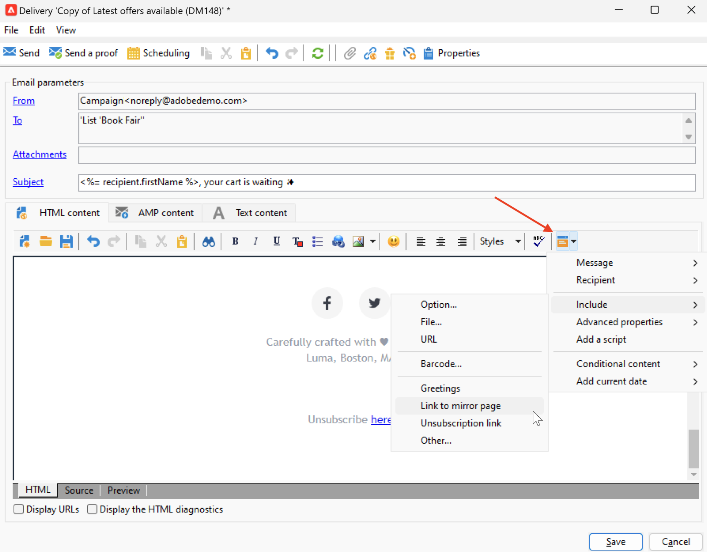

# Test message tracking {#testing-tracking}

Before sending your delivery to your entire audience, it's essential to test the tracking functionality to ensure all links work correctly and tracking data is captured properly. This verification process helps you identify and fix any tracking issues before your campaign goes live, preventing potential problems with link redirects, tracking pixel loading, or data collection.

Testing tracking allows you to:

* Verify that all links in your message are correctly tracked and redirect properly
* Confirm that the mirror page link works and is tracked
* Ensure that tracking pixels load correctly for open tracking
* Check that personalized parameters in URLs are captured accurately
* Validate that the tracking technical workflow processes data correctly

You can test tracking on mirror pages, email logs and links by following the steps below:

## Step 1: Create a test delivery {#create-test-delivery}

1. Create a new email delivery that will be used for testing. [Learn how to create a delivery](../start/create-message.md)
1. Design your email content with links that you want to track. [Learn about email content design](defining-the-email-content.md)
1. Add a mirror page personalization block in the email content. [Learn about personalization blocks](personalization-blocks.md)

   

1. Specify the user that will receive the email. Since this user will have to open the email and click the links it contains, make sure you select a test recipient address that you control. [Learn about test profiles](../audiences/test-profiles.md)

## Step 2: Send the test delivery {#send-test}

1. Verify that tracking is enabled in the delivery settings:
   * Open the **[!UICONTROL Properties]** of your delivery
   * Go to the **[!UICONTROL Tracking & Images]** section
   * Ensure that **[!UICONTROL Activate tracking]** is checked
   * Ensure that **[!UICONTROL Opens tracking]** is checked if you want to track opens

   

   [Learn more about URL tracking options](url-tracking.md)

1. Send the delivery to your test recipient. [Learn about sending deliveries](configure-and-send.md)

## Step 3: Verify tracking functionality {#verify-tracking}

1. Once you have received the email, open it and click the mirror page link. [Learn about mirror pages](mirror-page.md)
1. Click on various links in the email to generate tracking data.
1. After you are correctly redirected to the mirror page, access the **[!UICONTROL Administration > Production > Technical workflows]** folder. [Learn about workflows](../config/workflows.md)
1. Open the **[!UICONTROL Tracking]** workflow.
1. Start the workflow, or right-click the **[!UICONTROL Scheduler]** activity and select **[!UICONTROL Execute pending task now]**.
1. Wait around 30 seconds for the workflow to process the tracking logs.
1. Select the **[!UICONTROL Audit]** tab of the workflow. Ensure that at least one tracking log record is found. Click **[!UICONTROL Refresh]** if you do not see any new logs.

1. Verify tracking logs in the delivery:
   * Go back to your delivery
   * Select the **[!UICONTROL Tracking]** tab
   * Check that the list of tracking logs appears with the URLs clicked and other tracking events

   

## Step 4: Check recipient tracking tab {#check-recipient-tracking}

1. Go to the profile page of the recipient you used for the test. [Learn about viewing profiles](../audiences/view-profiles.md)
   * The recipient's profile page is located in the **[!UICONTROL Profiles and Targets > Recipients]** folder by default.

1. Select the **[!UICONTROL Tracking]** tab. [Learn more about tracking logs](tracking-logs.md)

   

1. Verify that tracking records appear with:
   * The **[!UICONTROL Mirror Page]** value in the **[!UICONTROL Type]** column
   * **[!UICONTROL Open]** values in the **[!UICONTROL Type]** column for email opens
   * **[!UICONTROL Email click]** values in the **[!UICONTROL Type]** column for link clicks

## Troubleshooting tracking test {#troubleshooting-tracking-test}

If the tracking logs do not appear:

1. **Check delivery settings**: Go to the delivery and access its **[!UICONTROL Properties]** to make sure that both **[!UICONTROL Activate tracking]** and **[!UICONTROL Opens tracking]** options are checked. [Learn more about URL tracking options](url-tracking.md)

1. **Verify the Tracking workflow**: Make sure the **[!UICONTROL Tracking]** technical workflow is running without errors. [Learn about tracking workflow troubleshooting](tracking-logs.md#check-tracking-workflow)

1. **Check URL format**: Verify that your URLs are correctly formatted and enclosed in delimiters. [Learn more about configuring tracked links](tracked-links.md)

1. **Review email client behavior**: Some email clients may block tracking pixels or modify links. Try testing with different email clients. [Learn about delivery best practices](../start/delivery-best-practices.md)

1. **Wait for processing**: The Tracking workflow runs hourly by default. If you manually trigger it, allow sufficient time for processing before checking results. [Learn more about tracking logs](tracking-logs.md)

## Related topics {#related-topics}

* [Learn how to configure tracked links](tracked-links.md)
* [Learn how to access tracking logs](tracking-logs.md)
* [Understand tracking reports](../reporting/delivery-reports.md#tracking-indicators)

