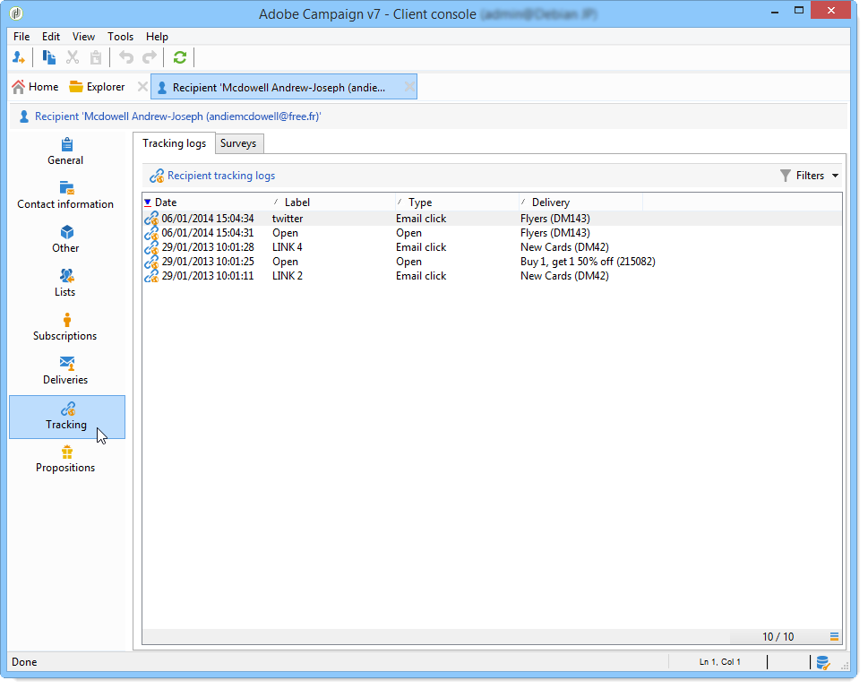
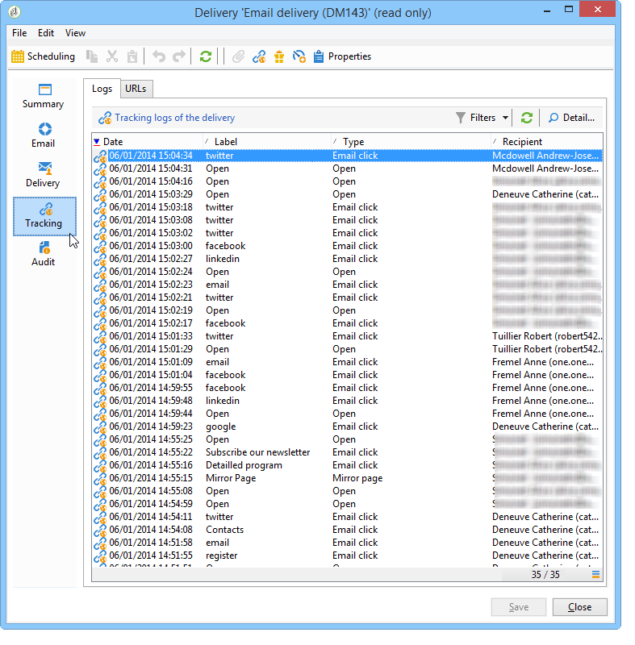

# Access tracking logs {#accessing-the-tracking-logs}

When the delivery has been sent and tracking activated, the **[!UICONTROL Tracking]** technical workflow is in charge of retrieving the tracking data. It is executed hourly by default.

## View tracking in recipient profiles {#recipient-tracking}

This information appears in the **[!UICONTROL Tracking]** tab of the profile of recipients targeted by the delivery, as in the following example:

This tab displays all URLs tracked and clicked by the recipient, including:

* The URL clicked
* The date and time of the click
* The delivery in which the URL was found
* Any other relevant tracking information

You can filter and sort this information to analyze recipient behavior and identify engagement patterns.

## View tracking in deliveries {#delivery-tracking}

Tracking information is also accessible via the **[!UICONTROL Tracking]** tab of the delivery.

From this tab, you can view:

* **[!UICONTROL Tracking statistics]**: provides an overview of opens, clicks, and other tracking events
* **[!UICONTROL URLs and click streams]**: shows which links were clicked and how many times
* **[!UICONTROL Hot clicks]**: displays a visual representation of where recipients clicked in your message
* **[!UICONTROL Tracking logs]**: provides detailed, individual tracking records

## Troubleshooting tracking {#troubleshooting}

>[!NOTE]
>
>If you cannot see the **[!UICONTROL Tracking]** tab of a delivery, it means that tracking has not been activated. Refer to [this section](tracked-links.md) to learn how to configure tracking.

### Check the Tracking technical workflow {#check-tracking-workflow}

The Tracking technical workflow must be running to collect tracking data. You can locate the Tracking technical workflow in the **[!UICONTROL Administration > Production > Technical workflows]** folder.

To verify the workflow:

1. Open the **[!UICONTROL Tracking]** workflow
1. Check the last execution date
1. Verify that there are no errors in the workflow logs

If the workflow is not running or has errors, contact your system administrator.

## Verify tracking data collection

After sending a delivery with tracking enabled:

1. Wait for the Tracking workflow to execute (by default, every hour)
1. Open the delivery and go to the **[!UICONTROL Tracking]** tab
1. Check that tracking data is appearing
1. If no data appears, check that:
   * Tracking was activated in the delivery settings
   * The tracking technical workflow is running
   * Recipients opened the email and clicked on links

## Related topics {#related-topics}

* [Learn how to configure tracked links](tracked-links.md)
* [Learn how to test tracking](testing-tracking.md)
* [Understand tracking reports](../reporting/delivery-reports.md#tracking-indicators)

