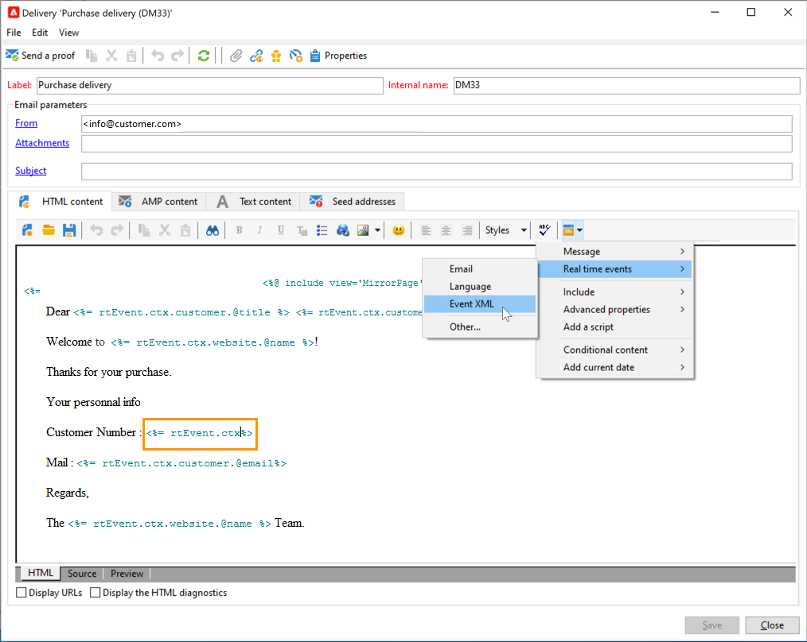

# Create and publish your template for Transactional messaging{#template-transactional-messages}

Each event can trigger a personalized message. For this to happen, you need to create a message template to match each event type. Templates contain the necessary information for personalizing the transactional message. You can also use templates to test the message preview and send proofs using seed addresses before delivering to the final target.

## Create the template{#create-message-template}

To create a message template, follow the steps below:

1. Go to the **[!UICONTROL Message Center >Transactional message templates]** folder in the Adobe Campaign tree.
1. In the list of transactional message templates, right-click and select **[!UICONTROL New]** in the drop-down menu or click the **[!UICONTROL New]** button above the list of transactional message templates. 

   

1. In the delivery window, select the delivery template suitable for the channel you want to use.

   

1. Change its label if necessary.
1. Select the type of event that matches the message you want to send. Event types destined to be processed by Adobe Campaign must be created beforehand. [Learn more](#create-event-types)

   

   >[!CAUTION]
   >
   >An event type should never be linked to more than one template.

1. Enter a nature and a description, then click **[!UICONTROL Continue]** to create the message body.

## Create the content{#create-message-content}

The definition of the transactional message content is the same as for all deliveries in Adobe Campaign. For instance, for an email delivery, you can create content in HTML or text format, add attachments or personalize the delivery object. [Learn more](../start/create-message.md).

>[!CAUTION]
>
>Images included in the message must be publicly accessible. Adobe Campaign does not provide any image upload mechanism for transactional messages.  
>Unlike in JSSP or webApp, `<%=` doesn't have any default escaping.
>
>You have to escape each data coming from the event properly. This escaping depends on how this field is used. For example, within a URL, please use encodeURIComponent. To be displayed in the HTML, you can use escapeXMLString.

Once you have defined your message content, you can integrate event information into the message body and personalize it. Event information is inserted into the body of the text thanks to personalization tags.

* All the personalization fields are coming from the payload.
* It is possible to reference one or several personalization blocks in a transactional message. <!--The block content will be added to the delivery content during the publication to the execution instance.-->

To insert personalization tags into the body of an email message, apply the following steps:

1. In the message template, click the tab that matches the email format (HTML or text).
1. Enter the body of the message.
1. In the body of the text, insert the tag using the **[!UICONTROL Real time events>Event XML]** menus.

   

1. Fill in the tag using the following syntax: **element name**.@**attribute name** as shown below.

   

## Test the transactional message template {#test-message-template}

### Add seed addresses{#add-seeds}

A seed address lets you display a preview of your message, send a proof, and test message personalization before sending the message. Seed addresses are linked to the delivery and cannot be used for other deliveries.

1. In the transactional message template, click the **[!UICONTROL Seed addresses]** tab, then click the **[!UICONTROL Add]** button.

   

1. Assign a label to it for easy selection later, then enter the seed address (email or mobile phone depending on the communication channel).

1. Enter the external identifier: this optional field allows you to enter a business key (unique ID, name + email, etc.) that is common to all applications on your website, used to identify your profiles. If this field is also present in the Adobe Campaign marketing database, you can then reconcile an event with a profile in the database.

   

1. Insert test data. Refer to [this section](#personalization-data).

   

1. Click **[!UICONTROL Ok]** to confirm the creation of the seed address.

1. Repeat the process to create as many addresses as you need.

   

Once the addresses are created, you can access their preview and personalization.

<!--

### Add personalization data{#personalization-data}

You can add data in the message template to test transactional message personalization. This will allow you to generate a preview or send a proof. If you install the **Deliverability** module, this data allows you to display a rendering of the messages for various desktop, web or mobile clients.

The purpose of this data is to test your messages before their final delivery. These messages do not coincide with actual data to be processed by Message Center.

However, the XML structure must be identical to that of the event stored in the execution instance, as shown below. 

This information enables you to personalize message content using personalization tags.

1. In the message template, click the **[!UICONTROL Seed addresses]** tab.
1. In the event content, enter the test information in XML format.

   
-->

### Preview your transactional message{#transactional-message-preview}

Once you have created one or more seed addresses and the message body, you can preview the message and check its personalization.

1. In the message template, click the **[!UICONTROL Preview]** tab, then select **[!UICONTROL A seed address]** in the drop-down list.

   

1. Select the seed address created previously to display the personalized message.

   

### Send a proof {#send-proof}

You can test message delivery by sending a proof to a previously created seed address.

Sending a proof involves the same process as for any delivery.

Learn more about proofs in [this section](../send/preview-and-proof.md#proofs-send).

However, to send a proof of a transactional message, you need to carry out the following operations:

* Create one or more [seed addresses](#add-seeds) with personalization test data
* Create the message content

To send the proof:

1. Click the **[!UICONTROL Send a proof]** button in the delivery window.
1. Analyze the delivery.
1. Correct any errors and confirm the delivery.

   

1. Check that the message was delivered to the seed address and that its content complies with your configuration.

   

Proofs can be accessed in each template via the **[!UICONTROL Audit]** tab.

#### Transition from [!DNL Campaign Classic] v7 {#transition-from-v7}

If you are [transitioning from Campaign Classic v7](../start/v7-to-v8.md), all deliveries go through the mid-sourcing (MID) server.

However, when creating a transactional message template, the routing needed for the template to be successfully used is **internal email delivery**. This routing prevents you from sending proofs.

Consequently, to send a proof for you transactional message template, you must change the routing from internal email delivery to the **mid-sourcing routing account**.

Once the proofs have been sent, you must change the routing back to internal email delivery prior to publishing the transactional message template.

## Publish the template {#publish-message-template}

When the message template created<!-- on the control instance--> is complete, you can publish it, which will allow you to send messages linked to real-time and batch events.

<!--This process will also publish it on all execution instances.

NOTE: When publishing transactional message templates, typology rules are also automatically published on the execution instances.

Publication lets you automatically create two message templates on the execution instances, which will allow you to send messages linked to real-time and batch events.-->

>[!CAUTION]
>
>Whenever you make any changes to a template, make sure you publish it again for these changes to be effective during transactional message delivery.

1. Go to the **[!UICONTROL Message Center > Transactional message templates]** folder of the tree.
1. Select the template you want to publish<!--on your execution instances-->.
1. Click **[!UICONTROL Publish]**.

   

Once publication is complete, both message templates to be applied to batch and real-time type events are created in the **[!UICONTROL Administration > Production > Message Center Execution> Default > Transactional message templates]** folder.

Once a template is published, if the corresponding event is triggered, Adobe Campaign<!--execution instance--> will receive the event, link it to the transactional template and send the corresponding transactional message to each recipient.

<!--
>[!NOTE]
>
>If you replace an existing field of the transactional message template, such as the sender address, with an empty value, the corresponding field on the execution instance(s) will not be updated once the transactional message is published again. It will still contain the previous value.
>
>However, if you add a non-empty value, the corresponding field will be updated as usual after the next publication.
-->

## Unpublish a template

Once a message template is published <!--on the execution instances-->, it can be unpublished.

* Indeed, a published template can still be called if the corresponding event is triggered: if you are no longer using a message template, it is recommended to unpublish it. This is to avoid sending an unwanted transactional message by mistake.

    For example, you published a message template that you only use for Christmas campaigns. You may want to unpublish it after the Christmas period is over, and publish it again next year.

* Also, you cannot delete a transactional message template that has the **[!UICONTROL Published]** status. You must unpublish it first.

To unpublish a transactional message template, follow the steps below.

1. Browse to the **[!UICONTROL Message Center > Transactional message templates]** folder.
1. Select the template to unpublish.
1. Click **[!UICONTROL Unpublish]**.
1. Click **[!UICONTROL Start]**.

The transactional message template status changes back from **[!UICONTROL Published]** to **[!UICONTROL Being edited]**.

Once unpublication is complete:

* Both message templates (applied to batch and real-time type events) are deleted<!-- from each execution instance-->.

    They no longer appear in the **[!UICONTROL Administration > Production > Message Center Execution > Default > Transactional message templates]** folder.

* Once a template is unpublished, you can delete it<!-- from the control instance-->.

    To do so, select it from the list and click the **[!UICONTROL Delete]** button on top right of the screen.
