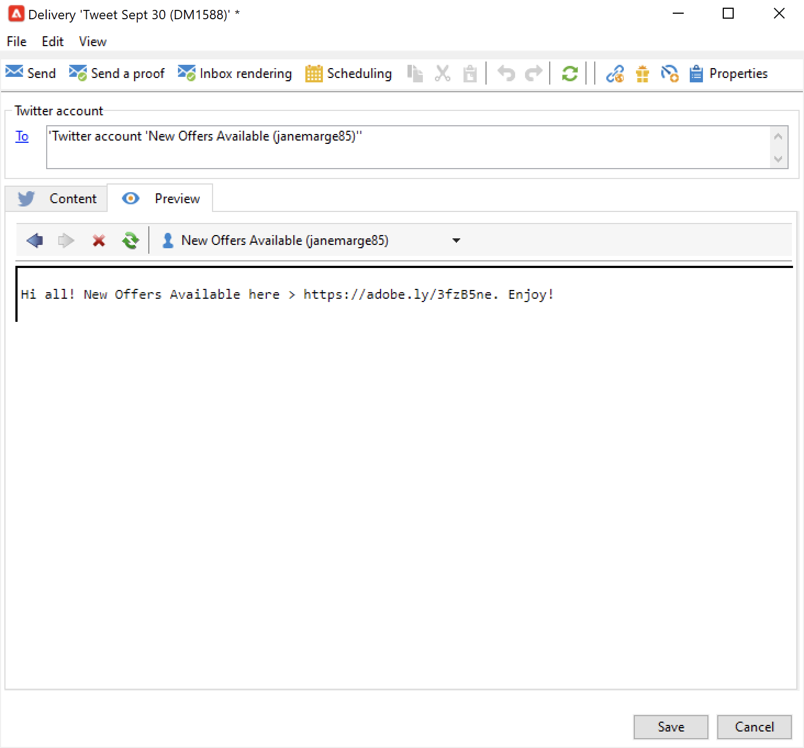

# Post messages on X (Twitter) with Adobe Campaign {#post-tw-messages}

Adobe Campaign comes with a **Social Marketing** module which lets you interact with your customers and prospects via X (formerly known as Twitter).

Once the integration is configured, you can:

* Send direct messages to your followers
* Post on your X account
* Collect new contacts by recovering the profile data, which enables you to carry out targeting campaigns and, when possible, to implement cross-channel strategies. This action requires user consent.

Configuration steps to integrate your X account with Adobe Campaign are described in [this page](../connect/ac-tw.md).

## Create and publish a X post {#publish-on-tw}

Follow the steps below to post a message on your X account:

1. Create a X delivery

    Create a new delivery based on the **[!UICONTROL Tweet (twitter)]** delivery template.

   

1. Select the main target

    Select the account(s) which you want to send posts to.

   

    1. Click the **[!UICONTROL To]** link.
    1. Click the **[!UICONTROL Add]** button.
    1. Select **[!UICONTROL A Twitter account]**.
    1. In the **[!UICONTROL Folder]** field, select the service folder which contains the X account. Then select the X account which you want to send your tweet to. 

1. Select the proof target

    The **[!UICONTROL Target of the proofs]** tab lets you define the X account to use for test deliveries before the final delivery.

    As detailed in the [configuration steps](../connect/ac-tw.md#tw-test-account), you must create a private test X account dedicated to sending proofs. 

    >[!NOTE]
    >
    >If you are using the same X test account for all your deliveries, you can save the proof target in the **[!UICONTROL Tweet]** delivery template, accessed via the **[!UICONTROL Resources > Templates > Delivery templates]** node. The proof target will then be entered by default for each new delivery.

1. Define the content of your post

    Enter the content of your post in the **[!UICONTROL Content]** tab.

   

    >[!CAUTION]
    >
    >When posting on X, the limitations apply:
    >
    >* The message cannot exceed 140 characters.
    >* HTML format is not supported.
    >

1. Preview your post

    Browse the **[!UICONTROL Preview]** tab to check the rendering of your post.

   

    1. Click the **[!UICONTROL Preview]** tab.
    1. Click the **[!UICONTROL Test personalization]** drop-down menu and select **[!UICONTROL Service]**.
    1. In the **[!UICONTROL Folder]** field, select the service folder which contains your X account. 

1. Send a proof

    Before posting your tweet, make sure to validate it by sending a proof of your publication: you can then get an exact rendering of the publication on a private X test page.

1. Post the message

    1. Once the content is approved, click the **[!UICONTROL Send]** button.
    1. Select **[!UICONTROL Deliver as soon as possible]** and click the **[!UICONTROL Analyze]** button.
    1. Once the analysis is finished, check the result. 
    1. Click **[!UICONTROL Confirm delivery]**, then click **[!UICONTROL Yes]**.

## Send direct messages to followers {#direct-tw-messages}

The **[!UICONTROL Synchronize Twitter accounts]** technical workflow recovers the list of X followers so that you can send them direct messages. [Learn more](../connect/ac-tw.md#synchro-tw-accounts)

To send direct messages to your followers, follow the steps below:

1. Create a X delivery based on the **[!UICONTROL Tweet (Direct Message)]** built-in delivery template.

1. Select the main target

   

    1. Select the **[!UICONTROL To]** link and the **[!UICONTROL Add]** button.

    1. Choose a type of targeting

        * Select **[!UICONTROL Twitter subscribers]** to send a direct message to all your followers.

        * Select **[!UICONTROL Filter conditions]** to define a query and view its result. Learn how to create a filter in [this section](../audiences/create-filters.md#advanced-filters). 

1. Select the proof target from the **[!UICONTROL Target of the proofs]** tab: this account will receive the proof of your direct message. 

    As detailed in the [configuration steps](../connect/ac-tw.md#tw-test-account), you must create a private test X account dedicated to sending proofs. 

    >[!NOTE]
    >
    >If you want to send all your direct message proofs to the same X account, you can save the proof target in the **[!UICONTROL Tweet (Direct Message)]** delivery template, accessed via the **[!UICONTROL Resources > Templates > Delivery templates]** node.

1. Enter the content of the message in the **[!UICONTROL Content]** tab.

   

    Personalization fields can be used the same way as for email deliveries, for instance to add the follower's name in the body of the message. Learn more in [this section](../send/personalize.md).

1. Preview your message

    Browse the **[!UICONTROL Preview]** tab to check the rendering of your post.
    
    

    1. Click the **[!UICONTROL Preview]** tab.
    1. Click the **[!UICONTROL Test personalization]** drop-down menu and select **[!UICONTROL Visitor Subscription]**.
    1. Choose a X account which you want to test the preview with.

1. Send a proof

    Before sending your message, make sure to validate it by [sending a proof to a test account](../send/preview-and-proof.md): you can then get an exact rendering of the message on a private X account and check content and personalization. 

1. Send the direct message

    1. Once the content is approved, click the **[!UICONTROL Send]** button.
    1. Select **[!UICONTROL Deliver as soon as possible]** and click the **[!UICONTROL Analyze]** button.
    1. Once the analysis is finished, check the result. 
    1. Click **[!UICONTROL Confirm delivery]**, then click **[!UICONTROL Yes]**.

>[!CAUTION]
>
>You cannot send more than 250 direct messages per day. To avoid exceeding this threshold, you can deliver in waves. For more on this, refer to this [section](configure-and-send.md#sending-using-multiple-waves).

## Access tracking data {#tw-tracking}

In the built-in **[!UICONTROL Tweet]** delivery template, tracking is enabled by default.

Tracking data can be viewed in the delivery reports and in the **[!UICONTROL Edit > Tracking]** tab of the delivery and the service.

Tracking configuration is the same as for an email delivery. Learn more about [tracking](tracking.md).

