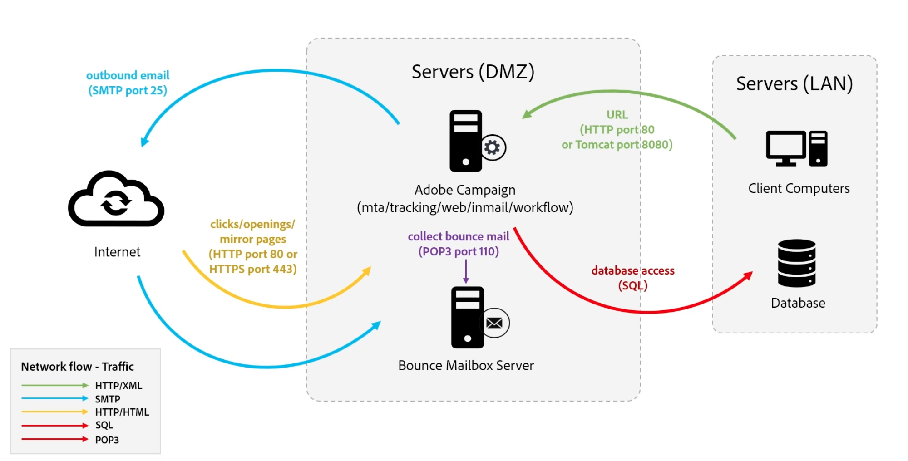

# Understand Campaign components and processes {#components-and-processes}

Adobe Campaign is a cross channel marketing solution that automates email, mobile, social and offline campaigns. Adobe Campaign provides a central place to access your customer data and profiles. Use Adobe Campaign to orchestrate consistent experiences to your customers, design, execute, and personalize your marketing across channels, while improving customer experiences on every device and touchpoint. With Adobe Campaign, you can manage multiple data sources, define your audience segments, and plan and execute multi-step, cross-channel campaigns through a drag-and-drop visual workflow interface.

Learn more about Campaign key capabilities in [this page](../start/get-started.md).

## Campaign components {#ac-components}

Adobe Campaign components and global architecture are described below. 

 

### Persistence layer{#persistance-layer}

Campaign databases are used as a persistence layers, and contains almost all the information and data managed by Adobe Campaign. This includes: functional data, such as profiles, subscriptions, content; technical data, such as delivery jobs and logs, tracking logs; and work data (purchases, leads).

The reliability of the database is of utmost importance because the majority of Adobe Campaign components require access to the database in order to perform their tasks (with the exception of the redirection module).

### Logical application layer{#logical-app-layer}

Campaign logical application layer is easily configurable to meet complex business needs. You can use Campaign as a sigle platform with different applications which combine to create an open and scalable architecture. Each Campaign intance is a collection of processes in the application layer, some of which are shared and some of which are dedicated.

## Campaign Managed Cloud Services{#ac-managed-services}

Adobe Campaign v8 is deployed as a Managed Service: all components of Adobe Campaign, including the user interface, the execution management engine, and Campaign databases are fully hosted by Adobe, including email execution, mirror pages, tracking server, and externally-facing web components such as unsubscribe page/preference center and landing pages.

## Campaign processes

Campaign Web server controls the access to Campaign Web processes. Javascript is the server-side language used for core product features and customization. Tomcat is the back-end engine and is embedded in the Campaign product as part of the Web process. Javascript is used for example in JSP or JSSP pages to render dynamic content.

 

Campaign client console connects to the Web server using SOAP XML over HTTP. The Web server provides the security layer, passes the requests to the Application layer using Javascript and the Campaign internal processes access to the database using SQL.

<!--The overall communication between Campaign processes are described in the following standalone deployment diagram: all Campaign components are installed in the same machine.

 -->

The user connects to the Campaign application server using the HTTP. All the data and information is managed in the Campaign database. If a Campaign developer performs any configuration changes, it is captured in the database. If a marketer creates a new campaign, all the information and data related to this new campaign is also managed in the database. When a marketer executes a campaign, email deliveries are sent to profiles from the Campaign server through the SMTP server. As profiles interact with email deliveries, such as opening the email, that tracking data is sent back to the tracking server.

[Learn more about Campaign processes](../architecture/general-architecture.md#dev-env).
