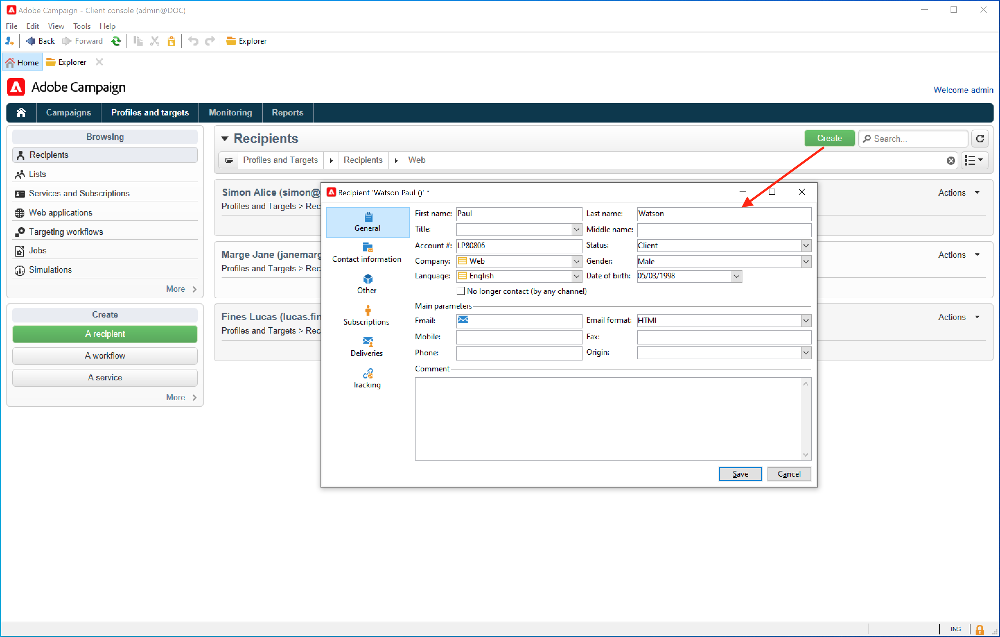

# Get Started with audiences{#gs-ac-audiences}

## Work with profiles{#gs-ac-profiles}

Profiles are contacts stored in Campaign database, including customers, subscribers and prospects. There are many possible mechanisms for acquiring profiles and building up this database: on-line collection via web forms, manual or automatic import of text files, replication with company databases or other information systems. With Adobe Campaign, you can incorporate marketing history, purchase information, preferences, CRM data, and any relevant PI data in a consolidated view to analyze and take action. Profiles contain all the information required for targeting, qualifying and tracking individuals.

A profile is a record in the **nmsRecipient** table or an external table which stores all the profile attributes, such as first name, last name, email address, a cookie ID, Customer ID, mobile identifier or other information relevant to a particular channel. Other tables linked to the recipient table contain profile-related data, for example the delivery logs table which contains records of all deliveries sent to recipients. Learn more about built-in profiles and recipient tables in [this section](../dev/datamodel.md#ootb-profiles).

In Adobe Campaign, **recipients** are the default profiles targeted for sending deliveries (emails, SMS, etc.). Recipient data stored in the database enable you to filter the target that will receive any given delivery and to add personalization data in your delivery contents. Other types of profiles exist in the database. They are designed for different uses. For example, seed profiles are made to test your deliveries before they are sent to the final target.

Profiles can be grouped in lists or collected by querying the database.

To populate Campaign with profile data, you can:

* [import data files](import.md) from an external data source such as a CRM system
* [create web forms](../dev/webapps.md) to allow customers to enter their own information and create their own profile
* [map to an external database](../connect/fda.md) where profiles are stored
* enter profiles manually using the Client console, as below:

 

[!DNL :arrow_upper_right:] Learn how to manage profiles in [Adobe Campaign Classic v7 documentation](https://experienceleague.adobe.com/docs/campaign-classic/using/getting-started/profile-management/about-profiles.html){target="_blank"}.

## Privacy and consent

Adobe Campaign is a powerful tool for collecting and processing large volume of data, including personal information and sensitive data. Adobe Campaign enables you to collect data, including personal and sensitive information. It is therefore essential that you receive and monitor consent from your recipients.

[!DNL :arrow_upper_right:] Learn how to manage privacy and consent in [Adobe Campaign Classic v7 documentation](https://experienceleague.adobe.com/docs/campaign-classic/using/getting-started/privacy/privacy-and-recommendations.html){target="_blank"}.

## Create lists

A list is a static set of profiles that can be targeted in delivery actions or updated during import operations or during workflow execution. For example, a population extracted from the database via a query can supply a list.

[!DNL :arrow_upper_right:] Learn how to create and manage lists in [Adobe Campaign Classic v7 documentation](https://experienceleague.adobe.com/docs/campaign-classic/using/getting-started/profile-management/creating-and-managing-lists.html){target="_blank"}.

## Query the database

Use the **Query** activity in a workflow to query your database, segment data and build complex audiences. 

[!DNL :arrow_upper_right:] Learn more about Campaign queries in [Adobe Campaign Classic v7 documentation](https://experienceleague.adobe.com/docs/campaign-classic/using/automating-with-workflows/introduction/targeting-data.html){target="_blank"}.

[!DNL :arrow_upper_right:] All targeting activities are listed in [Adobe Campaign Classic v7 documentation](https://experienceleague.adobe.com/docs/campaign-classic/using/automating-with-workflows/targeting-activities/about-targeting-activities.html){target="_blank"}.

## Create an audience in a workflow

Targeting can be created via a combination of queries in a graphical sequence in a workflow. You can create audiences which will be targeted according to your requirements. To display the workflow editor, click the **[!UICONTROL Targeting and workflows]** tab in the campaign dashboard.

[!DNL :arrow_upper_right:] Learn how to build an audience in a campaign workflow in [Adobe Campaign Classic v7 documentation](https://experienceleague.adobe.com/docs/campaign-classic/using/orchestrating-campaigns/orchestrate-campaigns/marketing-campaign-target.html?lang=en#building-the-main-target-in-a-workflow){target="_blank"}.

## Active profiles{#active-profiles}

According to your contract, each of your Campaign instances is provisioned with a specific amount of active profiles that are counted for billing purposes. Please refer to your latest contract for reference on number of purchased active profiles.

**Profile** means a record of information (e.g.: a record in the [Recipient table](../dev/datamodel.md) or an external table containing a cookie ID, Customer ID, mobile identifier or other information relevant to a particular channel) representing an end-customer, prospect, or lead. Profiles are considered active if they have been targeted or communicated within the past 12 months via any channel.

<!--
You can monitor the number of active profiles used on your instances directly from Campaign Control Panel. 

[!DNL :arrow_upper_right:] For more on this, refer to the [Control Panel documentation](https://docs.adobe.com/content/help/en/control-panel/using/performance-monitoring/active-profiles-monitoring.html).
-->

**Related topics** in Campaign Classic v7 documentation:

[!DNL :arrow_upper_right:] [Design and execute a campaign-specific workflow](https://experienceleague.adobe.com/docs/campaign-classic/using/automating-with-workflows/introduction/building-a-workflow.html){target="_blank"}

[!DNL :arrow_upper_right:] [Learn how to select the audience of a campaign](https://experienceleague.adobe.com/docs/campaign-classic/using/orchestrating-campaigns/orchestrate-campaigns/marketing-campaign-target.html){target="_blank"}

[!DNL :arrow_upper_right:] [Get started with workflows](https://experienceleague.adobe.com/docs/campaign-classic/using/automating-with-workflows/introduction/about-workflows.html){target="_blank"}
