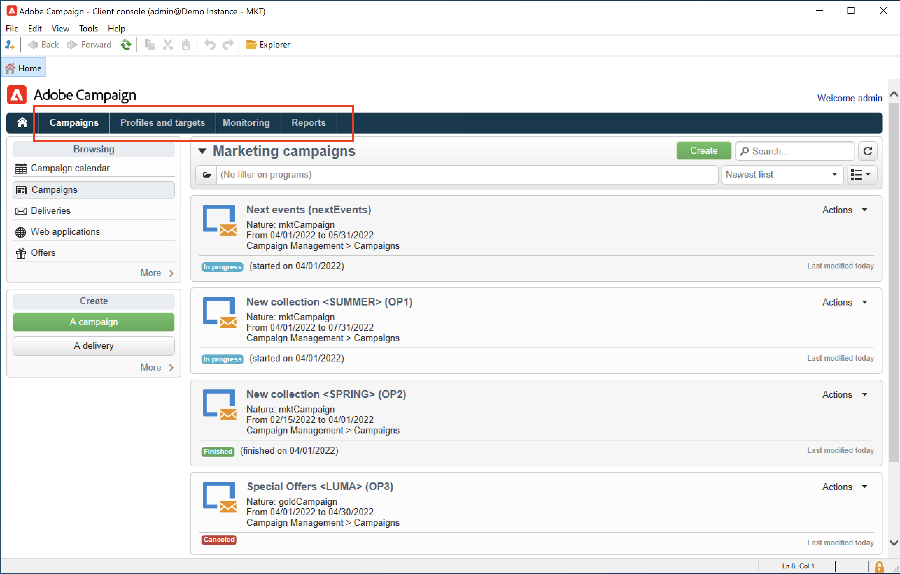
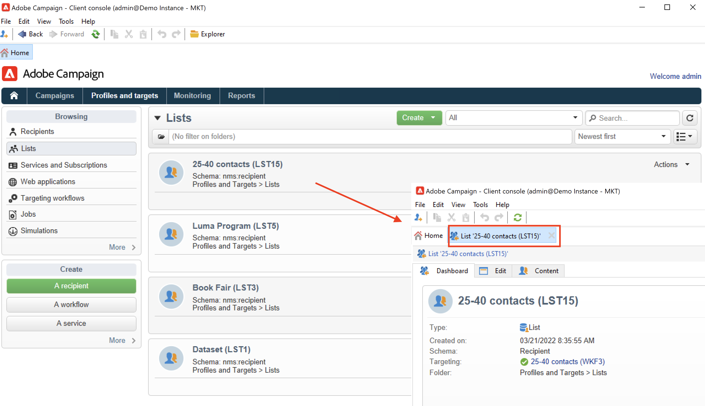

# Discover Campaign user interface

## Access Campaign UI{#ui-access}

Campaign workspace is available through the [client console](../architecture/general-architecture.md).

Learn how to install and configure Campaign client console in [this section](../start/connect.md).

 

You can also use a web browser to access Campaign. In this context, only a sub-set of Campaign capabilities are available. [Learn more](#web-browser)

## Access Campaign Web User Interface {#web-ui-access}

Campaign Campaign Web User Interface is available through the [client console](../architecture/general-architecture.md) homepage.

[Learn more about Campaign Web User Interface](campaign-web-ui.md)

 

If the new access card is not displayed, please ensure that the following fields are not left empty within your Adobe Experience Cloud external account: **Server**, **Tenant**, **Callback server**, and **Association mark**.

## Browse the UI{#ui-browse}

Once you are connected to Campaign, you access the home page. Browse the links to access capabilities. The set of capabilities available in the UI depend on your options and permissions.

From the central section of the home page, use links to access Campaign help materials, community and the support website.

Use the tabs in the upper section to browse Campaign key capabilities:

>[!NOTE]
>
>The list of core capabilities you can access depends on your permissions, and on your implementation.

For each capability, you can access the set of key features in the **[!UICONTROL Browsing]** section. The **[!UICONTROL More]** link lets you access all the other components.

For example, when browsing to the **[!UICONTROL Profiles and targets]** tab, you can access to the recipient lists, subscription services, existing targeting workflows and the shortcuts for creating all these components.

When you select an element in the screen, it is loaded in a new tab so that you can easily browse content.

## Create an element {#create-an-element}

Use shortcuts in the **[!UICONTROL Create]** section on the left of the screen to add new elements. You can also use the **[!UICONTROL Create]** button above the list to add new elements to the current list.

For example, on the delivery page, use the **[!UICONTROL Create]** button to create a new delivery.

## Use a web browser {#web-browser}

You can also access a subset of Campaign capabilities through the a web browser.

The web access interface is similar to the console interface. From a browser, you can use the same navigation and display features as in the console, but you can perform only a reduced set of actions on campaigns. For example, you can view and cancel campaigns, but you cannot modify campaigns. 

 [Learn more about Campaign web access](../start/connect.md#web-access).

## Access Campaign Explorer {#ac-explorer-ui}

Browse Campaign Explorer to access all the Adobe Campaign capabilities and settings. 

 

This workspace lets you access the Explorer tree to browse all features and options.

* The left section shows Campaign Explorer tree and lets you browse all components and settings of your instance - based on your permissions. You can add and customize folders as explained in [this page](../audiences/folders-and-views.md).

* The upper section shows the list of records in the current folder. These lists are fully customizable. [Learn more](../config/ui-settings.md)

* The lower section shows the details of the selected record. 

## Languages{#languages}

Campaign v8 user interface is available in the following languages:

* English (UK)
* English (US)
* French
* German
* Japanese

The language is selected during the installation process.

>[!CAUTION]
>
>The language cannot be changed after the instance creation. 

Language affects dates and time formats. 

Main differences between US English and UK English are: 

<table> 
 <thead> 
  <tr> 
   <th> Formats  </th> 
   <th> English (US)  </th> 
   <th> English (EN)  </th> 
  </tr> 
 </thead> 
 <tbody> 
  <tr> 
   <td> Date  </td> 
   <td> Week starts on Sunday  </td> 
   <td> Week starts on Monday  </td> 
  </tr> 
  <tr> 
   <td> Short date  </td> 
   <td> 
%2M/%2D/%4Y

<strong>ex: 09/25/2018</strong>
 </td> 
   <td> 
%2D/%2M/%4Y

<strong>ex: 25/09/2018</strong>
 </td> 
  </tr> 
  <tr> 
   <td> Short date with time  </td> 
   <td> 
%2M/%2D/%4Y %I:%2N:%2S %P

<strong>ex: 09/25/2018 10:47:25 PM</strong>
 </td> 
   <td> 
%2D/%2M/%4Y %2H:%2N:%2S

<strong>ex: 25/09/2018 22:47:25</strong>
 </td> 
  </tr> 
 </tbody> 
</table>
