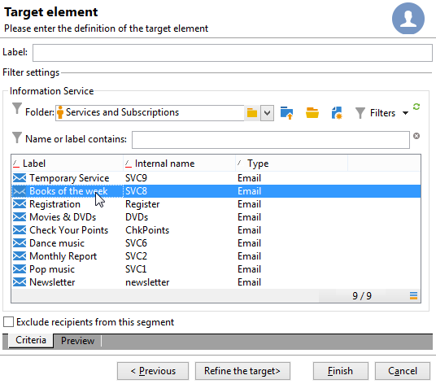

# Create your first delivery {#create-a-msg}

In this page, learn how to create a one-shot single delivery. You can create other types of deliveries to build your use cases. Learn more about the different types of deliveries and how to create them in [this page](gs-message.md).

The key steps when creating a one-shot delivery are:

1. **Create a new delivery**. [Read more](#create-the-delivery)

1. **Define the delivery content**. [Read more](#content-of-the-delivery)

1. **Select the target population**. [Read more](#target-population)

You can then prepare, test, send, and monitor your messages with Adobe Campaign. 

>[!NOTE]
>
>The steps described in this section assume that all target recipients and their profiles are stored in the database, except in the case of external delivery. See [Selecting external recipients](#selecting-external-recipients).

## Create the delivery {#create-the-delivery}

To create a delivery, follow these steps:

1. Browse to the list of deliveries and click **[!UICONTROL Create]**. 
1. Select the delivery channel. To do this, choose the appropriate delivery template from the drop-down list. 

   

   A built-in template is provided for each channel you have installed: email, telephone, mobile channels (push / SMS), direct mail, X (Twitter), etc. The channels available in the list depend on your license agreement.

   You can create new delivery templates in order to pre-configure specific parameters to suit your needs.  [Learn more](../send/create-templates.md).

1. Enter a name for the delivery in the **[!UICONTROL Label]** field.

   (optional) A delivery code can also be assigned to the delivery. The name of the delivery and its code are visible in the list of deliveries but not exposed to the recipients.

1. (optional) Add a description in the **[!UICONTROL Description]** field.
1. (optional) Select the delivery nature in the relevant field. This information is useful for delivery tracking: you can filter based on this criterion in the delivery list or build queries using this selection criterion.
1. Click **[!UICONTROL Continue]** to display the message content window.

## Define the delivery content {#content-of-the-delivery}

The delivery content is ready to be configured. Delivery content definition is specific to each channel. For more on this, refer to the dedicated section:

* [Define the email content](../send/email.md)
* [Define the SMS content](../send/sms/sms-content.md)
* [Define the direct mail content](../send/direct-mail.md)
* [Degine the push notification content](../send/push.md)

## Define the target audience {#target-population}

For each delivery, you can define several types of target audiences:

* **Main audience**: profiles who receive messages. [Learn more](#select-the-main-target)
* **Proof target**: profiles who receive proof messages. A proof is a specific message that allows you to test a message before sending it to the main target. [Learn more](#select-the-proof-target)

In addition, in the context of a marketing campaign, you can add:

* **Seed addresses**: recipients who are out of the delivery target but receive the delivery. [Learn more](../audiences/test-profiles.md)
* **Control groups**: population which does not receive the delivery, used to track behavior and campaign impact. [Learn more](../../automation/campaigns/marketing-campaign-target.md#add-a-control-group).

### Select the main recipients of the delivery {#select-the-main-target}

In most cases, the main target is extracted from Adobe Campaign database (default mode). However, recipients can also be stored in an [external file](#selecting-external-recipients).

To select the recipients of a delivery, follow the steps below:

1. In the delivery editor, select **[!UICONTROL To]**.
1. If the recipients are stored in the database, choose the first option.

   {zoomable="yes"}

1. Select the [target mapping](../audiences/target-mappings.md) in the **[!UICONTROL Target mapping]** drop-down list.
1. Click the **[!UICONTROL Add]** button to define restriction filters.

   {width="60%" align="left" zoomable="yes"}

   Select a type of filter and click **[!UICONTROL Next]** to define the conditions. You can display the filtered recipients from the **[!UICONTROL Preview]** tab. Depending on the type of target, the **[!UICONTROL Refine target]** button lets you combine several targeting criteria.

   The following target types are available:

    * **[!UICONTROL Filtering conditions]**: use this option to define a query and display the result. Learn how to design a query in [this section](../../automation/workflow/query.md).
    * **[!UICONTROL A list of recipients]**: use this option to target a list of profiles. Learn more about lists in [this section](../audiences/create-audiences.md).
    * **[!UICONTROL A recipient]**: use this option to select a specific profile in the database.
    * **[!UICONTROL Recipients included in a folder]**: use this option to target all the profiles contained in a specific folder.
    * **[!UICONTROL Recipients of a delivery]**: use this option to build the target from the recipients of a delivery. You must then select the delivery in the list:

      

    * **[!UICONTROL Delivery recipients belonging to a folder]**: use this option to build the target from the recipients deliveries included in a specific folder.
    
      
      
      You can filter the behavior of recipients by selecting from the drop-down list:
      
      

      >[!NOTE]
      >
      >The **[!UICONTROL Include sub-folders]** option also lets you target the deliveries contained in folders located in the tree structure below the selected node.

    * **[!UICONTROL Subscribers of an information service]** : this option lets you select a newsletter to which the recipients must be subscribed to be targeted by the delivery being created.

      

    * **[!UICONTROL User filters]**: this option lets you access the preconfigured filters to use them as filtering criteria for profiles in the database. Preconfigured filters are presented in [this section](../audiences/create-filters.md#default-filters).
    * The **[!UICONTROL Exclude recipients from this segment]** option lets you target on recipients who do not satisfy the defined target criteria. To use this option, select the appropriate box and then apply targeting, as defined earlier, to exclude the resulting profiles.

1. Enter a name for this targeting in the **[!UICONTROL Label]** field. By default, the label is the label of the first targeting criterion. When combining filtering criteria, it is recommended to use an explicit name.
1. Click **[!UICONTROL Finish]** to validate the targeting options.

   The targeting criteria defined are summarized in the central section of the main target configuration tab. Click a criterion to view its contents (configuration and preview). To delete a criterion, click the cross located after its label.

   

### Select external recipients {#selecting-external-recipients}

You can send messages to profiles who are not stored in the database, but in an external file. For example, to send a delivery to recipients imported from a text file, follow these steps:

1. Click the **[!UICONTROL To]** link to select the recipients of your delivery.
1. Select the **[!UICONTROL Defined in an external file]** option.
1. Select the file containing the recipients.
1. When importing the recipients, click the **[!UICONTROL File format definition...]** link to select and configure the external file.

   For more information on data import, refer to [Campaign Classic v7 documentation](https://experienceleague.adobe.com/en/docs/campaign-classic/using/getting-started/importing-and-exporting-data/generic-imports-exports/executing-import-jobs#step-2---source-file-selection){target="_blank"}.

1. Click **[!UICONTROL Finish]** and configure your delivery as a standard delivery.

>[!CAUTION]
>
>When defining the content of the message for email delivery to external recipients, do not include the link to the mirror page: it cannot be generated in this delivery mode.

### Exclusion settings {#define-exclusion-settings}

When defining the [audience of a delivery](#target-population), the **[!UICONTROL Exclusions]** tab is used to limit the number of messages. Default parameters are recommended, but you can adapt settings depending on your needs. However, these options should only be changed by an expert user to avoid any misusage and errors.

>[!CAUTION]
>
>As an expert user, for specific use cases, you can change these settings, but Adobe recommends to keep the default configuration.

You can exclude addresses that have reached a certain number of consecutive errors, or whose quality rating is below a threshold specified in this window. You can also choose whether or not to authorize non-qualified addresses for which no data has been returned.

To modify the default configuration, click the **[!UICONTROL Edit...]** link.

+++ See available options

* **[!UICONTROL Exclude duplicate addresses during delivery]**: this option is active by default and removes duplicate email addresses during delivery. The strategy applied can vary according to how Adobe Campaign is used and the type of data in the database. The value of the option can be configured for each delivery template.
* **[!UICONTROL Exclude recipients who no longer want to be contacted]** , i.e. recipients whose email addresses are on denylist ('opt out'). This option must remain selected in order to observe the professional ethics of e-marketing.
* **[!UICONTROL Exclude quarantined recipients]**: this option lets you exclude from the target any profiles with an address which is quarantined. We strongly recommend keeping this option selected. Learn more about quarantine management in [this section](../send/quarantines.md).
* **[!UICONTROL Limit delivery]** to a given number of messages. This option lets you enter the maximum number of messages to be sent. If the target audience exceeds the number of messages indicated, a random selection is applied to the target. To send all messages, keep this value to '0'.
* **[!UICONTROL Keep duplicate records (same identifier)]**: this option allows sending multiple deliveries to recipients who satisfy several targeting criteria.
+++

### Select the recipients of proof messages {#select-the-proof-target}

For email deliveries, you can send proofs to validate your message content. Sending proofs enables you to check the opt-out link, mirror page and any other links, validate the message, verify that images are displayed, detect possible errors, etc. You may also want to check your design and rendering on different devices.

A proof is a specific message that allows you to test a message before sending it to the main audience. Recipients of the proof are in charge of approving the message: rendering, content, personalization settings, configuration.

For more on proof recipients and sending, refer to [this section](../send/preview-and-proof.md#send-proofs).

#### Tutorial video {#seeds-and-proofs-video}

In this video you will learn how to add seeds and proofs to an existing email and how to send it.

>[!VIDEO](https://video.tv.adobe.com/v/333404?quality=12)

Additional Campaign Classic how-to videos are available [here](https://experienceleague.adobe.com/docs/campaign-classic-learn/tutorials/overview.html).

## Prepare and validate your delivery {#validate-the-delivery}

When a delivery has been created and configured, you must validate it before sending it to the main target.

To do this:

1. **Analyze the delivery**: this step lets you prepare the messages to deliver. [Learn more](../send/delivery-analysis.md).

1. **Send proofs**: this step lets you control content, URLs, personalization, etc. [Learn more](../send/preview-and-proof.md).

>[!IMPORTANT]
>
>The two steps above **must be** executed after each modification on the message content.

## Configure and send the delivery {#configuring-and-sending-the-delivery}

Access the delivery parameters to configure more settings and define how to send your messages. You can define delivery priority, set up sending waves, confugure the retry settings, and test your delivery sending. Once this configuration is done, you can confirm the sending. Messages are then sent immediately, or based on the delivery schedule.

Learn how to configure your delivery settings in [this page](../send/configure-and-send.md).
