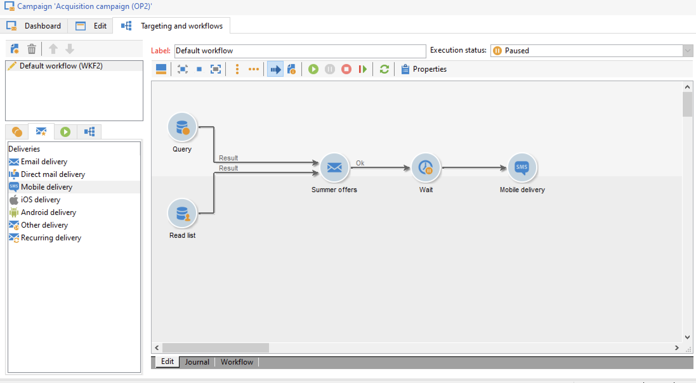

# Get Started with messages{#gs-ac-audiences}

With Adobe Campaign, you can send cross-channel campaigns including emails, SMS, Push notifications and direct mails, and measure their effectiveness using various dedicated reports. These messages are designed and sent though deliveries, and can be personalized for each recipient.

Core functionalities include targeting, definition and personalization of messages, execution of communications, and the associated operational reports. The main functional access point is the delivery assistant. This access point leads to multiple capabilities covered by Adobe Campaign.

Learn key steps to create a delivery in [Campaign Classic v7 documentation](https://experienceleague.adobe.com/docs/campaign-classic/using/sending-messages/key-steps-when-creating-a-delivery/steps-about-delivery-creation-steps.html).

Adobe Campaign v8 comes with the following delivery channels:

* **Email channel**: email deliveries let you send personalized emails to the target population. Learn more in [this page](../send/email.md).

* **Direct mail channel**: direct mail deliveries let you generate an extraction file which contains data on the target population.  Learn more in [this page](../send/direct-mail.md)

* **Mobile channel**: deliveries on mobile channels let you send personalized SMS to the target population.  Learn more in [this page](../send/sms.md)

* **Mobile application channel**: mobile app deliveries let you send notifications to iOS and Android systems.  Learn more in [this page](../send/push.md)

<!--
* **LINE channel**: LINE deliveries let you send messages on LINE, an instant messaging application available on all smartphones. Learn more in [this page](../send/line.md)
-->

## Choose how to send your messages 

Once your message has been created and its content designed and tested, you can choose how you want to send it. Campaign offers a set of capabilities to:

* Send messages manually to the main target

     

   ↗️ Learn how to send messages in [Campaign Classic v7 documentation](https://experienceleague.adobe.com/docs/campaign-classic/using/sending-messages/sending-emails/sending-an-email/sending-messages.html){target="_blank"}

* Send messages associated to a [marketing campaign](campaigns.md)

    

   ↗️ Learn how to send messages in the context of a campaign in [Campaign Classic v7 documentation](https://experienceleague.adobe.com/docs/campaign-classic/using/orchestrating-campaigns/orchestrate-campaigns/marketing-campaign-deliveries.html){target="_blank"}

* Send messages via a [workflow](../config/workflows.md)

     

   ↗️ Learn how to automate email deliveries in [Campaign Classic v7 documentation](https://experienceleague.adobe.com/docs/campaign-classic/using/automating-with-workflows/action-activities/delivery.html){target="_blank"}

* [Trigger messages](../send/transactional.md) from an event
   ↗️ [Use case: learn how to send a transactional email with an attachment](https://experienceleague.adobe.com/docs/campaign-classic/using/transactional-messaging/transactional-email-with-attachments.html?lang=en){target="_blank"}

* Schedule your messages

    
   
   ↗️ [Use case: learn how schedule and send a birthday email](https://experienceleague.adobe.com/docs/campaign-classic/using/automating-with-workflows/use-cases/deliveries/sending-a-birthday-email.html?){target="_blank"}

## Add personalization

Messages delivered by Adobe Campaign can be personalized in various ways. 

You can:

* Insert dynamic personalization fields. 
   ↗️ Learn how to use personalization fields in [Campaign Classic v7 documentation](https://experienceleague.adobe.com/docs/campaign-classic/using/sending-messages/personalizing-deliveries/personalization-fields.html){target="_blank"}
* Insert predefined personalization blocks. 
   ↗️ Learn what is a personalization block and how to use it in [Campaign Classic v7 documentation](https://experienceleague.adobe.com/docs/campaign-classic/using/sending-messages/personalizing-deliveries/personalization-blocks.html){target="_blank"}
* Create conditional content. 
   ↗️ Learn how to insert conditional content in [Campaign Classic v7 documentation](https://experienceleague.adobe.com/docs/campaign-classic/using/sending-messages/personalizing-deliveries/conditional-content.html){target="_blank"}

## Send transactional messages

Transactional messaging (Message Center) is the Campaign module designed for managing trigger messages. 

💡 Learn more about transactional messages capability in [this section](../dev/architecture.md#transac-msg-archi)

💡 Steps to configure and send transactional messages are detailed in [this page](../send/transactional.md)

↗️ Discover this capability in a end-to-end use case in [Campaign Classic v7 documentation](https://experienceleague.adobe.com/docs/campaign-classic/using/transactional-messaging/transactional-email-with-attachments.html){target="_blank"}

## Delivery and tracking logs

Monitoring your deliveries after they have been sent is a key step to ensure your maketing campaigns are efficient and reach out to your customers. You can monitor after sending a delivery, as well as understand how delivery failures and quarantines are managed.

↗️ Learn how to monitor your deliveries in [Campaign Classic v7 documentation](https://experienceleague.adobe.com/docs/campaign-classic/using/sending-messages/monitoring-deliveries/about-delivery-monitoring.html#sending-messages){target="_blank"}

**Related topics** in Campaign Classic v7 documentation:

↗️  [Delivery best practices](https://experienceleague.adobe.com/docs/campaign-classic/using/sending-messages/key-steps-when-creating-a-delivery/delivery-bestpractices/delivery-best-practices.html){target="_blank"}

↗️  [Test and send an email](https://experienceleague.adobe.com/docs/campaign-classic/using/sending-messages/sending-emails/sending-an-email/sending-messages.html){target="_blank"}

↗️  [Send proofs](https://experienceleague.adobe.com/docs/campaign-classic/using/sending-messages/key-steps-when-creating-a-delivery/steps-validating-the-delivery.html){target="_blank"}
