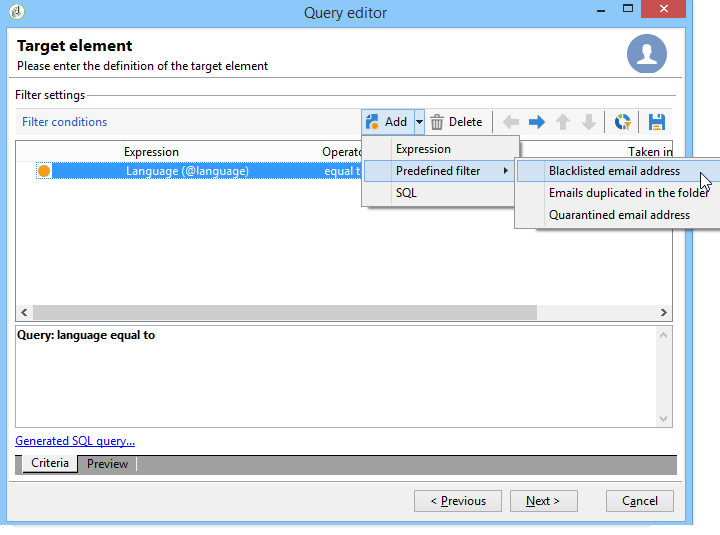

# Query Campaign database

Queries are created using fields of the selected table or using a formula.

The steps for building a query in Adobe Campaign are as follows:

1. [Select the work table](#step-1---choose-a-table).
1. [Select the data to extract](#step-2---choose-data-to-extract).
1. [Define the data sorting mode](#step-3---sort-data).
1. [Define data filtering options](#step-4---filter-data).
1. [Configure data formatting](#step-5---format-data).
1. [Preview the results of the query](#step-6---preview-data).

All these steps are available in the [generic query editor](query-editor.md). When a query is created in another context, some steps can be missing. To learn more about queries, see also the [workflow Query activity documentation](../../automation/workflow/query.md).

## Step 1 - Choose a table {#step-1---choose-a-table}

To query the Campaign database, open the **[Generic query editor](query-editor.md)**, and select the table containing the data you want to query in the **[!UICONTROL Document type]** window.

 If needed, filter the data using the filter field or the **[!UICONTROL Filters]** button.

## Step 2 - Choose data to extract {#step-2---choose-data-to-extract}

On the **[!UICONTROL Data to extract]** screen, choose the fields you want to include in the output. These fields will define the columns displayed in the results.

For example, you can select **[!UICONTROL Age]**, **[!UICONTROL Primary key]**, **[!UICONTROL Email domain]**, and **[!UICONTROL City]**. The output will be structured according to this selection. To adjust the order of the columns, use the blue arrows on the right side of the window.

You can modify an expression either by adding a formula or by applying a process to an aggregate function. To edit an expression, click the **[!UICONTROL Expression]** column field, then select **[!UICONTROL Edit expression]**.

ou can group the data displayed in the output columns. To do this, select **[!UICONTROL Yes]** in the **[!UICONTROL Group]** column of the **[!UICONTROL Data to extract]** window. The results will then be aggregated based on the selected grouping axis. For an example of a query using grouping, see [this section](../../automation/workflow/query-delivery-info.md).

* The **[!UICONTROL Handle groupings (GROUP BY + HAVING)]** option lets you group results and apply conditions to those groups. It applies to all fields in the output columns. For example, you can use it to group values from an output column and then filter the results to retrieve only specific information, such as recipients aged between 35 and 50.

  For more on this, refer to [this section](../../automation/workflow/query-grouping-management.md).

The **[!UICONTROL Remove duplicate rows (DISTINCT)]** option eliminates identical rows from the output (deduplicate). For example, if you select **Last name**, **First name**, and **Email** as output columns, any records with the same values in all three fields will be considered duplicates. Only one instance will be kept in the results, ensuring each contact appears only once.

## Step 3 - Sort data {#step-3---sort-data}

The **[!UICONTROL Sorting]** window lets you sort column content. Use the arrows to change the column order:

* The **[!UICONTROL Sorting]** column enables a simple sort and arranges column content from A to Z or in ascending order.
* The **[!UICONTROL Descending sort]** arranges the content from Z to A and in descending order. This is useful for viewing record sales for example: the highest figures are shown at the top of the list.

In this example, the data is sorted in ascending order based on recipient age.

## Step 4 - Filter data {#step-4---filter-data}

The query editor allows you to filter data to narrow down your results. The available filters depend on the table you are querying.

After selecting **[!UICONTROL Filtering conditions]**, the **[!UICONTROL Target elements]** section opens. Here, you can define the rules for filtering the data to be collected.

* To create a new filter, choose the fields, operators, and values needed to build the condition. You can also combine multiple conditions, as explained [on this page](filter-conditions.md). 

* To reuse an existing filter, click the **[!UICONTROL Add]** button, select **[!UICONTROL Predefined filter]** and choose the filter you want.

  

Filters created in the **[!UICONTROL Generic query editor]** can be reused in other query applications, and the reverse is also true. To save a filter for later use, click the **[!UICONTROL Save]** icon.

  >[!NOTE]
  >
  >For more on creating and using filters, refer to [Filtering options](filter-conditions.md).

As shown in the following example, to recover all English-speaking recipients, select: "recipient language **equal to** EN".

>[!NOTE]
>
>You can directly access an option by typing the following formula in the **Value** field: **$(options:OPTION_NAME)**.

Click the **[!UICONTROL Preview]** tab to view the result of the filtering condition. In this case, all English-speaking recipients are displayed with their name, first name and email address.

Users familiar with SQL language can click **[!UICONTROL Generate SQL query]** to view the query in SQL.

## Step 5 - Format data {#step-5---format-data}

After configuring the restriction filters, the **[!UICONTROL Data formatting]** window opens. In this window, you can rearrange output columns, transform data, and adjust column label capitalization. You can also apply formulas to the final result by creating a calculated field.

>[!NOTE]
>
>For more information on the types of calculated fields, refer to [Create calculated fields](filter-conditions.md#creating-calculated-fields).

Unchecked columns are hidden in the data preview window.

The **[!UICONTROL Transformation]** column lets you change a column label to upper or lower case. Select the column and click in the **[!UICONTROL Transformation]** column. You can choose:

* **[!UICONTROL Switch to lower case]**,
* **[!UICONTROL Switch to upper case]**, 
* **[!UICONTROL First letter in upper case]**.

## Step 6 - Preview data {#step-6---preview-data}

The **[!UICONTROL Data preview]** window marks the final stage of the query process. Click **[!UICONTROL Start the preview of the data]** to review your results, which can be displayed in columns or XML format. To examine the underlying SQL query, open the **[!UICONTROL Generated SQL queries]** tab. This step lets you verify that your query behaves as expected before using it further.

In this example, data is sorted in ascending order based on recipient age.

>[!NOTE]
>
>As in for all lists available in the console, by default, only the first 200 lines are displayed in the **[!UICONTROL Data preview]** window. To change this, enter a number in the **[!UICONTROL Lines to display]** box and click **[!UICONTROL Start the preview of the data]**. [Learn more](../config/ui-settings.md#manage-and-customize-lists)

**Related topics**

* [Workflow Query Activity](../../automation/workflow/query.md)
* [Query the recipient table](../../automation/workflow/querying-recipient-table.md)
* [Filtering conditions](filter-conditions.md)