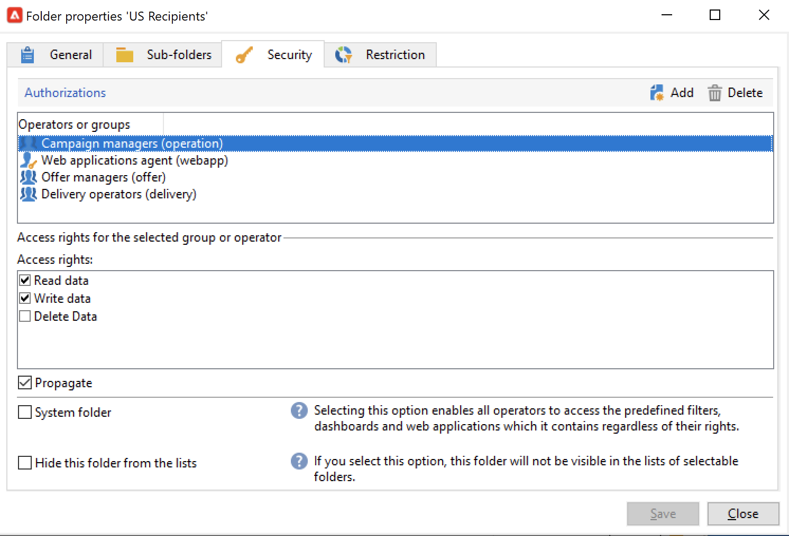

# Manage folder permissions{#manage-folder-permissions}

## Restrict access to a folder{#restrict-access-to-a-folder}

Use permissions on folders to organize and control access to Campaign data.

Folder management is detailed in [this page](../audiences/folders-and-views.md).

To edit permissions on a specific Campaign folder, follow the steps below:

1. Right-click on the folder and select **[!UICONTROL Properties...]**.
1. Browse to the **[!UICONTROL Security]** tab to view authorizations on this folder.

    

* To **authorize a group or an operator**, click the **[!UICONTROL Add]** button and select the group or operator to assign authorizations for this folder.
* To **forbid a group or an operator**, click **[!UICONTROL Delete]** and select the group or operator to remove authorization for this folder.
* To **select the rights assigned to a group or an operator**, select the group or operator, select the access rights you want to grant, and unselect the others.

>[!NOTE]
>
>You should not be able to create an object for which you do not have at least one folder with writing rights.
>
>You do not need to be an admin to create fragments, but you must have writing rights on at least one "Content visual fragment" folder. Otherwise, you won't be able to create a visual fragment.

## Propagate permissions {#propagate-permissions}

To propagate authorizations and access rights, select the **[!UICONTROL Propagate]** option in the folder properties.

The authorizations defined in this window will then be applied to all the sub-folders of the current node. You can always overload these authorizations for each of the sub-folders.

>[!NOTE]
>
>Unchecking the **[!UICONTROL Propagate]** option for a folder does not clear it for the sub-folders: you must clear it explicitly for each of the sub-folders.

## Grant access to all operators {#grant-access-to-all-operators}

In the **[!UICONTROL Security]** tab, select the **[!UICONTROL System folder]** to allow access to all operators, regardless of their permissions. 

If this option is cleared, you must explicitly add the operator (or their group) back to the list of authorizations for them to have access.
