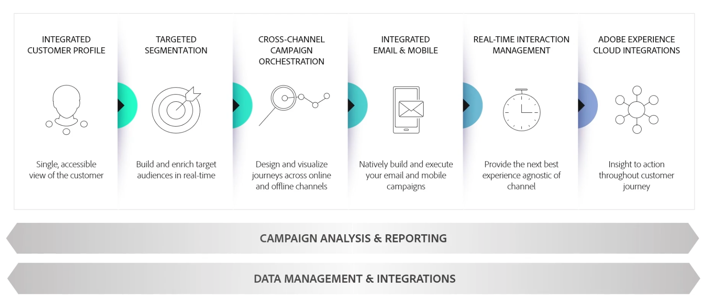

# Get Started with Adobe Campaign{#gs-ac-v8}

Adobe Campaign provides a platform for designing cross-channel customer experiences and provides an environment for visual campaign orchestration, real time interaction management and cross channel execution.

Use Campaign to:

* Drive personalization and engagement through a single accessible view of the customer
* Integrate email, mobile, online and offline channels into the customer journey
* Automate the delivery of meaningful and timely messages and offers

 

## Integrated customer profile {#integrated-customer-profile}

Profiles are centralized in a powerfull cloud database. There are many possible mechanisms for acquiring profiles and building up this database: on-line collection via web forms, manual or automatic import of text files, replication with company databases or other information systems. With Adobe Campaign, you can incorporate marketing history, purchase information, preferences, CRM data, and any relevant PII data in a consolidated view to analyze and take action.

In Adobe Campaign, recipients are the default profiles targeted for sending deliveries (emails, SMS, etc.). Thanks to the recipient data that are stored in the database, you will be able to filter the target that will receive any given delivery and to add personalization data in your delivery contents. Other types of profiles exist in the database. They are designed for different uses. For example, seed profiles are made to test your deliveries before they are sent to the final target.

:rocket: Profile management basics are explained in [this section](audiences.md).

:rocket: Learn how to add profiles to Campaign in [this section](import.md).

## Targeted segmentation {#targeted-segmentation}

Adobe Campaign has powerful, user-friendly segmentation and targeting features that let you create highly targeted, differentiated offers. The descriptive analysis functionality lets you analyze information upstream and downstream of your marketing campaigns, and the filter management and graphical query editor functionality lets you filter your subscriber population and sample or create target groups based on an unlimited number of criteria. 

The advanced Data Management functionality extends the data processing capabilities. It simplifies and optimizes the targeting process by including data not modeled in the datamart. 

Learn more about segmentation, audience creation and personalization in [this section](audiences.md).

## Cross-channel campaign orchestration {#cross-channel-campaign-orchestration}

Adobe Campaign lets you design and orchestrate targeted and personalized campaigns on multiple channels: email, direct mail, SMS, push notification. A single interface provides you with all the functions required to schedule, orchestrate, configure, personalize, automate, execute, and measure all your campaigns and communications. 

For more on scheduling and executing campaigns, refer to [this section](campaigns.md).

## Workflows

Adobe Campaign offers a comprehensive graphical environment that allows you to design complex processes including segmentation, campaign execution, file processing, etc. For example, you can use a workflow to download a file from a server, decompress it, and then import its records into the Adobe Campaign database.

A workflow can also involve users by assigning them tasks or having them approve performed tasks. This means you can assign a task to one or several users to work on content or specify targets, and approve proofs before sending the message.

Workflows can be used in different contexts, as for example:

* Targeting to manage audiences or send messages.
* Data management (ETL) to manipulate data.
* Importing data into Campaign database.
* Technical processes such as database cleanup, recovering tracking information, etc.

Learn more about workflows in [this section](../config/workflows.md).

## Reporting and analysis {#analysis-and-reporting}

Adobe Campaign lets you monitor and interpret the behavior of your customers by gradually enriching their data and profiles. The reporting and analysis tools let you capitalize on each new campaign, target your marketing initiatives better, and optimize their impact and return on investment. 

Learn more about report and tracking capabilities in [this section](reporting.md).

## Adobe Experience Cloud integrations {#adobe-experience-cloud-integrations}

You can combine the delivery functionalities and advanced campaign management functionalities of Adobe Campaign with a set of solutions created to help you personalize your users' experience: Adobe Experience Manager, Adobe Analytics, Adobe Target or Adobe Experience Cloud triggers for example. You can also integrate to Adobe IMS and login to Campaign with your Adobe ID. 

For more on cross-solution and authentication integrations, refer to [this section](integration.md).

## More about Campaign capabilities {#core-capabilities-and-add-ons}

Adobe Campaign offers a set of capabilities to help you implementing and optimizing the conversational marketing functionalities depending on your needs and your architecture. Some of them are core capabilities and some depend on the installation of a package and on your configuration. A detailed product description is available here: [Adobe Campaign v8 Product Description](https://helpx.adobe.com/legal/product-descriptions/adobe-campaign-classic---product-description.html).

As an existing Campaign Classic user, learn key differences between Campaign Classic and Campaign v8 in [this page](capability-matrix.md).

## Workspace and customization

Learn how to use Campaign workspace in [this section](https://experienceleague.adobe.com/docs/campaign-classic/using/getting-started/starting-with-adobe-campaign/campaign-workspace/adobe-campaign-workspace.html)

Learn how to customize lists in [this section](https://experienceleague.adobe.com/docs/campaign-classic/using/getting-started/starting-with-adobe-campaign/campaign-workspace/adobe-campaign-ui-lists.html)
