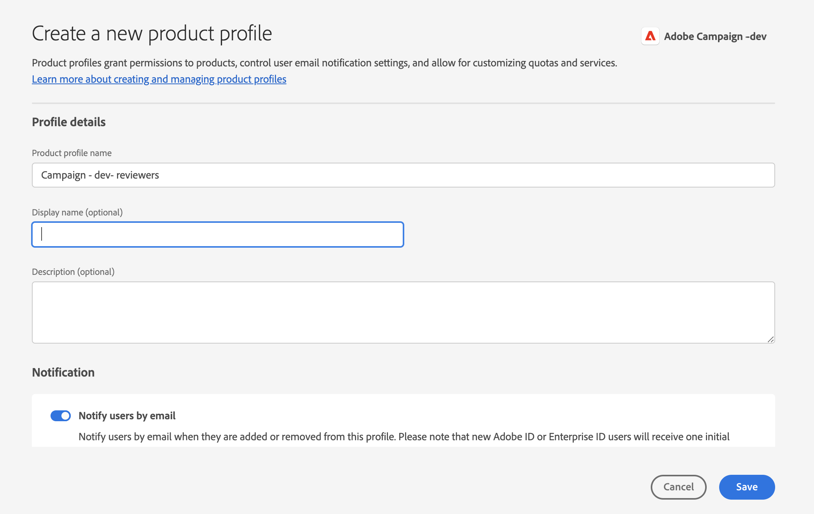

# Manage user permissions{#manage-permissions}

## Add users {#add-users}

As a product administrator, you can add users and grant access to Campaign.

To add a user, follow the steps below:

1. In the [Admin Console](https://adminconsole.adobe.com/enterprise){target="_blank"} home page, select **Add Users**.

    

1. Enter the email address of the user. 
1. Use the '+' sign to select the product profiles or user groups to assign to the user. 
    
    

    Campaign built-in product profiles are listed in [this section](#ootb-productprofiles).
    
    Learn how to create user groups in [this section](#user-groups)

1. Click **Save**. The user is added, and displays in the Users list. If you assign an admin role or a Product Profile to users, they receive an email notification. Users must follow the link to complete their profile.

Learn more about user creation in the Admin Console in [this page](https://helpx.adobe.com/ie/enterprise/using/manage-users-individually.html){target="_blank"}.

When new users [log on to Campaign](connect.md) with their Adobe ID, they are added to the Campaign operators list in the client console. Campaign operators are stored in the **[!UICONTROL Administration > Access management > Operators]** folder of Campaign explorer.

## Work with product profiles{#product-profiles}

Use product profiles to entitle users with the capabilities included in the product.

* For each product on the Admin Console, you can create one or more product profiles.
* In each product profile, you assign users and user groups (in your organization). 
* When a user signs in with their credentials as specified in the product profile, they are granted access to the apps and services of the product on which the product profile is based.

These product profiles match with operator groups which are stored in the **[!UICONTROL Administration > Access management > Operator groups]** folder of Campaign explorer.

In the Admin Console, product profiles use the following syntax:

campaign - `<your instance>` - internal name of the operator group

For example, for the **Delivery operator** group in the 'test' instance, the product profile in the Admin Console is:

campaign - test - delivery

You can use default product profiles or create new ones.

### Create a product profile{#create-product-profile}

To add a new product profile to Adobe, you must first create it in Campaign client console, and then add it in the Admin Console.

For example to create a 'reviewers' product profile, follow the steps below.

#### Create the operator group in Campaign{#create-op-group}

1. Connect to Campaign, open the Explorer, and browse to **[!UICONTROL Administration > Access management > Operator groups]**.
1. Click **[!UICONTROL New]**, and define the name of the operator group and set its internal name ('reviewers').
    
1. Define the associated permissions by selecting named rights. Named rights are detailed in [this section](#use-named-rights)
1. Save the new operator group.

#### Create the product profile in the Admin Console{#create-profile-in-admin-console}

1. Connect to the [Admin Console](https://adminconsole.adobe.com/enterprise){target="_blank"}.
1. From the **Product and services** section of the home page, open Campaign product.
1. Click **New profile** and enter the name of the product profile to create, with the exact correct syntax as explained [here](#product-profiles). For our example, we enter: campaign - `<your-instance-name>` - reviewers

    
    
1. Save your changes.

You can now add users to this new product profile, as explained in [this section](#add-users).

Best practice is to assign product profiles to user groups. Managing permissions by user is not a sustainable model.

### Default product profiles and operator groups {#ootb-productprofiles}

Adobe Campaign comes with built-in **product profiles** which are defined when Adobe enables your environment. 

These product profiles match with Campaign **operator groups**. The default operator groups and their [named rights](#use-named-rights) are listed below:

1. **[!UICONTROL Administrator]** (admin)

   The operators in this group have full access to the instance. Administrators are users who can access the most technical parts of the user interface.

   This group contains the following named right:

    * **[!UICONTROL ADMINISTRATION]**: right to execute/create/edit/delete any object such as workflow, delivery, scripts, etc.

1. **[!UICONTROL Delivery operators]** (delivery)

   The operators in this group are in charge of managing deliveries: they enable access to the main resources required for creating and preparing deliveries (campaign typologies, delivery mappings, default templates, personalization blocks, etc.).

   This group contains the following named rights:

    * **[!UICONTROL PREPARE DELIVERIES]**: right to create, edit and start the delivery analysis,
    * **[!UICONTROL START DELIVERIES]**: right to approve previously analyzed deliveries.

1. **[!UICONTROL Campaign managers]** (operation)

   The operators in this group can manage marketing campaigns: it lets you access the objects linked to campaigns (plans, programs, workflows, budgets, etc.) within the framework of **[!UICONTROL Campaign]** (optional Adobe Campaign module).

   This group contains the following named rights:

    * **[!UICONTROL INSERT FOLDERS]**: right to insert folders into the Adobe Campaign tree (provided you have editing rights for the concerned branches),
    * **[!UICONTROL WORKFLOW]**: right to use workflows.

   >[!NOTE]
   >
   >This group does not enable operators to start deliveries.

1. **[!UICONTROL Content contributors]** (content)

   Users in this group can access the Content folders, in the context of the **[!UICONTROL Content management]** add-on. This group does not grant any additional permissions.

1. **[!UICONTROL Access to reports]** (report)

   This group is reserved for external operators, to access the delivery reports via a [Web access](../start/campaign-ui.md#web-browser).

1. **[!UICONTROL Workflow execution]** (workflow)

   The **[!UICONTROL Workflow execution]** group lets you control the execution and approval of targeting workflows: the WORKFLOW named right is mapped to this group's operators. It is required for all actions on workflows, in addition to access rights to the data files. By default, the **[!UICONTROL Workflow execution]** group has read-only access to standard targeting workflow files and workflow templates. Operators in this group also have read and write access to the pending approvals file.

1. **[!UICONTROL Workflow supervisors]** (workflowSupervisor)

   Users in this group manage workflow approvals and receive an email notification in case of alerts concerning campaign workflows.

1. **Local / Central management** (central / local)

   Users in this group can use **[!UICONTROL Distributed marketing]** add-on.

1. **[!UICONTROL Offer managers]** (offer)

   The operators in this group can create and maintain offers when using the Interaction add-on. [Learn more](../interaction/interaction-operators.md).

   This group contains the following named rights:

    * **[!UICONTROL INSERT FOLDERS]**: Right to insert folders into the Adobe Campaign tree (provided you have editing rights for the concerned branches),
    * **[!UICONTROL EDIT FOLDERS]**: Right to alter folder properties such as internal name, label, associated image, sub folder order, etc.

    Permissions assigned to Offer managers enable them to carry out the following tasks:

    * Modify **[!UICONTROL Design]** environments.
    * View **[!UICONTROL Live]** environments.
    * Configure administration functions (pre-defined spaces and filters).
    * Create and update categories.
    * Create offers.
    * Configure offer eligibility.
    * Approve offers.

    >[!NOTE]
    >
    >**Offer managers** can only approve an offer if no reviewer is specified, or if they have been set as reviewers in the offer template.

    Offer manager permission matrix per environment is available in [this page](../interaction/interaction-operators.md#recap-of-rights-according-to-operator).

## Work with user groups{#user-groups}

You can use the Admin Console to create user groups and assign users to them. 

A user group is a collection of different users that have to be given a shared set of permissions. Learn how to create user groups in [this section](https://helpx.adobe.com/ie/enterprise/using/user-groups.html){target="_blank"}.

You can assign product profiles to user groups. So, all the users in that group to receive the same set of product permissions.

## Named rights{#use-named-rights}

Adobe Campaign comes with a set of named rights that let you define the permissions assigned to users and groups of users. These rights can be edited from the **[!UICONTROL Administration > Access management > Named rights]** folder of Campaign explorer.

Named Rights grant permissions to:

* Perform operations
    For example, the **Analyze** button in the Delivery editor is activated for members of the **Delivery Operator** group who have the **Prepare Delivery** Named Right

* Access to folders
    Membership of Operator Groups can grant or restrict access rights to folders, by changing the security settings on folders. [Learn more](folder-permissions.md#restrict-access-to-a-folder). 
    
    For example it can impact: **Write access** to create new entities (such as deliveries, profiles, etc.), **Read access** to use entities, **Delete access** to delete entities.

Default named rights in Adobe Campaign are:

* **[!UICONTROL ADMINISTRATION]**: Operators with the **[!UICONTROL ADMINISTRATION]** right has full access on the instance. Admin users can execute/create/edit/delete any object such as workflow, delivery, scripts, etc.

* **[!UICONTROL APPROVAL ADMINISTRATION]**: You can set multiple approval steps within workflows and deliveries to ensure that the current state has been approved by an assigned operator or group. Users with the **[!UICONTROL APPROVAL ADMINISTRATION]** right can set approval steps and also assign an operator or operator group who should approve those steps.

* **[!UICONTROL CENTRAL]**: Right for central management (Distributed Marketing).

* **[!UICONTROL DELETE FOLDER]**: Right to delete folders. With this right, users are allowed to delete folders from the explorer view.

* **[!UICONTROL EDIT FOLDERS]**: Right to alter folder properties such as internal name, label, associated image, sub folder order, etc.

* **[!UICONTROL EXPORT]**: Users can export data out of their Adobe Campaign instances into a file on server or local machine using the **[!UICONTROL EXPORT]** workflow activity.

* **[!UICONTROL FILES ACCESS]**: Right to read and write access for files via a script which can be written in the **[!UICONTROL JavaScript]** workflow activity to read/write files on a server.

* **[!UICONTROL IMPORT]**: Right for generic data import. **[!UICONTROL IMPORT]** allows you to import data into any other table whereas the **[!UICONTROL RECIPIENT IMPORT]** right allows to import into the recipient table only.

* **[!UICONTROL INSERT FOLDERS]**: Right to insert folders. Users with the **[!UICONTROL INSERT FOLDERS]** right can create new folders in the folder tree in explorer view.

* **[!UICONTROL LOCAL]**: Right for local management (Distributed Marketing).

* **[!UICONTROL MERGE]**: Right to merge the selected records into one. If recipients exist as duplicates, the **[!UICONTROL MERGE]** right allows user to select the duplicates and merge them into a primary recipient.

* **[!UICONTROL PREPARE DELIVERIES]**: Right to create, edit and save a delivery. Users with the **[!UICONTROL PREPARE DELIVERIES]** right can also start the delivery analysis process.

* **[!UICONTROL PRIVACY DATA RIGHT]**: Right to collect and delete privacy data. [Learn more](privacy.md).

* **[!UICONTROL PROGRAM EXECUTION]**: Right to execute commands in various programming languages.

* **[!UICONTROL RECIPIENT IMPORT]**: Right to import recipients. Users with the **[!UICONTROL RECIPIENT IMPORT]** right can import a local file into recipient table.

* **[!UICONTROL SQL SCRIPT EXECUTION]** Right to execute any SQL command directly on the database.

* **[!UICONTROL START DELIVERIES]**: Right to approve previously analyzed deliveries. After the delivery analysis, delivery will pause at various approval steps and will need to be approved to resume. Users with the **[!UICONTROL START DELIVERIES]** right are allowed to approve deliveries.

* **[!UICONTROL USE SQL DATA MANAGEMENT ACTIVITY]**: Right to write your own SQL scripts using the SQL Data Management activity, in order to create and populate work tables. [Learn more](../../automation/workflow/sql-data-management.md).

* **[!UICONTROL WORKFLOW]**: This named right is specific to workflows: it lets you create, start and stop workflows. Reading rights on the workflow file are required for the named right to be applicable. For targeting workflows, the reading right on the **[!UICONTROL Profiles and Targets]** folder is necessary.

* **[!UICONTROL WEBAPP]**: Right to use web applications.

>[!NOTE]
>
>This list can differ depending on the add-ons installed on your environment.

## Additional resources{#additional-res}

* [Manage permissions for workflows](../../automation/workflow/managing-rights.md)
* [Manage permissions for distributed marketing](../../automation/distributed-marketing/about-distributed-marketing.md#operators)
* [Manage permissions for the interaction module](../interaction/interaction-operators.md)
* [Filter access to schemas](../dev/filter-schema.md)
* [Restrict PI view](../dev/restrict-pi-view.md)
