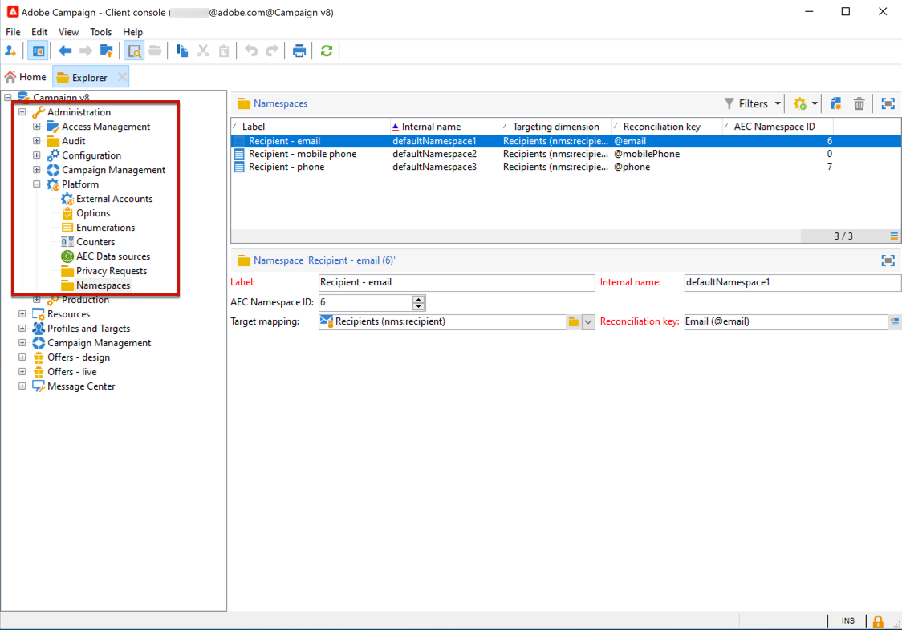

# Privacy and consent in Campaign {#privacy}

Adobe Campaign is a powerful tool for collecting and processing large volume of data, including personal information and sensitive data. It is therefore essential that you receive and monitor consent from your recipients.

Learn more in Campaign Classic v7 documentation:

* [Learn about privacy and consent](https://experienceleague.adobe.com/docs/campaign-classic/using/getting-started/privacy/privacy-and-recommendations.html){target="_blank"}.

* [Getting started with Privacy Management](https://experienceleague.adobe.com/docs/campaign-classic/using/getting-started/privacy/privacy-management.html){target="_blank"}.

This information applies to GDPR, CCPA, PDPA, and LGPD. For more on these regulations, see [Adobe Campaign Classic v7 documentation](https://experienceleague.adobe.com/docs/campaign-classic/using/getting-started/privacy/privacy-management.html?lang=en#privacy-management-regulations){target="_blank"}.

The opt-out for the Sale of Personal Information, which is specific to CCPA, is explained in [Adobe Campaign Classic v7 documentation](https://experienceleague.adobe.com/docs/campaign-classic/using/getting-started/privacy/privacy-requests.html#sale-of-personal-information-ccpa){target="_blank"}.

## About Privacy requests {#about-privacy-requests}

In order to help you facilitate your Privacy readiness, Adobe Campaign allows you to handle Access and Delete requests. The **Right to Access** and the **Right to be Forgotten** (delete request) are described in [this section](#right-access-forgotten).

To perform those requests, you must use the **Privacy Core Service** integration. Privacy requests pushed from the Privacy Core Service to all Experience Cloud solutions are automatically handled by Campaign via a dedicated workflow.

 Learn about the **Right to Access** and the **Right to be Forgotten** (delete request) in [Adobe Campaign Classic v7 documentation](https://experienceleague.adobe.com/docs/campaign-classic/using/getting-started/privacy/privacy-management.html?lang=en#right-access-forgotten){target="_blank"}.

## Right to Access and Right to be Forgotten {#right-access-forgotten}

In order to help you facilitate your Privacy readiness, Adobe Campaign allows you to handle **Access** and **Delete** requests.

* The **Right to Access** is the right for the Data Subject to obtain from the Data Controller confirmation as to whether or not personal data concerning them is being processed, where and for what purpose. The Data Controller shall provide a copy of the personal data, free of charge, in an electronic format.

* Also known as Data Erasure, the **Right to be Forgotten** (delete request) entitles the Data Subject to have the Data Controller erase their personal data, cease further dissemination of the data, and potentially have third parties halt processing of the data.

## Implementation steps

Let's see how you can create Access and Delete requests, as well as how Adobe Campaign processes them.

Currently in ACC, privacy requests can only be raised using API or UI presented by instance.
This is a problem in v8 because:
These requests are based on tenantIds. So if a customer is having N instances then he/she needs to raise N requests in order to process the privacy request in all of their environments.
In case some error occurs while processing privacy request or job gets stuck, then customer is not aware of it as there is no alerting or monitoring around it.
The Privacy Core Service integration will now allow to solve this issue. Privacy requests pushed from the Privacy Core Service to all Experience Cloud solutions are automatically handled by Campaign via a dedicated workflow.

Before creating Privacy requests, you need to define the namespace you will use. However ACC doesn't support importing Identity Service Namespaces yet. So once you have created a new namespace on Identity namespace service, you need to create manually the namespace from ACC UI using the Administration > Platform > Namespaces menu, with the AEC namespace ID matching the one in Identity namespace.

<!--Starting 19.4, the use of the Campaign API and interface for Access and Delete requests is deprecated. For any GDPR, CCPA, PDPA, or LGPD Access and Delete requests, you need to use the [Privacy Core Service](#create-privacy-request) integration method.-->

### Prerequisites {#prerequesites}

Adobe Campaign offers Data Controllers tools to create and process Privacy requests for data stored in Adobe Campaign. However, it is the Data Controller's responsibility to handle the relationship with the Data Subject (email, customer care or a web portal).

It is therefore your responsibility as a Data Controller to confirm the identity of the Data Subject making the request and to confirm that the data returned to the requester is about the Data Subject.

>[!NOTE]
>
>For more on personal data and on the different entities that manage data (Data Controller, Data Processor and Data Subject), see [Personal data and Personas](../../start/using/privacy.md#personal-data).

### Namespaces {#namesspaces}

Before creating Privacy requests, define the namespace you will use. The namespace is the key that will be used to identify the Data Subject in the Adobe Campaign database. Out-of-the-box, two namespaces are available: email and mobile phone. If you need a different namespace (a profile custom field, for example), follow these steps.

Also refer to this [tutorial](https://experienceleague.adobe.com/docs/campaign-standard-learn/tutorials/privacy/namespaces-for-privacy-requests.html?lang=en#privacy) on how to create a namespace.

>[!NOTE]
>
>If you use several namespaces, create one Privacy request per namespace.

1. Click the Adobe Campaign logo in the top-left corner, then select **[!UICONTROL Administration]** > **[!UICONTROL Namespaces]**.

    

1. In the list of namespaces, click **[!UICONTROL Create]**.

    

1. Enter a **[!UICONTROL Label]**.

    

1. If you want to use an existing identity service namespace, choose **[!UICONTROL Map from Identity Namespace Service]** and select a namespace from the **[!UICONTROL Identity Service Namespaces]** list.

    

    If you want to create a new namespace in **[!UICONTROL Identity Service]** and map it in Campaign, select **[!UICONTROL Create new]** and enter a name in the **[!UICONTROL Identity namespace name]** field.

    

    To learn more about identity namespaces, see the [Experience Platform](https://experienceleague.adobe.com/docs/experience-platform/identity/namespaces.html?lang=en) documentation.

1. One Identity Service Namespace is mapped to one namespace in Campaign. You must specify how the namespace will be reconciled in Campaign.

    Select a target mapping (**[!UICONTROL Recipients]**, **[!UICONTROL Real-time event]** or **[!UICONTROL Subscriptions to an application]**). If you want to use several target mappings, create one namespace per target mapping.

    

1. Choose the **[!UICONTROL Reconciliation key]**. This is the field that will be used to identify the Data Subject in the Adobe Campaign database.

    

1. Click **[!UICONTROL Create]**. You can now create Privacy requests based on your new namespace. If you use several namespaces, create one Privacy request per namespace.

### Creating a Privacy request {#create-privacy-request}

<!--Starting 19.4, the use of the Campaign API and interface for Access and Delete requests is deprecated. Use the **Privacy Core Service** for any GDPR, CCPA, PDPA, or LGPD Access and Delete requests.-->

The Privacy Core Service Integration allows you to automate your Privacy requests in a multi-solution context through a single JSON API call. Privacy requests pushed from the Privacy Core Service to all Experience Cloud solutions are automatically handled by Campaign via a dedicated workflow.

Refer to the [Experience Platform Privacy Service](https://experienceleague.adobe.com/docs/experience-platform/privacy/home.html?lang=en) documentation to learn how to create Privacy requests from the Privacy Core Service.

>[!IMPORTANT]
>
>To submit a request using the custom namespace type, leverage the [JSON method](https://experienceleague.adobe.com/docs/experience-platform/privacy/ui/user-guide.html?lang=en#json){target="_blank"} and add the namespaceId to the request, or use the [API call](https://experienceleague.adobe.com/docs/experience-platform/privacy/api/privacy-jobs.html?lang=en#access-delete){target="_blank"} to make the request.
>
>Only use the [Privacy user interface](https://experienceleague.adobe.com/docs/experience-platform/privacy/ui/user-guide.html?lang=en#request-builder){target="_blank"} to submit requests using the standard namespace type.

Each Privacy core service job is split into multiple Privacy requests in Campaign based on how many namespaces are being used, one request corresponding to one namespace. Also, one job can be run on multiple instances. Therefore, multiple files are created for one job. For example, if a request has two namespaces and is running on three instances, then a total of six files are sent. One file per namespace and instance.

The pattern for a file name is : `<InstanceName>-<NamespaceId>-<ReconciliationKey>.xml`

* **InstanceName**: Campaign instance name
* **NamespaceId**: Identity Service Namespace ID of the namespace used
* **Reconciliation key**: Encoded reconciliation key

### List of resources {#list-of-resources}

When performing a Delete or Access Privacy request, Adobe Campaign searches all the Data Subject's data based on the **Reconciliation** value in all the resources that have a link to the profiles resource (own type).

Here is the list of out-of-the-box resources that are taken into account when performing Privacy requests:

* Profiles (recipient)
* Profile delivery logs (broadLogRcp)
* Profile tracking logs (trackingLogRcp)
* Delivery logs (Subscriptions to an application) (broadLogAppSubRcp)
* Tracking logs (Subscriptions to an application) (trackingLogAppSubRcp)
* Subscriptions to an application (appSubscriptionRcp)
* Subscription history of profiles (subHistoRcp)
* Profile subscriptions (subscriptionRcp)
* Visitors (visitor)

If you created custom resources that have a link to the profiles resource (own type), they will also be taken into account. For example, if you have a transaction resource linked to the profiles resource and a transaction details resource linked to the transaction resource, they will be both taken into account.

Also refer to [this tutorial](https://experienceleague.adobe.com/docs/campaign-standard-learn/tutorials/privacy/custom-resources-for-privacy-requests.html?lang=en#privacy) on how to modify custom resources.

For this to work, you must select the **[!UICONTROL Deleting the target record implies deleting records referenced by the link]** option in the custom resource:

1. Click the Adobe Campaign logo in the top-left corner, then select **[!UICONTROL Administration]** > **[!UICONTROL Development]** > **[!UICONTROL Custom resources]**.

1. Select a custom resource that has a link to the profiles resource (own type).

1. Click the **[!UICONTROL Links]** section.

1. For each link, click the pencil icon (**[!UICONTROL Edit properties]**).

1. In the **[!UICONTROL Behavior if deleted/duplicated]** section, select the **[!UICONTROL Deleting the target record implies deleting records referenced by the link]** option.

    

### Privacy request statuses {#privacy-request-statuses}

Here are the different statuses for Privacy requests:

* **[!UICONTROL New]** / **[!UICONTROL Retry pending]**: in progress, the workflow has not processed the request yet.
* **[!UICONTROL Processing]** / **[!UICONTROL Retry in progress]**: the workflow is processing the request.
* **[!UICONTROL Delete pending]**: the workflow has identified all the recipient data to delete.
* **[!UICONTROL Delete in progress]**: the workflow is processing the deletion.
    <!--**[!UICONTROL Delete Confirmation Pending]** (Delete request in 2-steps process mode): the workflow has processed the Access request. Manual confirmation is requested to perform the deletion. The button is available for 15 days.-->
* **[!UICONTROL Complete]**: the processing of the request has finished without an error.
* **[!UICONTROL Error]**: the workflow has encountered an error. The reason is displayed in the list of Privacy requests in the **[!UICONTROL Request status]** column. For example, **[!UICONTROL Error data not found]** means that no recipient data matching the Data Subject's **[!UICONTROL Reconciliation value]** has been found in the database.